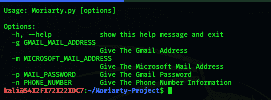
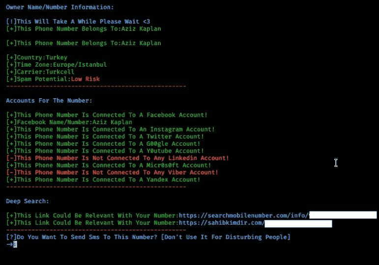

# 莫里亚蒂项目:这个工具给出了你输入的电话号码的信息

> 原文：<https://kalilinuxtutorials.com/moriarty-project/>

莫里亚蒂是一个试图找到你提供的电话号码的有用信息的工具

*   试图找到号码的主人
*   尝试找出数字的风险等级
*   尝试查找位置、电话号码的时区、运营商
*   试图找到该号码注册的社交媒体平台
*   尝试查找有关电话号码的链接
*   尝试查找关于电话号码的评论
*   使用亚马逊 Aws 向电话号码发送短信

*   高级信息收集和信息工具

**安装**

*   chmod 755 install.sh
*   。/install.sh

**安装注意事项**

*   该工具必须以非根用户身份运行。它必须下载到不需要任何 root 权限的目录中。该功能将在下一版本中添加

**用途**

*   python 3 mori arty . py-m[microsoft_mail@outlook.com](mailto:microsoft_mail@outlook.com)-p 密码-n+电话号码
*   python 3 mori arty . py-g[gmail_mail@gmail.com](mailto:gmail_mail@gmail.com)-p 密码-n+电话号码

**输出**

**发送短信**

*   有一个亚马逊 aws 帐户是必要的，否则短信不会被发送。

**当前版本**

*   v2.4

**注**

*   为了更好地使用该工具，请不要使用您的真实 gmail 帐户，开一个假帐户，并且不要添加您的电话号码。
*   这个工具不会窃取你的帐户。代码是开源的，你可以查看。

[**Download**](https://github.com/AzizKpln/Moriarty-Project)