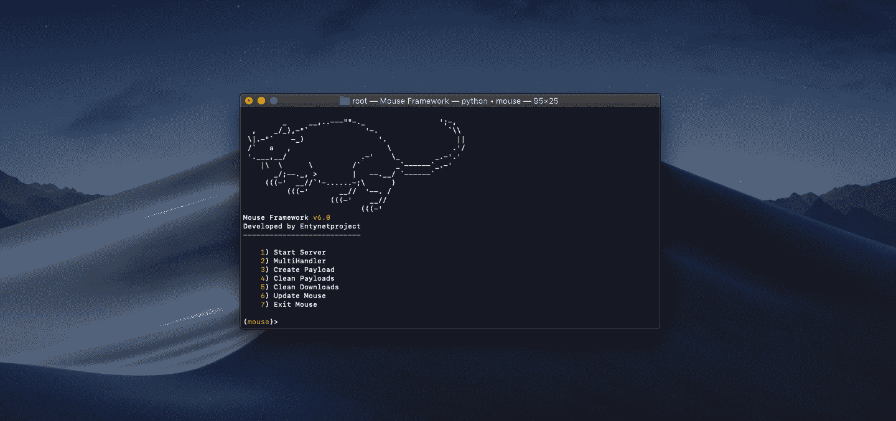
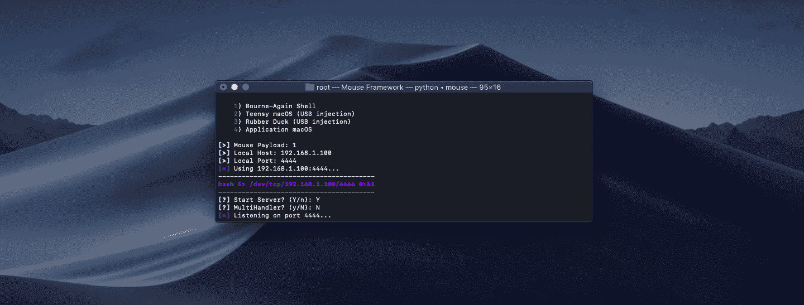
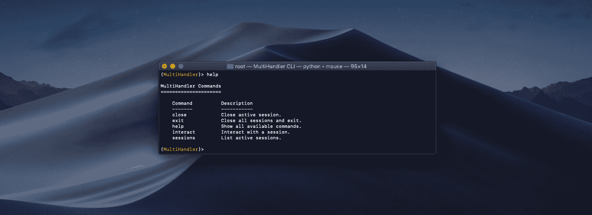
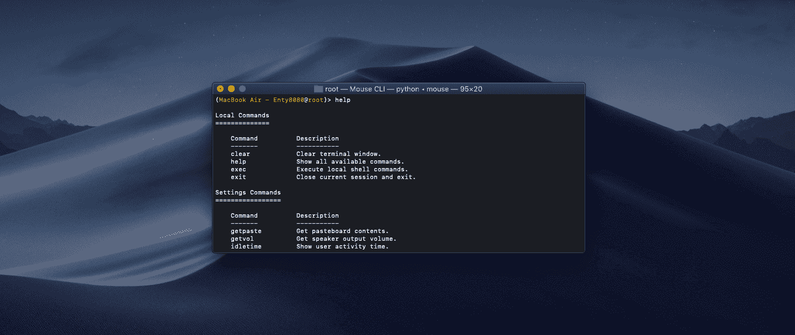
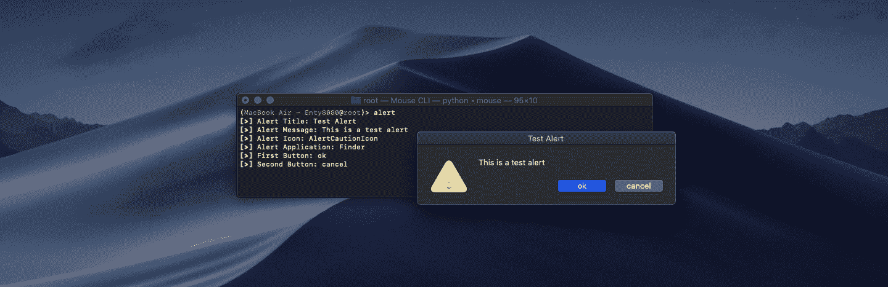
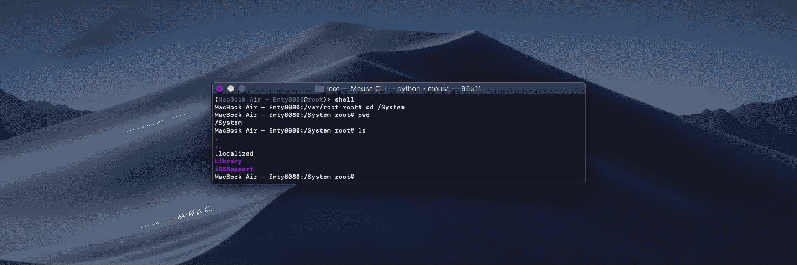

# 鼠标:iOS 和 macOS 后期开发框架

> 原文：<https://kalilinuxtutorials.com/mouse/>

**Mouse Framework** 是一个 iOS 和 macOS 后开发框架，仅使用一个简单的鼠标有效负载，就可以在您和目标机器之间进行命令行会话，并提供额外的功能。

鼠标为您提供了上传和下载文件、标签补全、拍照、位置跟踪、shell 命令执行、权限升级、密码检索等功能和便利。

**入门**

*   **鼠标安装**

**cd 鼠标
chmod +x install.sh
。/install.sh**

*   **鼠标卸载**

**cd 鼠标
chmod +x uninstall.sh
。/uninstall.sh**

**鼠标框架执行**

要执行鼠标框架，您应该执行以下命令。

**鼠标**

**鼠标有效载荷(macOS/iOS)**

鼠标有效负载旨在获取远程目标机器会话。

*   **Bourne-Again Shell 有效负载**

从 payload 菜单中选择 Bourne-Again Shell payload 将给出一个 1 liner，它在目标机器上执行时建立一个远程鼠标会话。

**平台:iOS/macOS**

*   **Teensy macOS 有效载荷(USB 注入)**

Teensy 是一个开发 USB 板，可以用 Arduino IDE 编程。它模仿 usb 键盘敲击速度极快，可以在几秒钟内注入鼠标有效载荷！

**平台:macOS**

*   **橡皮鸭有效载荷(USB 注入)**

USB 橡皮鸭是一个开发 USB 板，可以在几秒钟内注入上传到鸭子 SD 卡 inject.bin 有效载荷！

**平台:macOS**

*   **应用 macOS 有效载荷**

从有效载荷菜单中选择应用程序 macOS 将会给你标准的鼠标有效载荷转换成 macOS 应用程序。

**平台:macOS**

**也读作-[Owasp d4n 155:智能&动态词表使用 Osint](https://kalilinuxtutorials.com/owasp-d4n155/)**

多处理器命令行界面

MultiHandler 选项允许我们处理多个会话。您可以选择与不同的设备进行交互，同时在后台监听新的连接。

*   **多处理器命令**

关闭:关闭活动会话。退出:关闭所有会话并退出。
帮助:显示所有可用的命令。
互动:与会话互动。
会话:列出活动会话。

**鼠标基板**

鼠标底层是一个包，在接收到远程控制运行底层命令和服务后，可以安装在目标 iOS 设备上。

*   **基板命令**

模拟双击 home 键。模拟 home 键的按下。
locat:切换位置服务。
静音:更新和查看静音状态。

**鼠标 CLI**

建立会话后，我们可以通过鼠标 CLI 在该设备上执行命令。我们可以通过键入“help”来显示所有可用的命令。鼠标 CLI 允许您控制远程设备。可以通过鼠标 CLI 命令控制远程设备。您可以浏览以下可用鼠标 CLI 命令列表。

*   **本地命令**

清除:清除终端窗口。帮助:显示所有可用的命令。
exec:执行本地 shell 命令。
退出:关闭当前会话并退出。

**设置命令**

**苹果电脑**

获取剪贴板内容。
getvol:获取扬声器输出音量。
idletime:获取用户活动时间量。
setbright:设置屏幕亮度。
setvol:设置输出音量。

**iOS**

电池:获取电池电量。
getvol:获取音量级别。
msub:鼠标基板。
setvol:设置输出音量。
sysinfo:显示系统信息。

**拖拽命令**

**苹果电脑**

提醒:让提醒显示在设备上。chwall:改变桌面壁纸。
关闭:关闭应用。
imessage:通过“信息”应用程序发送信息。
itunes:控制 itunes 播放器。
键盘:控制键盘。
打开:打开应用。
说:将文本转换为语音。

**iOS**

提醒:让提醒显示在设备上。
拨号:拨打电话号码。
ipod:控制音乐播放器。
终止:终止或通知一个进程。
killall:按名字杀死进程。
lastapp:打开上次打开的应用程序。
打开:打开应用。
openurl:在设备上打开 url。
说:将文本转换为 speach。
振动:振动装置。

**窃取命令**

**苹果电脑**

下载:下载远程文件。getfacebook:检索 facebook 会话 cookies。
mic:记录麦克风声音。
图片:通过 iSight 拍照。
提示:提示用户输入密码。
截图:截图。

**iOS**

下载:下载远程文件。getcontacts:下载通讯录。
getnotes:下载笔记。
获取密码:获取设备密码。
getsms:下载短信数据。
定位:获取设备位置坐标。
mic:录制麦克风声音。
图片:通过相机拍摄图片。

**启动命令**

**苹果电脑**

重新启动:重新启动设备。
睡眠:将设备置于睡眠模式。
暂停:暂停当前会话。

**iOS**

重新启动:重新启动设备。重新开始:重新开始跳板。
安全模式:将设备置于安全模式。

**其他命令**

**苹果电脑**

图标:列出系统警报图标。
pid:获取鼠标进程 id。
shell:打开目标设备外壳。
苏:以 root 身份登录。
上传:上传本地文件。

**iOS**

bundleids:列出包标识符。
islocked:检查设备是否锁定。
pid:获取鼠标进程 id。
外壳:打开目标设备外壳。
上传:上传本地文件。

**鼠标框架免责声明**

未经双方事先同意，使用鼠标框架攻击目标是非法的。最终用户有责任遵守所有适用的地方、州、联邦和国际法律。开发人员不承担任何责任，也不对本程序造成的任何误用或损坏负责。

[**Download**](https://github.com/entynetproject/mouse)