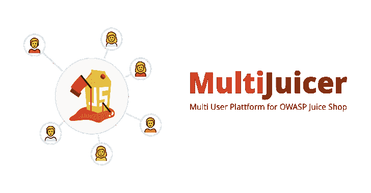
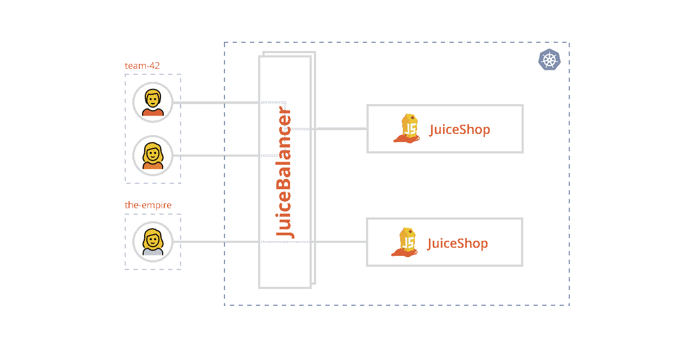

# 多榨汁机:与 OWASP 果汁店一起运行捕获标志和安全培训

> 原文：<https://kalilinuxtutorials.com/multijuicer/>

**multi 榨汁机**是一款工具，用于运行 OWASP juice shop 的 capture the flags 和安全培训。用 OWASP Juice Shop 运行 CTFs 和安全培训通常是相当棘手的，Juice Shop 并不打算同时被多个用户使用。指导每个人如何在他们自己的机器上开果汁店还行，但是会占用太多宝贵的时间。

multi 榨汁机使您能够为中央 kubernetes 集群上的每个参与者运行单独的果汁店实例，从而在不需要本地果汁店实例的情况下运行事件。

注意:这个项目直到最近才被称为 JuicyCTF。这是为了避免与 juice-shop-ctf 项目混淆而更改的。

**也可理解为-[Liffy:本地文件包含利用工具](https://kalilinuxtutorials.com/liffy-local-file-inclusion-exploitation-tool/)**

**它有什么作用？**

*   需要时动态创建新的果汁店实例
*   在单个域上运行，带有一个负载平衡器，将流量发送到参与者 Juice Shop 实例
*   果汁店容器重启时的备份和自动应用挑战进度
*   自动清理旧的和未使用的实例

**安装**

multi 榨汁机在 kubernetes 上运行，要安装它，你需要 helm。

掌舵回购添加多榨汁机 https://iteratec.github.io/multi-juicer/

#为掌舵< = 2
掌舵安装多榨汁机/多榨汁机–名称多榨汁机

#为掌舵> = 3
掌舵安装多榨汁机多榨汁机/多榨汁机

**定制设置**

您可以选择如何设置堆栈，还可以根据自己的喜好定制 JuiceShop 实例。你可以在:[helm/multi-榨汁机/values.yaml](https://github.com/iteratec/multi-juicer/blob/master/helm/multi-juicer/values.yaml) 下找到默认的配置值

下载并保存文件，通过运行以下命令告诉 helm 使用您的默认配置文件:

**helm install -f values.yaml 多功能榨汁机。/多功能榨汁机/舵/多功能榨汁机/**

**拆卸**

**赫尔姆删除多台榨汁机**

**常见问题解答**

*   群集需要多少计算资源？

为安全起见，用下列方法计算:

*   *1GB 内存& 1CPU 开销*，用于平衡器，redis & co
*   *200MB & 0.2CPU *参与人数*，针对各个 JuiceShop 实例

上面的数字反映了默认的资源限制。这些可以调整，参见:[定制设置](https://github.com/iteratec/multi-juicer#customizing-the-setup)

*   多榨汁机可以处理多少用户？

没有真正的固定限制。(即使你可以配置一个😉)定制的负载平衡器(单个实例的所有流量都通过它流动)可以根据您的需要进行复制。您还可以附加一个[水平 Pod 自动缩放器](https://kubernetes.io/docs/tasks/run-application/horizontal-pod-autoscale/)来自动缩放负载平衡器。

在向上扩展时，还要注意 redis 实例。确保它仍然能够承受负载。

*   **为什么要定制负载平衡器？**

有一些特殊的要求，我们发现用任何预构建的负载平衡器都不容易解决:

*   将部署的用户数量限制为某个团队的成员。
*   负载平衡器 cookie 必须被保存，且不容易被欺骗来访问另一个实例。
*   处理新实例的启动。

如果您有关于如何在没有定制负载平衡器的情况下克服这些问题的好主意，请写信给我们，我们很乐意听到您的意见！

*   **为什么每个团队都要单独部署 kubernetes？**

这有一些很好的理由:

*   单独删除团队实例的能力。在不删除活动团队实例的情况下，安全地缩减规模，对于扩展部署来说确实很棘手。你只能选择你想要的规模，而不是哪些豆荚要保留，哪些要扔掉。
*   以确保在 pod 被重新创建后，pod 仍然与团队正确关联。这在单独部署时不成问题，但在大规模部署时却非常困难。
*   在部署名称中嵌入团队名称的能力。这似乎是一个愚蠢的理由，但是只需使用`kubectl`就可以让调试变得非常容易。

[**Download**](https://github.com/iteratec/multi-juicer)