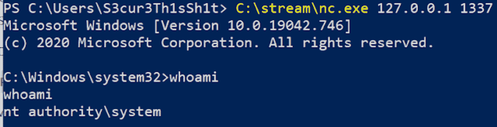
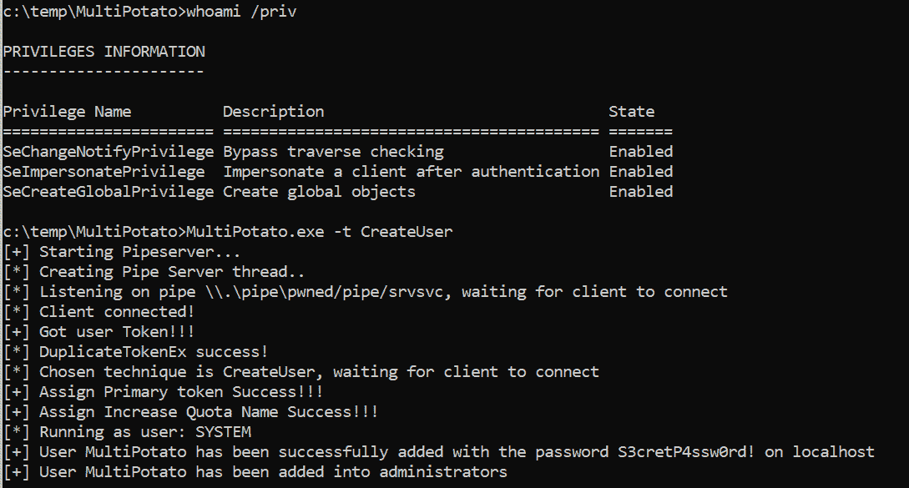
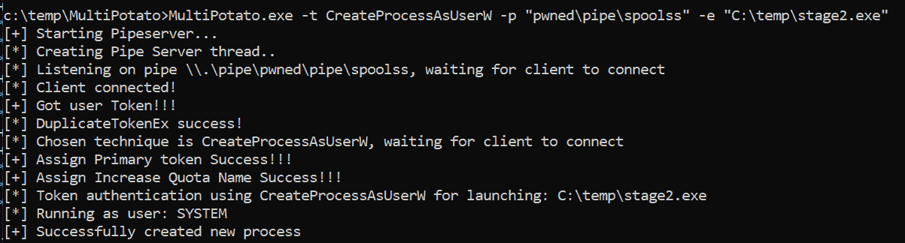
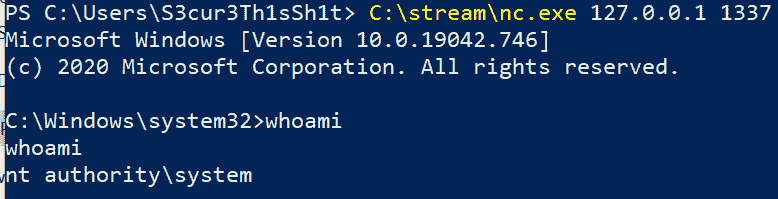

# 多重身份:另一个通过君主特权获得系统的土豆

> 原文：<https://kalilinuxtutorials.com/multipotato/>

multi tato 只是另一个通过君主特权获得系统的土豆。但是这个不同之处在于

*   它不包含任何武器化的系统授权触发。相反，代码可以用来集成你自己最喜欢的触发器。
*   它不仅仅使用`**CreateProcessWithTokenW**`来产生一个新的进程。相反，你可以在`**CreateProcessWithTokenW**`、`**CreateProcessAsUserW**`、`**CreateUser**`和`**BindShell**`之间进行选择。

因此，这个项目能够打开一个命名管道服务器，模拟连接到它的任何用户，然后执行上述选项之一。如果将来发布了任何新的系统身份验证触发器，这个工具仍然可以用来提升权限——在这种情况下，您只需要使用另一个管道名。

示例:

*   使用修改后的 PetitPotam 触发器创建用户:

MultiPotato.exe-t 创建用户

缺省值为 60 秒(可通过 AD_TIMEOUT 更改),让系统帐户或任何其他帐户进行身份验证。这可以通过例如未打补丁的 MS-EFSRPC 函数来完成。默认情况下，MultiPotato 监听管道名`**\\.\pipe\pwned/pipe/srvsvc**`，该管道名旨在与 MS-EFSRPC 结合使用。对于其他系统授权触发器，您可以通过`**-p**`参数调整该值。

PetitPotamModified.exe 本地主机/管道/pwned 本地主机

当然，使用有效的低特权用户从远程系统使用`**PetitPotam.py**`作为触发器也是可能的。

带有 SpoolSample 触发器的 CreateProcessAsUserW:

**C:\ temp \ multi potato>MultiPotato.exe-t CreateProcessAsUserW-p " pwned \ pipe \ spoolss "-e " C:\ temp \ stage 2 . exe "**

并通过以下方式触发它

MS-RPRN.exe \ 192 . 168 . 100 . 150 \ 192 . 168 . 100 . 150/管道/焊接

[**Download**](https://github.com/S3cur3Th1sSh1t/MultiPotato)