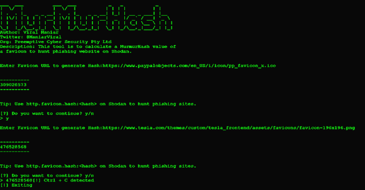
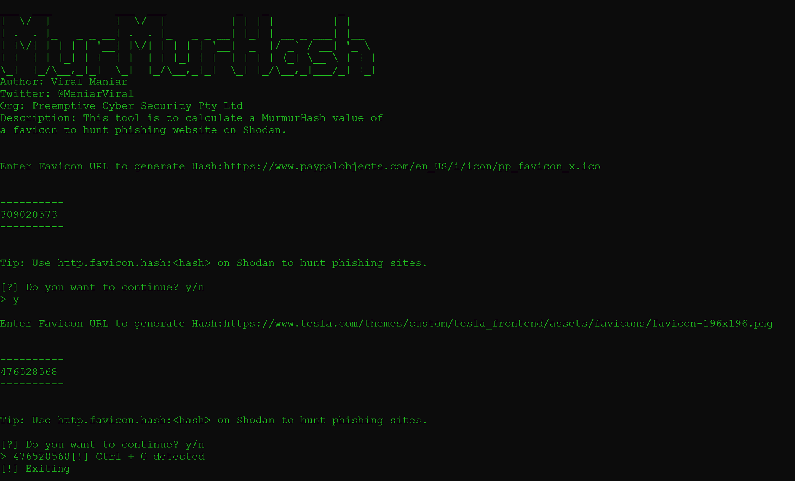
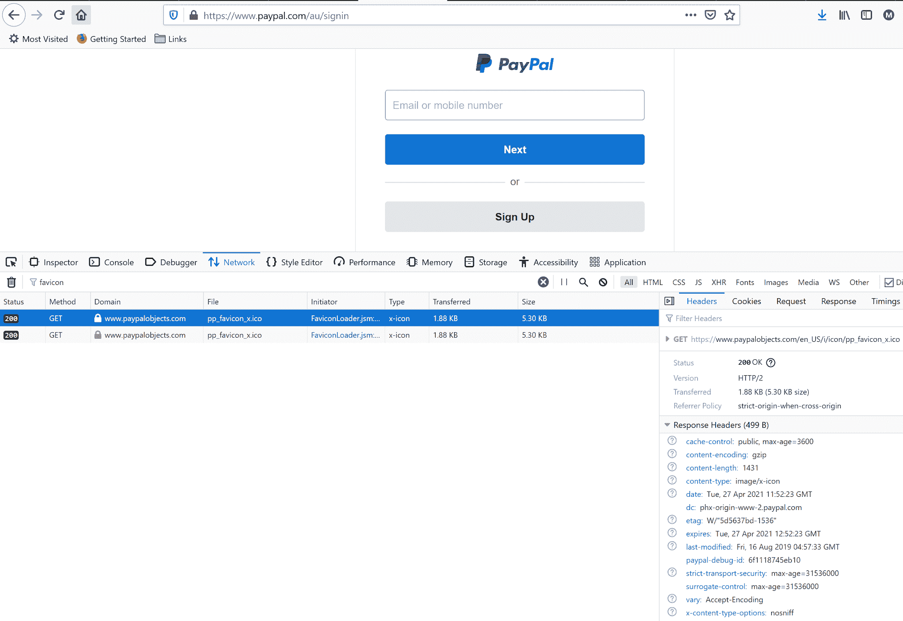
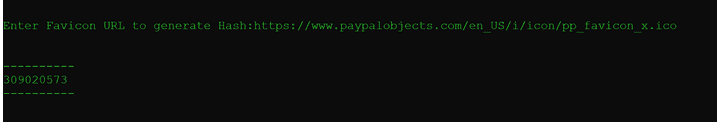
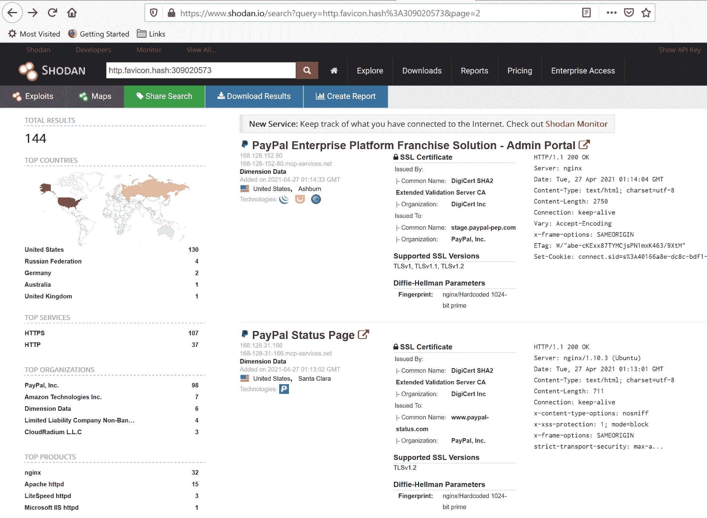
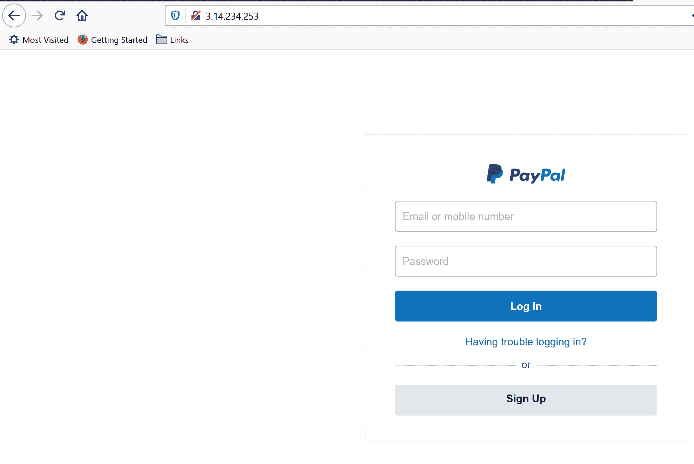
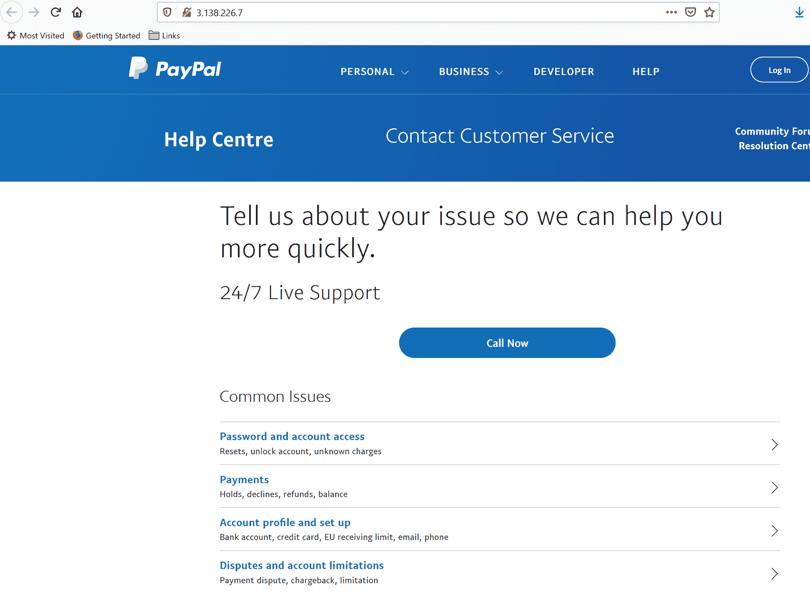
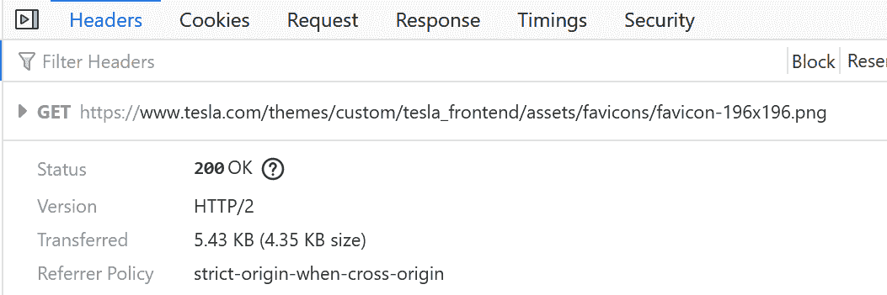
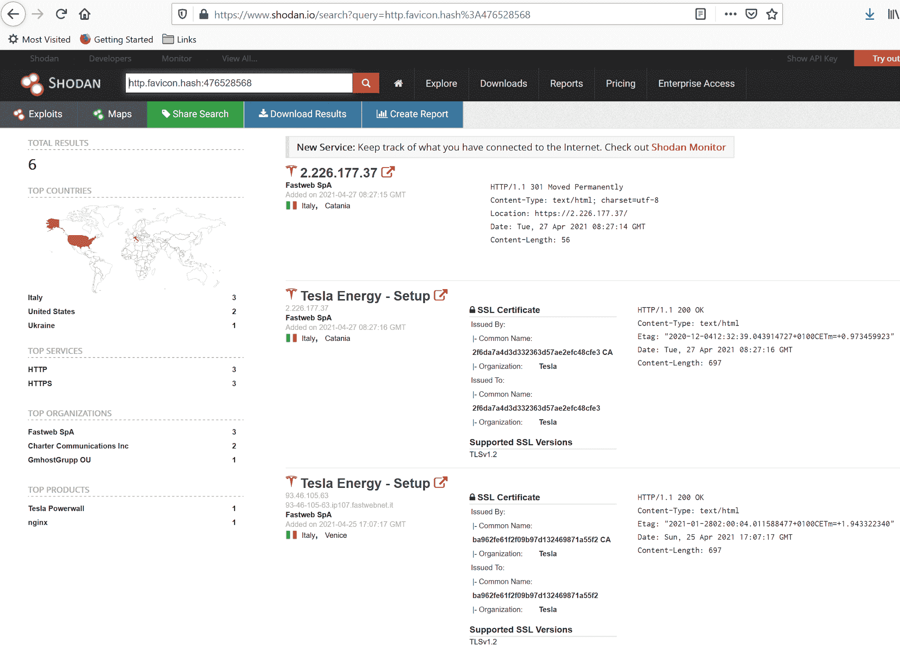
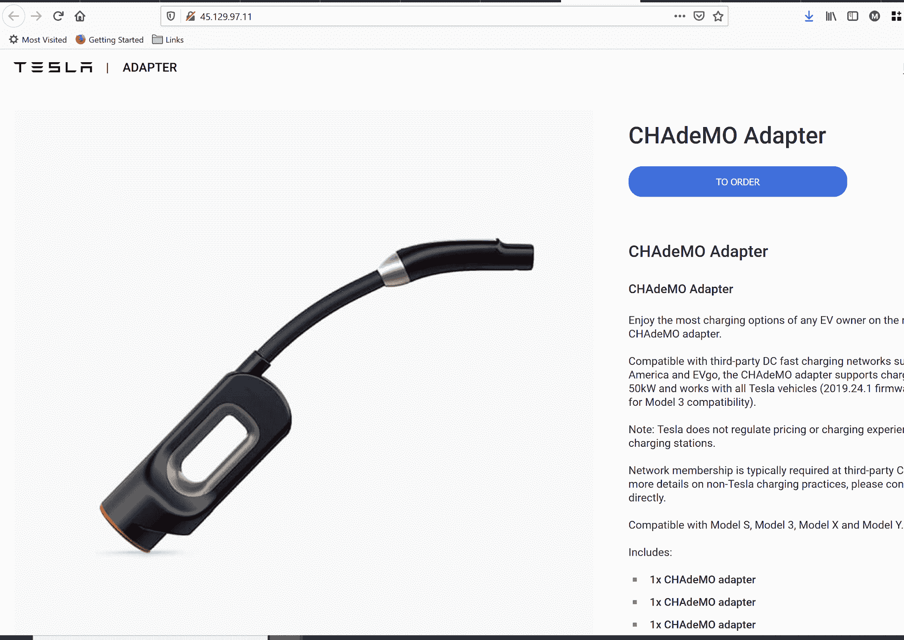

# MurmurHash:计算 Favicon 的 MurMurHash 值的工具，用于在 Shodan 平台上搜索钓鱼网站

> 原文：<https://kalilinuxtutorials.com/murmurhash/>

**MurMurHash** 是一个用来计算 favicon 的 MurMurHash 值的工具，用来在 Shodan 平台上搜索钓鱼网站。

**什么是 MurMurHash？**

MurmurHash 是一个非加密哈希函数，适用于一般的基于哈希的查找。这个名字来自两个基本操作，乘法(MU)和旋转(R)，用在它的内部循环中。当前版本是 MurmurHash3，它产生 32 位或 128 位哈希值。当使用 128 位时，x86 和 x64 版本不会产生相同的值，因为算法针对各自的平台进行了优化。MurmurHash3 是和 SMHasher 一起发布的——一个哈希函数测试套件。

**如何安装？**

**git 克隆 https://github.com/Viralmaniar/MurMurHash.git
CD MurMurHash
pip install-r requirements . txt
python murhash . py**

**为 Paypal 寻找费西合唱团事件&特斯拉**

在阅读了关于使用 favicon 散列搜索钓鱼网站的文章后，我想将其一般化，接受 Favicon URLs，以便在 Shodan 上进行快速分析。

在 paypal 的原始网站上寻找 favicon 图标文件:

使用`**MurMurHash.py**`文件生成图标的哈希:

在 Shodan 上搜索 Paypal 钓鱼域名/IP:

[https://www.shodan.io/search?query = http . favicon . hash % 3a 309020573](https://www.shodan.io/search?query=http.favicon.hash%3A309020573)

现在，让我们在原始网站上搜索特斯拉图标:

在 Shodan 上搜索 Tesla 钓鱼域名/IP:

*   [https://www.shodan.io/search?query = http . favicon . hash % 3a 476528568](https://www.shodan.io/search?query=http.favicon.hash%3A476528568)

验证 Shodan 结果:

[**Download**](https://github.com/Viralmaniar/MurMurHash)