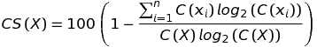
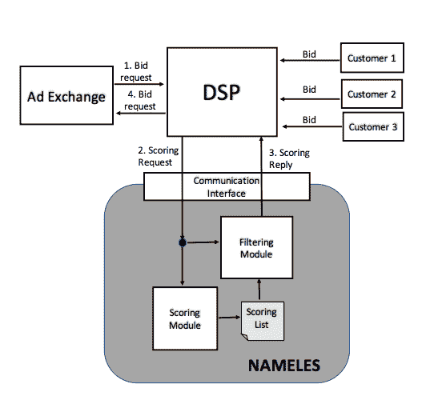

# nameles——基于开源熵的无效流量检测和投标前过滤

> 原文：<https://kalilinuxtutorials.com/nameles/>

Nameles 提供了一个易于部署、可扩展的 IVT 检测和过滤解决方案，该解决方案已被证明能够以高准确度检测广告欺诈和其他类型的无效流量，如网页抓取。

## **Nameles 入门**

```
wget https://raw.githubusercontent.com/Nameles-Org/Nameles/master/setup
chmod +x setup && ./setup
```

## **检测能力**

虽然绝对测量检测能力是不可能的，但 Nameles 是唯一可以由独立方审核的检测解决方案，并得到多份科学论文的支持。

Nameles 可以检测以下设备上的无效流量:

*   移动和桌面
*   显示、视频和应用内

**亦读[recon dog——侦察瑞士军刀](https://kalilinuxtutorials.com/recondog-swiss-army-knife/)**

## **检测方法**

Nameles 使用给定站点从其接收流量的 IP 地址的香农熵来实现高度可扩展的熵测量，然后根据其流量模式为该站点分配标准化分数。

[](https://raw.githubusercontent.com/Nameles-Org/Nameles-logfile/master/CS_formula.png) 熵被广泛应用于金融、智能和其他处理大量数据和许多未知问题的领域。香农熵的使用在数百篇科学论文中有所涉及。有人认为香农是从艾伦·图灵那里得到的，图灵就是用这种方法破解纳粹密码的。

## **系统概述**

无名由两个独立的模块组成

*   评分模块
*   数据处理模块

评分模块根据离群度的统计阈值，用域的置信度得分和域所属的类别来回复 DSP 发送的查询消息。此外，计分模块将消息转发给数据处理模块，用于在一天结束时更新分数。

*图 1:使用 DSP 的示例部署*

[](https://camo.githubusercontent.com/206ac17766461c0f5020db696a2cda1e9b2a255d/68747470733a2f2f692e696d6775722e636f6d2f6a65744a464c332e706e67) 图 1 给出了 Nameles 功能块的高级表示。此外，该图显示了如何将 Nameles 整合到程序性广告投放链中，作为 DSP 的辅助服务。与 DSP 当前操作的唯一区别在于，作为预投标阶段的一部分，DSP 请求 Nameles 提供每个投标请求的置信度得分。为此，DSP 向 Nameles 发送评分请求(图 3 中的步骤 2)。评分请求包括以下字段:投标请求 id(将域名结果映射到相应的投标请求)、与投标事件相关联的设备的 IP 地址以及提供广告空间的域。该信息包括在 openRTB 协议标准中定义的投标请求中。评分请求被传递给 Nameles 的两个独立模块:评分模块和过滤模块。

### **评分模块**

计分模块运行几个工作线程，从 DSP 端提取查询并推送回复消息。工作线程在共享哈希表中为每条消息执行一次查找。因此，运行计分模块的主机需要最小的存储器和驱动器。我们建议为每个 CPU 设置一个工作线程，并根据您的预期吞吐量负载运行延迟测试，以便为主机确定合适的处理器数量。请注意，您可以在系统中运行多个评分模块，与同一个数据处理模块进行通信。

### **数据处理模块**

数据处理模块用从评分模块接收的数据流执行预计算。数据会定期序列化到 PostgreSQL 数据库中。每天结束时计算分数。该模块的主机将受益于具有大量 RAM 和一定数量的处理器，以便减少得分计算时间。我们建议至少 64GB 内存和 4 个内核。

## **安装名称**

您可以按照下面第 2.1 节中的说明，在单台计算机或多台计算机的集群上安装 unnamed。有两种选择:

*   单一配置部署
*   多配置部署

如果你在多机器 docker 集群/群上安装 Nameles，那么你有两个选择:a)让 docker 为每个服务分配资源 b)你自己分配资源。

### **使用安装脚本安装**

对于在 Ubuntu 或 Debian 系统的单个服务器上运行 Nameles:

```
# download the setup script
wget https://raw.githubusercontent.com/Nameles-Org/Nameles/master/setup

# change the permissions
chmod +x setup

# run the setup script
./setup
```

## **测试安装**

您必须创建另一个 shell，因为在您运行安装程序的 shell 中，现在您将有一个正在运行的 docker 实例。

```
psql -h 127.0.0.1 -p 5430 -U nameles
```

注意:您需要安装 postgreSQL 客户端，详见 1.2 节

## **使用名称**

dsp 仿真器模块可用作基础设施名称接口的示例，即消息格式化和 zeromq 端口绑定。延迟测试源代码是用 C++实现的，但是也可以使用 zeromq 可用的不同语言。

### **重启**

#### **单一配置安装**

如果运行 Nameles 的计算机重新启动或由于其他原因中断，您可以使用以下命令重新启动:

```
sudo docker-compose -f ~/Nameles/nameles-docker-compose.yml up
```

#### **多重配置安装**

请注意，在每个命令之后，您必须启动一个新的 shell，因为当前的 shell 中运行着一个容器。

```
 sudo docker-compose -f ~/Nameles/data-docker-compose.yml up
  sudo docker-compose -f ~/Nameles/scoring-docker-compose.yml up
  sudo docker-compose -f ~/Nameles/emulator-docker-compose.yml up
```

[](https://github.com/Nameles-Org/nameles)