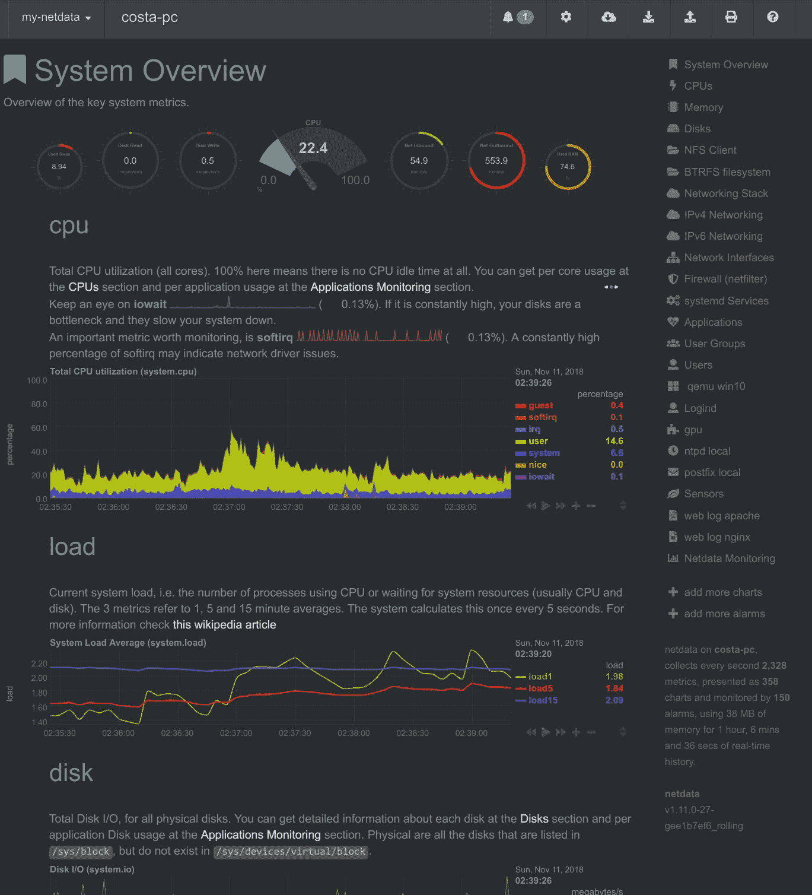
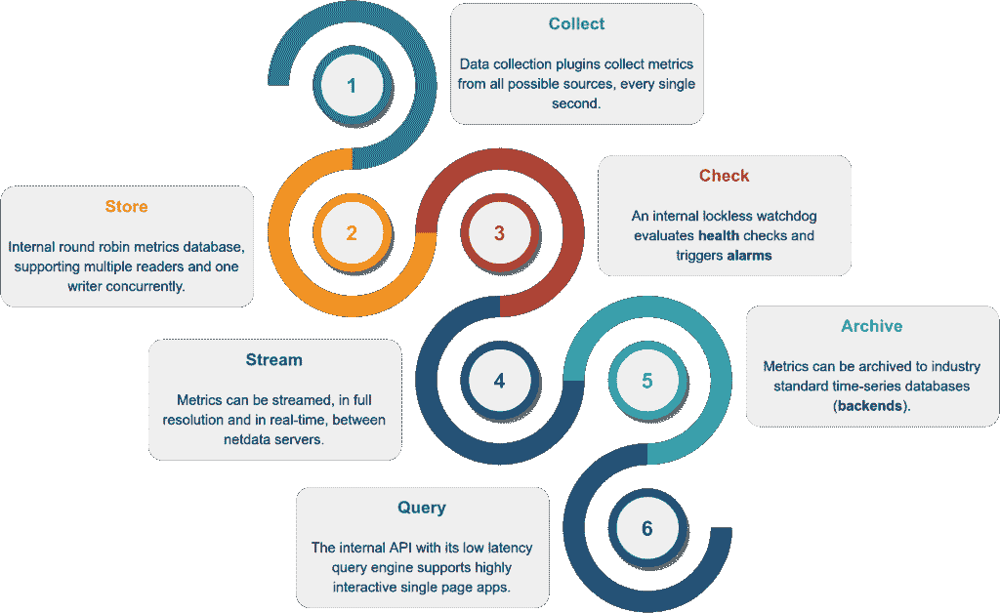
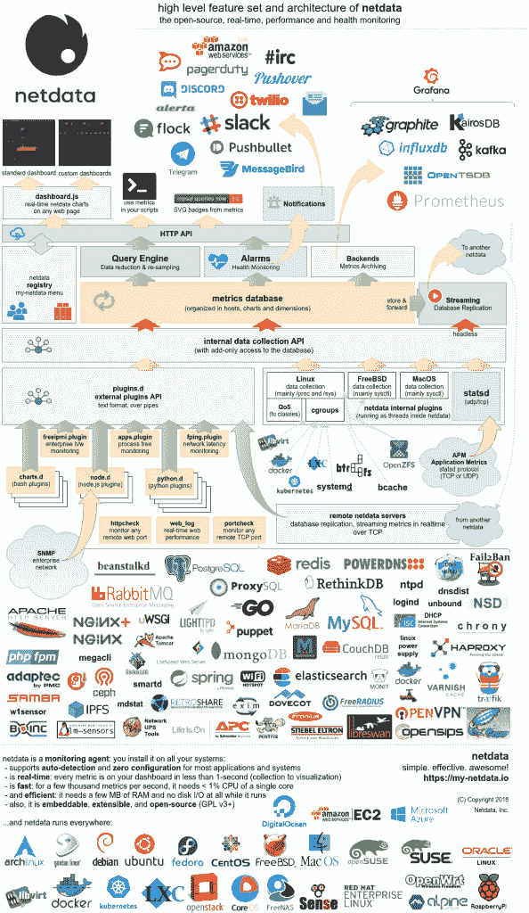
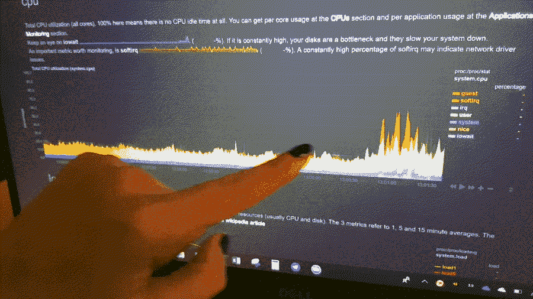
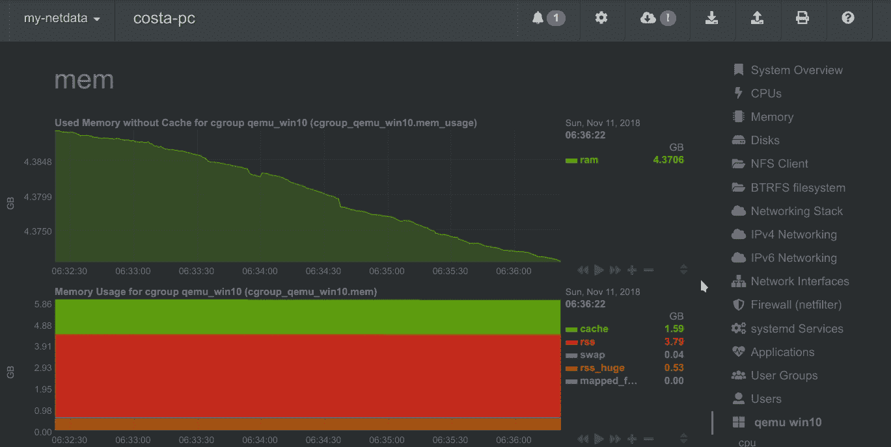
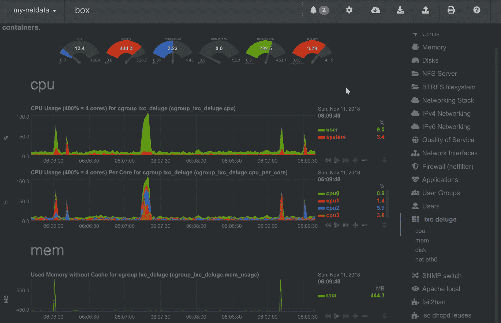
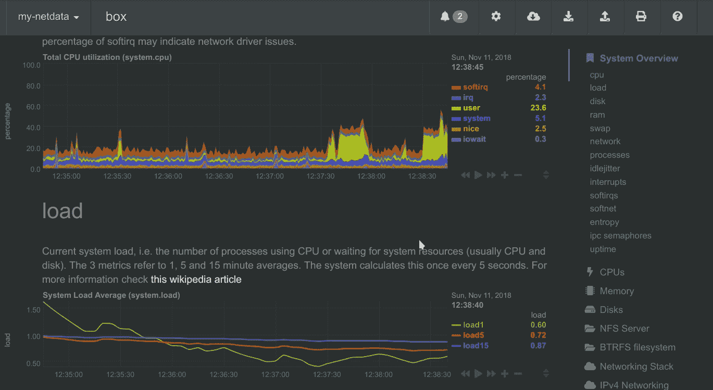

# NetData:实时性能监控工具

> 原文：<https://kalilinuxtutorials.com/netdata-performance-monitoring/>

Netdata 是针对系统和应用程序的分布式实时性能和健康监控。它是一个高度优化的监控代理，安装在您的所有系统和容器上。

Netdata 使用高度交互式的 web 仪表板，实时提供无与伦比的洞察力，了解其运行的系统(包括 web 服务器、数据库、应用程序)上发生的一切。

它可以自主运行，无需任何第三方组件，也可以集成到现有的监控工具链中(Prometheus、Graphite、OpenTSDB、Kafka、Grafana 等)。

Netdata 快速高效，旨在永久运行在所有系统(物理和虚拟服务器、容器、物联网设备)上，而不会中断其核心功能。

Netdata 是免费的开源软件，目前可以在 Linux、FreeBSD 和 MacOS 上运行。

Netdata 是云计算原生计算基金会(CNCF)的一员，是排名第三的开源项目。查看 CNCF TOC Netdata 演示。

人们会对网络数据上瘾。一旦在您的系统上使用它，就没有回头路了！你已经被警告了..

Few tweets about netdata

**也读作-[ISF:工业控制系统开发框架](https://kalilinuxtutorials.com/industrial-control-system/)**

**看起来怎么样**

下图显示了典型 netdata 控制面板的顶部。

典型的 netdata 仪表盘，1:1 计时。拖动图表可以平移，用 **SHIFT +鼠标滚轮**放大/缩小，用 **SHIFT +鼠标选择**可以选择一个区域进行放大。

Netdata 具有高度的交互性和实时性，为完成工作进行了优化！

几个在线演示来体验它[现场](https://my-netdata.io)

**用户群**

全世界有成千上万的用户在使用 Netdata。查看我们的 GitHub 观察者列表。你会发现有人为亚马逊、Atos、百度、思科系统、思杰、德国电信、DigitalOcean、Elastic、EPAM Systems、爱立信、谷歌、Groupon、Hortonworks、惠普、华为、IBM、微软、NewRelic、Nvidia、Red Hat、SAP、Selectel、TicketMaster、Vimeo 等等公司工作！

**注册表**

当您安装多个 netdata 时，它们通过 netdata 注册表集成到一个分布式应用程序中。这是一项网络浏览器功能，它允许我们统计安装的唯一用户和唯一 netdata 服务器的数量。

**快速启动**

您可以使用以下命令在 Linux 机器(物理、虚拟、容器、物联网)上快速安装 netdata:

**确保你为你的 shell 运行 bash
bash
安装 netdata，直接从 github 源
bash<(curl-Ss https://my-netdata.io/kickstart.sh)**

上述命令将:

*   在您的系统上安装任何必需的软件包(在这样做之前会要求您确认)，
*   编译它，安装它并启动它

要在 docker 容器中尝试 netdata，请运行以下命令:

**docker run-d–name = net data \
-p 19999:19999 \
-v/proc:/host/proc:ro \
-v/SYS:/host/SYS:ro \
-v/var/run/docker . sock:/var/run/docker . sock:ro \
–cap-add SYS _ PTRACE \
–security-opt apparmor = unconned \
net data/net data**

**为什么选择 Netdata？**

Netdata 有一种完全不同的监控方法。

Netdata 是安装在所有系统上的监控代理。它是:

*   指标收集器——用于系统和应用程序指标(包括 web 服务器、数据库、容器等)
*   时序数据库—全部存储在内存中(运行时不接触磁盘)
*   指标可视化工具–超快速、交互式、现代化，针对异常检测进行了优化
*   警报通知引擎——用于检测性能和可用性问题的高级看门狗

所有这些都打包在一个非常灵活、高度模块化的分布式应用程序中。

以下是 netdata 与其他监控解决方案的比较:

| **网络数据** | **其他(开源和商业)** |
| **高分辨率指标** (1s 粒度) | 低分辨率指标(最多 10 秒粒度) |
| 监控一切，**每个节点数以千计的指标** | 只监控几个指标 |
| UI 超快，针对异常检测进行了优化 | UI 只适用于抽象视图 |
| 有意义的演示，帮助您理解指标 | 在开始之前，您必须了解指标 |
| 安装并立即获得结果 | 要得到有用的结果，需要长时间的准备 |
| 使用它来解决性能问题 | 使用它们来获得过去性能的统计数据 |
| 终止跟踪性能问题的控制台 | 排除故障时总是需要控制台 |
| 不需要专用资源 | 需要大量专用资源 |

Netdata 是开源的、免费的、超快的、非常容易的、完全开放的、极其高效的、灵活的和可集成的。

它由系统管理员、开发人员和开发人员设计，用于解决性能问题，而不仅仅是可视化指标。

**工作原理**

Netdata 是一个高效、高度模块化的指标管理引擎。它的无锁设计使它非常适合对指标进行并发操作。

它是这样工作的:

*   **收集**:多个独立的数据收集工作者使用每个应用程序的最佳协议从其来源收集指标，并将指标推送到数据库。每个数据收集工作者对其收集的指标具有无锁写访问权限。
*   **Store** :指标存储在循环数据库(环形缓冲区)的 RAM 中，使用定制的浮点数以最小化内存占用。
*   **检查**:一个无锁的独立监视程序正在对收集的指标进行健康检查，触发警报，维护健康事务日志，并发送警报通知。
*   **流**:一个无锁的独立工作人员正在将收集到的全部详细信息实时地传输到远程 netdata 服务器。
*   **归档**:一个无锁的独立工作者正在对指标进行下采样，并将它们推送到后端时序数据库。
*   **查询**:多个独立的工作器连接到内部 web 服务器，为 API 请求提供服务，包括数据查询。

结果是一个高效、低延迟的系统，在每个指标上支持多个读取器和一个写入器。

**信息图**

这是对 netdata 功能集和体系结构的高度概述。
点击它与它互动(它有直接链接到文档)。

**特性**

这是您对 Netdata 的期望:

**通用**

*   **1s 粒度**–所有指标的最高可能分辨率。
*   **无限制指标**–收集所有可用指标，越多越好。
*   **单核 CPU 利用率为 1%**–速度超快，优化程度令人难以置信。
*   **几兆内存**–默认情况下，它使用 25MB 内存。[你量一下](https://github.com/netdata/netdata/blob/master/database)。
*   **零磁盘 I/O**——运行时不加载或保存任何东西(除了`error`和`access`日志)。
*   **零配置**–自动检测一切，每台服务器开箱即可收集多达 10000 项指标。
*   **零维护**–您只需运行它，其余的由它来完成。
*   **零依赖性**–它甚至是自己的 web 服务器，用于静态 web 文件和 web API(尽管其插件可能需要额外的库，这取决于所监控的应用程序)。
*   **无限扩展**–您可以将其安装在您的所有服务器、容器、虚拟机和物联网上。默认情况下，指标不是集中的，因此没有限制。
*   **几种操作模式**–自主主机监控(默认)、无头数据收集器、转发代理、存储和转发代理、中央多主机监控，所有可能的配置。每个节点可能有不同的指标保留策略，并在有或没有健康监控的情况下运行。

**健康监测&警报**

*   **高级警报**:自带数百种警报，开箱即用！支持动态阈值、滞后、警报模板、多种基于角色的通知方法。
*   **通知:** alerta.io、亚马逊 sns、discordapp.com、邮箱、flock.com、irc、kavenegar.com、messagebird.com、pagerduty.com、prowl、pushbullet.com、pushover.net、rocket.chat、slack.com、smstools3、syslog、telegram.org、twilio.com、web 和自定义通知。

**集成**

*   时间序列数据库—可以将其指标归档到 graphite、opentsdb、prometheus、json 文档数据库，分辨率相同或更低(更低:防止由于收集的数据量而导致这些服务器拥塞)。

**可视化**

*   令人惊叹的交互式仪表盘–鼠标、触摸板和触摸屏友好，有两种主题:石板色(深色)和白色。
*   惊人的快速可视化–在不到 1 毫秒的时间内对每个指标的所有查询做出响应，即使在低端硬件上也是如此。
*   视觉异常检测–仪表盘针对视觉异常检测进行了优化。
*   可嵌入——它的图表可以嵌入到你的网页、维基和博客中。你甚至可以使用 Atlassian 的 Confluence 作为监控仪表板。
*   可定制–可以使用简单的 HTML(不需要 javascript)构建定制仪表板。

**正值和负值**

为了提高图表的清晰度，netdata 仪表盘显示代表读取、输入、入站、接收的指标的正值，以及代表写入、输出、出站和发送的指标的负值。

显示网络接口的带宽和数据包的网络数据图表。**接收的**为正，**发送的**为负。

**自动缩放 y 轴**

Netdata 图表自动垂直缩放，以直观显示每个指标在可见时间范围内的变化。

从零开始的堆积图，当选择一个维度时，会自动切换到自动缩放的面积图。

**图表同步**

netdata 仪表板上的图表相互同步。没有主图表。任何图表都可以随时平移或缩放，所有其他图表也会随之平移或缩放。

通过用鼠标拖动图表来平移图表。当鼠标指针位于图表上方时，可以使用 SHIFT +鼠标滚轮放大/缩小图表。

通过 my-netdata 菜单导航时，可视时间范围(平移和缩放)从 netdata 服务器传播到 netdata 服务器。

**高亮显示的时间范围**

为了改进跨图表的视觉异常检测，用户可以在所有图表上突出显示一个时间范围(通过按下 **ALT +鼠标选择**)。

通过在任何图表上按 ALT +鼠标选择，可以给出突出显示的时间范围。Netdata 将在所有图表上突出显示相同的范围。

当通过 **my-netdata** 菜单导航时，突出显示的范围从 netdata 服务器传播到 netdata 服务器。

**它监控什么**

Netdata 数据收集是可扩展的——您可以监控任何您可以获得指标的内容。它的插件 API 支持所有编程语言(任何东西都可以是网络数据

plugin、BASH、python、perl、node.js、java、Go、ruby 等)。

*   为了获得更好的性能，大多数系统相关的插件(cpu、内存、磁盘、文件系统、网络等)都是用 c 语言编写的。
*   为了更快的开发和更容易的贡献，大多数应用程序相关的插件(数据库、web 服务器等)都是用 python 编写的。

**APM(应用性能监控)**

*   statsd–net data 是一个全功能的 statsd 服务器。
*   Go expvar——使用 exp var 包收集用 Go 编程语言编写的应用程序公开的指标。
*   Spring Boot——监视器运行 Java Spring Boot 应用程序，这些应用程序使用 Spring Boot 库中包含的 Spring Boot 致动器来公开它们的度量。
*   uWSGI–从 uw SGI 应用程序收集性能指标。

**系统资源**

*   CPU 利用率–总 CPU 利用率和每核心 CPU 利用率。
*   中断–总中断数和每个内核的 CPU 中断数。
*   软中断–总软中断和每个内核软中断。
*   SoftNet–与网络活动相关的总的和每个核心的软中断。
*   CPU 节流–收集每个核心的 CPU 节流。
*   CPU 频率–收集当前的 CPU 频率。
*   CPU 空闲–收集每个处理器状态花费的时间。
*   idle jitter–测量 CPU 延迟。
*   熵——随机数池，用于密码学。
*   进程间通信——IPC——如信号量和信号量数组。

**内存**

*   ram–收集有关 RAM 使用的信息。
*   交换–收集关于交换内存使用的信息。
*   可用内存–收集用户空间进程可用的 RAM 数量。
*   提交的内存–收集提交给用户空间进程的 RAM 量。
*   页面错误–收集系统页面错误(主要和次要)。
*   写回内存–收集系统脏内存和写回活动。
*   大页面–收集用于大页面的 RAM 量。
*   KSM–收集关于内核相同合并的信息(内存重复数据删除)。
*   Numa-在支持 Numa 的系统上收集 Numa 信息。
*   slab——收集关于 Linux 内核内存使用的信息。

**磁盘**

*   块设备—每个磁盘:I/O、操作、积压、利用率、空间等。
*   b cache–SSD 缓存设备的详细性能。
*   磁盘空间–监控磁盘空间使用情况。
*   mdstat–软件 RAID。
*   HDD temp–磁盘温度。
*   smartd–磁盘 S.M.A.R.T 值。
*   设备映射器–命名磁盘。
*   VERITAS Volume Manager–命名磁盘。
*   mega CLI–适配器、物理驱动器和电池状态。
*   adaptec _ raid–逻辑和物理设备健康指标。

**文件系统**

*   Bt rfs–详细的磁盘空间分配和使用情况。
*   ceph–OSD 使用情况、池使用情况、对象数量等。
*   NFS 文件服务器和客户端—NFS v2、v3、v4: I/O、缓存、预读、RPC 调用
*   Samba——Samba SMB2 文件共享的性能指标。
*   ZFS—详细的性能和资源使用情况。

**联网**

*   网络堆栈——网络堆栈的所有内容(所有协议的 IPv4 和 IPv6:TCP、UDP、SCTP、UDPLite、ICMP、多播、广播等)和所有网络接口(每个接口:带宽、数据包、错误、丢弃)。
*   Netfilter——关于 netfilter 连接跟踪器的一切。
*   syn proxy–收集关于 linux SYNPROXY (DDoS)的性能数据。
*   NFacct–从 iptables 收集会计数据。
*   网络服务质量——实时可视化网络 tc 类的唯一工具
*   FPing–测量任意数量的主机之间的延迟和数据包丢失。
*   ISC dhcpd–泳池利用、租赁等。
*   AP–收集 Linux 接入点性能数据(hostapd)。
*   SNMP–SNMP 设备也可以被监控(尽管您需要配置这些设备)。
*   port _ check–检查 TCP 端口的可用性和响应时间。

**虚拟专用网**

*   OpenVPN–收集每个隧道的状态。
*   libres wan–收集每个 IPSEC 隧道的指标。
*   Tor–收集 Tor 流量统计数据。

**流程**

*   系统进程–运行、阻塞、分叉、活动。
*   应用程序–通过对进程树进行分组，并报告每个进程组的 CPU、内存、磁盘读取、磁盘写入、交换、线程、管道、套接字。
*   systemd–使用 CGROUPS 监控 systemd 服务。

**用户**

*   用户和用户组资源使用情况–通过总结每个用户和组的进程树，报告:CPU、内存、磁盘读取、磁盘写入、交换、线程、管道、套接字
*   logind–收集连接的会话、用户和座位。

**容器和虚拟机**

*   containers——使用 CGROUPS (systemd-nspawn、lxc、lxd、docker、kubernetes 等)收集各种容器的资源使用情况。
*   lib virt VMs–使用 CGROUPS 收集各种虚拟机的资源使用情况。
*   docker–收集 docker 运行状况指标。

**网络服务器**

*   Apache 和 light tpd–mod-status(v 2.2、v2.4)和缓存日志统计，适用于多台服务器。
*   IPFS——带宽，同行。
*   LiteSpeed–读取 litespeed rtreport 文件以收集指标。
*   nginx–存根状态，用于多台服务器。
*   nginx+–连接到多个 nginx_plus 服务器(本地或远程)以收集实时性能指标。
*   PHP-FPM–多个实例，每个报告连接、请求、性能等。
*   Tomcat——访问、线程、空闲内存、卷等。
*   web 服务器访问. log 文件–实时提取 web 服务器和代理性能指标，并应用若干健康检查等。
*   HTTP 检查–检查一个或多个 web 服务器的 HTTP 状态代码和返回的内容。

**代理、平衡器、加速器**

*   ha proxy–带宽、会话、后端等。
*   squid——多个服务器，每个服务器显示:客户端带宽和请求，服务器带宽和请求。
*   Traefik–连接到多个 traefik 实例(本地或远程)以收集 API 度量(响应状态代码、响应时间、平均响应时间和服务器
*   正常运行时间)。
*   清漆–线程、会话、点击、对象、后端等。
*   IPVS——从 Linux IPVS 负载平衡中收集指标

**数据库服务器**

*   couch db——读/写、请求方法、状态代码、任务、复制、每数据库等。
*   MemCached——多个服务器，每个显示:带宽、连接、项目等。
*   MongoDB——操作、客户端、事务、游标、连接、断言、锁等。
*   MySQL 和 Maria db–多个服务器，每个服务器显示:带宽、查询/秒、处理程序、锁、问题、tmp 操作、连接、binlog 指标、线程、innodb
*   PostgreSQL–多个服务器，每个服务器显示:每个数据库的统计数据(连接、读取-写入-返回的元组、事务、锁)、后端进程，
*   索引、表格、预写、后台编写器等等。
*   代理 SQL–收集代理 SQL 后端和前端性能指标。
*   redis–多个服务器，每个服务器显示:操作、命中率、内存、密钥、客户端、从属服务器。
*   RethinkDB–连接到多个 rethink db 服务器(本地或远程)以收集实时指标。

**消息代理**

*   beanstalkd–全局和每管监控。
*   rabbit MQ–性能和健康指标。

**搜索和索引**

*   elastic search——搜索和索引性能、延迟、计时、集群统计、线程统计等。

**DNS 服务器**

*   bind _ rndc–解析 named.stats 转储文件以收集实时性能指标。支持 bind 以后的所有版本。
*   DNS dist–性能和运行状况指标。
*   ISC 绑定(命名)–多个服务器，每个显示:客户端，请求，查询，更新，失败和几个每视图指标。9.9.10 之后的所有 bind 版本
*   受到支持。
*   NSD-查询、区域、协议、查询类型、传输等。
*   PowerDNS–查询、回答、缓存、延迟等。
*   未绑定–性能和资源使用指标。
*   DNS _ query _ time–DNS 查询时间统计

**时间服务器**

*   chrony–使用 chronyc 命令收集 chrony 统计数据(频率、上次失调、均方根失调、残余频率、根延迟、根色散、偏斜、系统时间)。
*   ntpd——连接到多个 ntpd 服务器(本地或远程),以提供系统变量和可选的对等变量的统计数据。

**邮件服务器**

*   dovecot–pop 3/IMAP 服务器。
*   exim–消息队列(电子邮件排队)。
*   postfix–消息队列(条目，大小)。

**硬件传感器**

*   IPMI-企业硬件传感器和事件。
*   lm 传感器——温度、电压、风扇、功率、湿度等。
*   Nvidia–为 Nvidia GPUs 收集信息。
*   RPi–树莓 Pi 温度传感器。
*   w1 传感器–从连接的单线传感器收集数据。

**上升**

*   APC USD–负载、充电、电池电压、温度、效用指标、输出指标
*   螺母-负载、充电、电池电压、温度、效用指标、输出指标
*   Linux 电源–收集 Linux 上电源驱动程序报告的指标。

**社交共享服务器**

*   逆向共享–连接到多个逆向共享服务器(本地或远程)以收集实时性能指标。

**安全**

*   Fail2Ban–监视 fail 2 ban 日志文件，以检查所有活动监狱的所有禁令。

**认证、授权、计费(AAA、RADIUS、LDAP)服务器**

*   FreeRadius—使用 radclient 命令提供 FreeRadius 统计信息(身份验证、记帐、代理身份验证、代理记帐)。

**电话服务器**

*   opensips–连接到 open sips 服务器(仅限本地主机)以收集实时性能指标。

**家用电器**

*   SMA 网络盒–连接到多个远程 SMA 网络盒，以收集光伏(太阳能)发电的实时性能指标。
*   Fronius–连接到多个远程 Fronius Symo 服务器，以收集光伏(太阳能)发电的实时性能指标。
*   StiebelEltron–使用互联网服务网关(ISG 网络)从您的 StiebelEltron 供暖系统收集温度和其他指标。

**游戏服务器**

*   SpigotMC——监控 SpigotMC《我的世界》服务器每秒的滴答数和使用《我的世界》远程控制台的在线玩家数量。

**分布式计算**

*   BOINC——使用远程 GUI RPC 界面监控本地和远程 BOINC 客户端软件的任务状态。还为一些错误情况提供警报。

**流媒体服务器**

*   IceCast–收集活动源的侦听器数量。

**监控系统**

*   Monit—收集有关 monit 目标(文件系统、应用程序、网络)的指标。

**供应系统**

*   Puppet——连接到多个 Puppet 服务器和 Puppet DB 实例(本地或远程),以收集实时状态指标。

通过使用任何计算机语言编写从任何来源收集数据的插件，可以很容易地扩展 Netdata。

[**Download**](https://github.com/netdata/netdata)