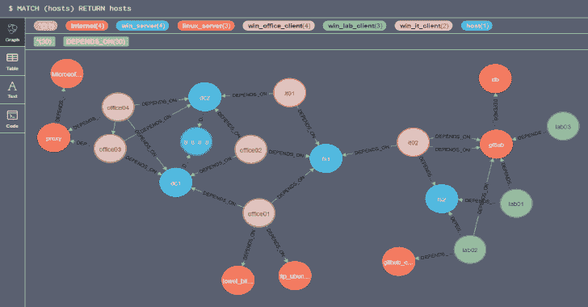

# Netstat2Neo4J:用 Neo4J 实现 Netstat 可视化

> 原文：<https://kalilinuxtutorials.com/netstat2neo4j-netstat-visualization-neo4j/>

Netstat2Neo4J 创建 cypher 的工具从多台机器的 Netstat 文件中为 Neo4J 创建语句。

图表有助于发现大型数据集中的异常和模式。这个脚本从多台主机获取 netstat 信息，并以一种可以导入 Neo4j 的方式对其进行格式化。可以通过查询 Neo4j 来查找与特定主机的连接、特定主机的连接、使用情况或协议等等。

**示例文件**

示例目录中已经有一些文件可供您测试该工具。您还可以找到示例查询，它将帮助您对搜索的可能性有一个基本的概念

**状态**

目前，该工具通过使用命令“netstat -an”对 Windows 系统的 netstat 输出进行测试

**设置**

**安装坞站和坞站-复合**

[https://docs . docker . com/install/Linux/docker-ce/centos/](https://docs.docker.com/install/linux/docker-ce/centos/)
[https://docs . docker . com/compose/install/](https://docs.docker.com/compose/install/)

**也读作-[XML 外部实体-XXE 注入有效载荷列表](https://kalilinuxtutorials.com/xml-external-entity-xxe-injection-payload-list/)**

**提取文件**

**git 克隆 https://github.com/trinitor/netstat2neo4j.git/opt/net stat 2 neo 4j/**

**启动容器**

**CD/opt/netstat 2neo 4j/docker
docker—合成 up -d**

**测试登录**

[https://IP:7473](https://ip:7473)
用户名: neo4j
**密码:** neo4j

**上传 Netstat 文件**

复制所有 netstat 输出文件(*。txt 文件)放入/opt/net stat 2 neo 4j/script/import/

**为 Neo4j 创建密码语句**

**CD/opt/net stat 2 neo 4j/script/
bash cs v2 neo 4j . sh**

所需的密码语句可以在 create_database.txt 中找到

**创建数据库**

*   浏览到 [https://localhost:7473](https://localhost:7473)
*   从 create_database.txt 复制内容
*   粘贴到 neo4j 界面的命令栏中

**示例查询**

**MATCH(src)-[:DEPENDS _ ON]->(dst)
其中 src.ip 以' 192_168_'
返回 src，dst**

在示例文件夹中也有一个 query.txt。

**问&答**

**问:**这是多余的。你不知道还有其他项目吗？
**答:**我愿意。这并不新鲜，也不特别。有免费的项目，教程和基于代理的商业产品来绘制地图，甚至执行规则。一些例子:

*   [https://www.tanium.com/products/map/](https://www.tanium.com/products/map/)
*   [https://www.illumio.com/](https://www.illumio.com/)
*   [https://www.cisco.com/c/en/us/products/security/tetration/](https://www.cisco.com/c/en/us/products/security/tetration/)

这个小项目绝不是替代品。

问:在所有机器上创建 netstats 很难。你有解决办法吗？
**答:**虽然你可以用 WMI/PowerShell remoting 收集信息，但我不建议你在所有系统上拥有完全管理权限的帐户。
使用您的配置管理来计划 netstat 创建或使用计划任务。这超出了这个小项目的范围。
如果你想用一个账号拥有 kindom 的所有钥匙:
[https://ijustwannared . team/2019/04/22/network-connection-footprinting-with-wmi-and-neo4j/](https://ijustwannared.team/2019/04/22/network-connection-footprinting-with-wmi-and-neo4j/)

**问:**你肯定错了。Neo4j 必须能够直接读取 CSV 文件。你为什么要自己创建报表？
**答:**你说得对。可以直接导入 CSV 文件。
[https://neo4j.com/developer/guide-import-csv/](https://neo4j.com/developer/guide-import-csv/)

[**Download**](https://github.com/trinitor/netstat2neo4j)