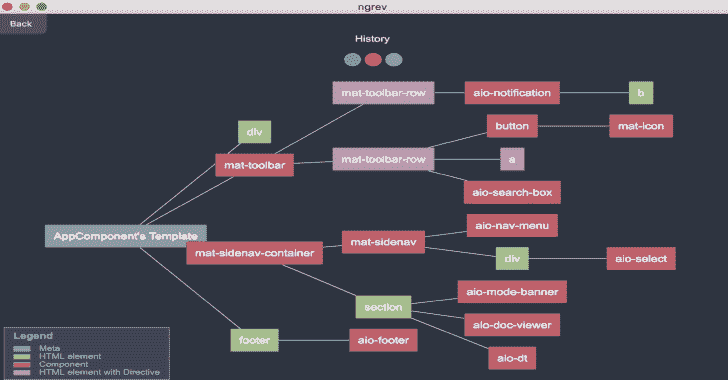

# Ngrev:角度应用逆向工程工具

> 原文：<https://kalilinuxtutorials.com/ngrev-reverse-engineering-angular-applications/>

用于角度项目逆向工程的图形工具。Ngrev 允许您在应用程序的结构中导航，并观察不同模块、提供者和指令之间的关系。该工具执行**静态代码分析**，这意味着你**不必为了使用它而运行你的应用**。

**如何使用？**

**苹果电脑**

*   转到[发布页面](https://github.com/mgechev/ngrev/releases)。
*   下载最新的`***.dmg**`文件。
*   安装应用程序。

**Linux**

*   转到[发布页面](https://github.com/mgechev/ngrev/releases)。
*   下载最新的`***.AppImage**`文件。
*   运行`***.AppImage**`文件(你可能需要`**chmod +x *.AppImage**`)。

**窗户**

*   转到[发布页面](https://github.com/mgechev/ngrev/releases)。
*   下载最新的`***.exe**`文件。
*   安装应用程序。

RetDec : RetDec 是一个基于 LLVMT3 的可重定向的机器代码反编译器

**创建自定义主题**

你可以通过在电子版`**[userData]/themes**`中创建一个`**[theme-name].theme.json**`文件来添加你自己的主题。主题示例见[黑暗](https://github.com/mgechev/ngrev/blob/master/app/dark.theme.json)。

**应用需求**

您的应用程序需要与 Angular 的 AoT 编译器兼容(也就是说，您应该能够用`ngc`编译它)。

**使用带角度的 CLI**

*   打开 Angular 的应用程序目录。
*   确保安装了依赖项。
*   打开`**ngrev**`。
*   点击`**Select Project**`并选择`**[YOUR_CLI_APP]/src/tsconfig.app.json**`。

**使用有角种子**

*   打开 Angular 的应用程序目录。
*   确保安装了依赖项。
*   打开`**ngrev**`。
*   点击`**Select Project**`并选择`**[YOUR_CLI_APP]/src/client/tsconfig.json**`。

**演示**

[https://www.youtube.com/embed/sKdsxdeLWjM?feature=oembed&enablejsapi=1](https://www.youtube.com/embed/sKdsxdeLWjM?feature=oembed&enablejsapi=1)

[**Download**](https://github.com/mgechev/ngrev)