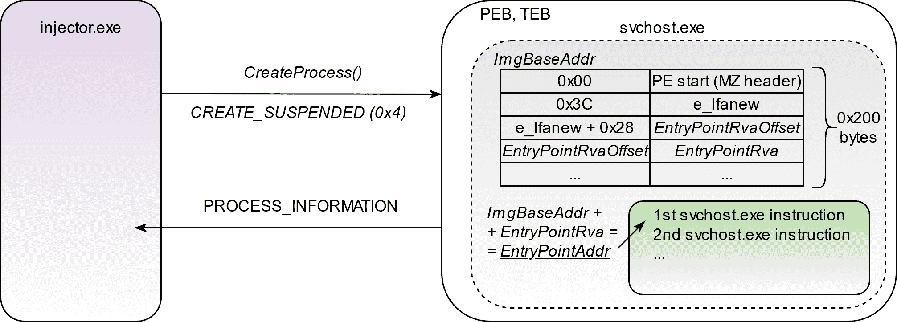
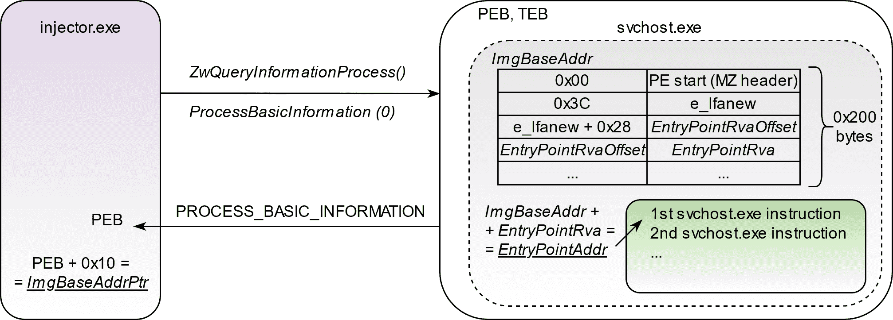
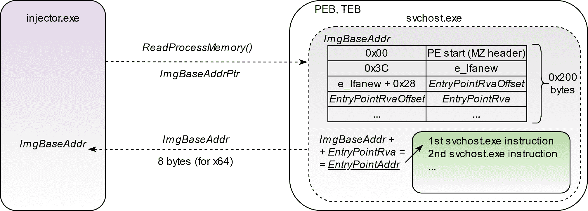
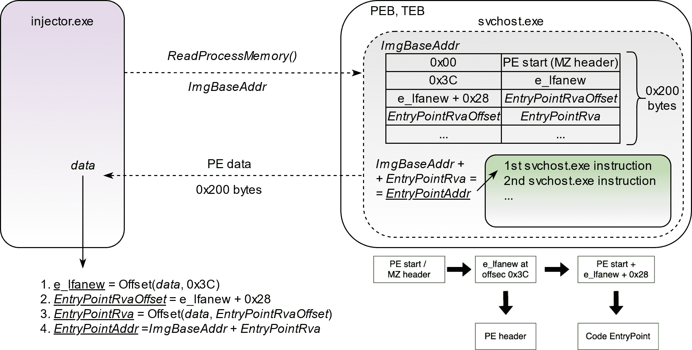
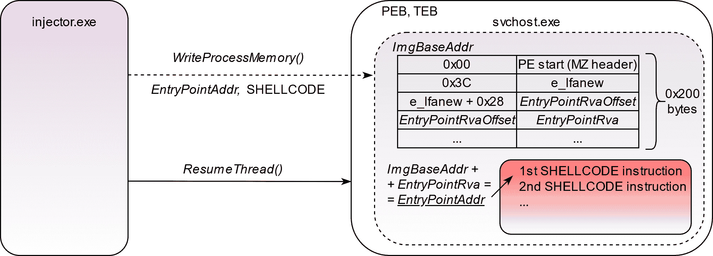

# NimHollow:使用 Syscalls (PoC)实现进程中空化的 Nim 实现

> 原文：<https://kalilinuxtutorials.com/nimhollow/>

NimHollow 是使用 Syscalls (PoC)的进程中空化的 Nim 实现。用 Nim 玩工艺镂空技术。

**特性**

*   使用 NimlineWhispers 或 NimlineWhispers2 触发 Windows 本机 API 函数的直接系统调用。
*   在 CTR 模式下使用 AES 进行外壳代码加密/解密。
*   简单的沙盒检测方法，来自@offensive-security 的 OSEP 课程。

**免责声明。**本库中包含的所有信息仅用于教育和研究目的。作者对该工具的任何非法使用不负任何责任。

**用法**

**安装**

**~ $ git clone–recurse-submodules https://github.com/snovvcrash/NimHollow&&CD nim hollow
~ $ git submodule update–init–recursive
~ $ nimble install winim nim crypto
~ $ pip 3 install-r requirements . txt
~ $ sudo apt install upx-y**

**例子**

**~ $ MSF venom-p windows/x64/messagebox TITLE = ' MSF ' TEXT = ' Hack the Planet！'exit func = thread-f raw-o shellcode . bin
~ $ python 3 nim hollow . py shellcode . bin-I ' C:\ Windows \ System32 \ svchost . exe '-o injector–upx–RM[–whispers 2]
~ $ file injector.exe
injector . exe:PE32+可执行文件(控制台)x86-64(剥离到外部 PDB)，用于 MS Windows**

**帮助**

**用法:Nim hollow . py[-h][-I IMAGE][-o OUTPUT][–whispers 2][–debug][–upx][–RM]shellcode _ bin
位置参数:
shellcode_bin 原始 shellcode 文件的路径
可选参数:
-h，–help 显示此帮助消息并退出
-i IMAGE，–IMAGE
将图像处理为中空(默认为“C:\ Windows \ System32 \ svchost . exe”)
-o**

**在载玻片上加工镂空**

1.创建处于挂起状态的目标进程(如`**svchost.exe**`)。

2.查询创建了从 PEB 提取其基址指针的进程( **P** 进程 **E** 环境 **B** 锁)。

3.读取映像基址指针*指向的 8 字节内存(64 位架构),以获取映像基址的实际值。*

4.读取加载的 EXE 映像的 0x200 字节，并解析 PE 结构以获取入口点地址。

5.将外壳代码写入入口点地址，并恢复线程执行。

[**Download**](https://github.com/snovvcrash/NimHollow)