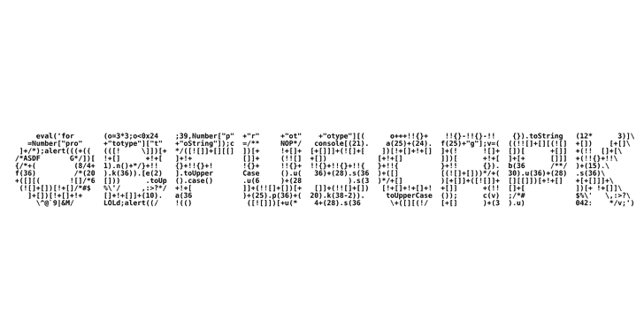

# ninjan droid:Android apk 包的忍者逆向工程

> 原文：<https://kalilinuxtutorials.com/ninjadroid/>

NinjaDroid 是一个简单的逆向工程 Android APK 包的工具。

**$ snap 安装 ninja droid–channel = beta**

**概述**

NinjaDroid 使用 AXMLParser 和一系列基于 **`aapt`、`keytool`、**、`**string**`等的 Python 脚本从给定的 APK 包中提取一系列信息，例如:

*   APK 的文件列表:文件名，大小，MD5，SHA-1，SHA-256 和 SHA-512
*   信息:应用名称，包名称，版本，SDK，权限，活动，服务，广播接收器，…
*   数字证书信息:序列号、有效性、指纹、颁发者和所有者
*   硬编码到 **`classes.dex`** 文件中的 URL、shell 命令和其他通用字符串的列表

此外，NinjaDroid 使用 apktool 和 dex2jar 来提取和存储:

*   JSON 报告文件，其中包含所有提取的 APK 信息
*   `**AndroidManifest.xml**`文件(感谢`**apktool**`)
*   `**CERT.RSA/DSA**`数字证书文件
*   **`classes.dex`** 文件
*   *译自**。罐子*** 文件(感谢`**dex2jar**`)
*   拆解 smali 文件(感谢`**apktool**`)
*   `**assets/**`和`**res/**`文件夹及其内容(感谢`**apktool**`)

**安装**

第一步是克隆 NinjaDroid 库，或者下载它的源代码。

**$ git 克隆 https://github.com/rovellipaolo/NinjaDroid
$ CD 忍者机器人**

NinjaDroid 有几种执行方式:在您的本地环境中，在 Docker 中，作为 Flatpak(实验)和作为 Snap(实验)。

**本土**

要在本地机器上执行 NinjaDroid，需要安装`**Python 3.5**`以上、 **`Java 8`** 以上、 **`binutils`。**

可选的，如果你本地安装了 Android SDK，你可以使用 SDK 版本的`aapt`来代替自带的。为此，您需要更改`**ninjadroid/aapt/Aapt.py**`中的`**aapt**`位置(即 **`__AAPT_EXEC_PATH = "ninjadroid/aapt/aapt"`)。**

**Linux**

只需启动以下命令，这将安装所有的 Python 依赖项(确保`**aapt**`、`**apktool**`和`**dex2jar**`有可执行的权限)并添加一个**、`ninjadroid`符号链接**到`**/usr/local/bin/**`。

**$ make build-Linux
$ make install
$ ninja droid-help**

**苹果电脑**

只需启动以下命令，这将安装所有需要的 Python 依赖项(确保`**aapt**`、`**apktool**`和`**dex2jar**`具有可执行权限)并添加一个`**ninjadroid**`符号链接到**、`/usr/local/bin/`。**

**$ make build-MAC OS
$ make install
$ ninja droid-help**

**码头工人**

要在 Docker 中执行 NinjaDroid，需要安装`**Docker**`。

要构建 Docker 映像，请启动以下命令:

**$ make build-docker
$ docker run–name ninja droid ninja droid:最新的 ninja droid–help**

注意，您需要将包含目标 APK 包的目录绑定到 Docker 映像:

**$ mkdir apks
$ CP/path/to/your/package . apk apks/package . apk
$ docker run–name ninja droid-it–RM-v $(pwd)/apks:/apks ninja droid:最新 ninja droid/apks/package . apk-aj**

当使用`**-e**` / `**--extract**`选项时，同样的情况也适用于输出目录，您也需要对其授予权限:

**$ mkdir 输出
$ chmod 777
$ docker run–name ninja droid–RM-v $(pwd)/apks:/apks-v $(pwd)/output:/output ninja droid:最新的 ninja droid/apks/package . apk-AE/output**

**Flatpak(实验)**

要将 NinjaDroid 作为 Flatpak 执行，需要安装`**Flatpak**`和`**flatpak-builder**`。

只需启动以下命令，这将安装所有需要的 Flatpak 依赖项:

**$ make build-flat pak
$ flat pak-builder–运行 flat pak/build flat pak/com . github . rovellipolo . ninja droid . YAML ninja droid–help**

**注意:**`**-e**`/`**--extract**`选项目前无法正常工作(见:https://github . com/rovellipolo/ninja droid/issues/21)。

**【Snap(实验)】**

要快速执行 NinjaDroid，需要安装`**Snap**`和`**snapcraf**t`。

只需启动以下命令，这将安装所有需要的快照依赖项:

**$制作安装快照
$制作安装快照
$忍者机器人——帮助**

**注意:**`**-e**`/`**--extract**`选项在没有使用`**--devmode**`选项的情况下安装 snap 时无法正常工作(参见:https://github . com/rovellipolo/ninja droid/issues/20)。

**检查样式**

一旦完成配置(参见 ***“安装”*** 一节)，还可以如下运行 NinjaDroid checkstyle。

**本土**

要在本地计算机上运行 checkstyle，请启动以下命令:

**$ make checkstyle**

**注:**这是使用 **`pylint`** 的暗箱操作。

您还可以通过启动以下命令，在每次 git 提交时自动运行 checkstyle:

**$ make 安装挂钩**

**码头工人**

要在 Docker 中运行 checkstyle，请启动以下命令:

**$使校验和坞站**

**测试**

一旦完成配置(参见*“安装”*一节)，还可以如下运行 NinjaDroid 测试。

**本土**

要在本地计算机上运行单元和回归测试，请启动以下命令:

**$做测试
$做回归**

您也可以通过启动下面的命令来运行覆盖率测试:

**$进行测试覆盖**

**码头工人**

要在 Docker 中运行单元和回归测试，启动以下命令:

**$ make test-docker
$ make regression-docker**

**平袋**

要在 Flatpak 中运行回归测试，请启动以下命令:

**$ make regression-flatpak**

**抓拍**

要在 Snap 中运行回归测试，请启动以下命令:

**$制作回归快照**

**用途**

下面是针对示例 APK 包运行 NinjaDroid 的示例。

**展示 APK 总结**

**$ ninjadroid 回归/data/Example.apk**

**file:regression/data/Example . apk
size:70058
MD5:c 9504 f 487 c8 b 51412 ba 4980 bfe 3c c15 d
sha1:482 a 28812495 b 996 a 92191 fbb 3 be 1376193 ca 59 b
sha 256:8773441 a 656 b 60 C5 e 18481 FD 5 ba 9 C1 BF 356RSA
size:906
MD5:860 e 19 fa 47d 37d 9510 f 1245 c 511 a 8578
sha1:59a 04084 c 0 D5 ef 23 FD 05 f 0 f 429 dab 6267 cc B3 d 0 b
sha 256:0 EFA 622919417 adfa 6 EB 77770 FD 33 BCD 93265 AC 73343695 e 2**

以 JSON 格式显示 APK 扩展信息

**$ ninja droid regression/data/example . apk–all–JSON**

**{
“cert”: {
“file”: “META-INF/CERT.RSA”,
“fingerprint”: {
“md5”: “”,
“sha1”: “5A:C0:6C:32:63:7F:5D:BE:CA:F9:38:38:4C:FA:FF:ED:20:52:43:B6”,
“sha256”: “E5:15:CC:BC:5E:BF:B2:9D:A6:13:03:63:CF:19:33:FA:CE:AF:DC:ED:5D:2F:F5:98:7C:CE:37:13:64:4A:CF:77”,
“signature”: “SHA1withRSA”,
“version”: “3”
},
“issuer”: {
“city”: “City”,
“country”: “XX”,
“domain”: “”,
“email”: “”,
“name”: “Name”,
“organization”: “Organization”,
“state”: “State”,
“unit”: “Unit”
},
“md5”: “860e19fa47d37d9510f1245c511a8578”,
“owner”: {
“city”: “City”,
“country”: “XX”,
“domain”: “”,
“email”: “”,
“name”: “Name”,
“organization”: “Organization”,
“state”: “State”,
“unit”: “Unit”
},
“serial_number”: “558e7595”,
“sha1”: “59a04084c0d5ef23fd05f0f429dab6267ccb3d0b”,
“sha256”: “0efa622919417adfa6eb77770fd33d3bcd93265ac7343695e246dab1a7b6bfee”,
“sha512”: “2a5befcc0bcb14e44d7b7cb4322a76933ad3e90e5e1ffbb87ba31ee7cc0172725dcc98e9d414fb3a207bc107b2a7ca7563b5f954cac6bd41d77e4726c70a95a3”,
“size”: 906,
“validity”: {
“from”: “2015-06-27 10:06:13Z”,
“until”: “2515-02-26 10:06:13Z”
}
},
“dex”: [
{
“file”: “classes.dex”,
“md5”: “7bc52ece5249ccd2d72c4360f9be2ca5”,
“sha1”: “89476799bf92798047ca026c922a5bc33983b008”,
“sha256”: “3f543c68c4c059548cec619a68f329010d797e5e4c00aa46cd34c0d19cabe056”,
“sha512”: “0725f961bc1bac47eb8dd045c2f0a0cf5475fd77089af7ddc3098e341a95d8b5624969b6fa47606a05d5a6adf9d74d0c52562ea41a376bd3d7d0aa3695ca2e22”,
“shell_commands”: [
“set”
],
“size”: 2132,
“strings”: [
“!Lcom/example/app/ExampleService2;”,
“!Lcom/example/app/ExampleService3;”,
“#Landroid/content/BroadcastReceiver;”,
“)Lcom/example/app/ExampleBrodcastReceiver;”,
“*Lcom/example/app/ExampleBrodcastReceiver2;”, “*Lcom/example/app/ExampleBrodcastReceiver3;”,
“*Lcom/example/app/ExampleBrodcastReceiver4;”,
“”,
“Landroid/app/Activity;”,
“Landroid/app/Service;”,
“Landroid/content/Context;”,
“Landroid/content/Intent;”,
“Landroid/os/Bundle;”,
“Landroid/os/IBinder;”,
“Lcom/example/app/ExampleService;”,
“Lcom/example/app/HomeActivity;”,
“Lcom/example/app/OtherActivity;”,
“onBind”,
“onCreate”,
“onReceive”,
“setContentView”
],
“urls”: []
}
],
“file”: “regression/data/Example.apk”,
“manifest”: {
“activities”: [
{
“intent-filter”: [
{
“action”: [
“android.intent.action.MAIN”
],
“category”: [
“android.intent.category.LAUNCHER”
]
}
],
“launchMode”: “1”,
“name”: “com.example.app.HomeActivity”
},
{
“intent-filter”: [
{
“action”: [
“android.intent.action.VIEW”
],
“category”: [
“android.intent.category.DEFAULT”
],
“data”: [
{
“scheme”: “content”
},
{
“scheme”: “file”
},
{
“mimeType”: “application/vnd.android.package-archive”
}
]
}
],
“launchMode”: “1”,
“meta-data”: [
{
“name”: “android.support.PARENT_ACTIVITY”,
“value”: “com.example.app.HomeActivity”
}
],
“name”: “com.example.app.OtherActivity”,
“noHistory”: “true”,
“parentActivityName”: “com.example.app.HomeActivity”
}
],
“file”: “AndroidManifest.xml”,
“md5”: “1f97f7e7ca62f39f8f81d79b1b540c37”,
“package”: “com.example.app”,
“permissions”: [
“android.permission.INTERNET”,
“android.permission.READ_EXTERNAL_STORAGE”,
“android.permission.RECEIVE_BOOT_COMPLETED”,
“android.permission.WRITE_EXTERNAL_STORAGE”
],
“receivers”: [
{
“name”: “com.example.app.ExampleBrodcastReceiver”
},
{
“exported”: false,
“intent-filter”: [
{
“action”: [
“android.intent.action.BOOT_COMPLETED”,
“android.intent.action.MY_PACKAGE_REPLACED”
],
“priority”: “1000”
}
],
“name”: “com.example.app.ExampleBrodcastReceiver2”
},
{
“enabled”: true,
“exported”: false,
“intent-filter”: [
{
“action”: [
“android.intent.action.BROADCAST_PACKAGE_REMOVED”,
“android.intent.action.PACKAGE_ADDED”,
“android.intent.action.PACKAGE_REPLACED”
],
“data”: [
{
“scheme”: “package”
}
],
“priority”: “800”
}
],
“name”: “com.example.app.ExampleBrodcastReceiver3”
},
{
“enabled”: false,
“exported”: true,
“name”: “com.example.app.ExampleBrodcastReceiver4”
}
],
“sdk”: {
“max”: “20”,
“min”: “10”,
“target”: “20”
},
“services”: [
{
“name”: “com.example.app.ExampleService”
},
{
“enabled”: false,
“exported”: true,
“isolatedProcess”: true,
“name”: “com.example.app.ExampleService2”
},
{
“enabled”: true,
“exported”: false,
“isolatedProcess”: false,
“name”: “com.example.app.ExampleService3”
}
],
“sha1”: “011316a011e5b8738c12c662cb0b0a6ffe04ca74”,
“sha256”: “7c8011a46191ecb368bf2e0104049abeb98bae8a7b1fa3328ff050aed85b1347”,
“sha512”: “8c7c1ede610f9c6613418b46a52a196ad6d5e8cc067c2f26b931738ad8087f998d9ea95e80ec4352c95fbdbb93a4f29c646973535068a3a3d584da95480ab45f”,
“size”: 6544,
“version”: {
“code”: 1,
“name”: “1.0”
}
},
“md5”: “c9504f487c8b51412ba4980bfe3cc15d”,
“name”: “Example”,
“other”: [
{
“file”: “res/drawable-hdpi-v4/ic_launcher.png”,
“md5”: “e74dbf28ebab4e1b7442a9c78067d1c2”,
“sha1”: “450d3d44325fdf259810a60e6afa36103e186b3d”,
“sha256”: “9b2639dbfdd60e0dab70e572f39660c8dfabd19b7987a7619d770824db342925”,
“sha512”: “44050c4db6d5275b70856050c0d58d3d9892ba09bd8cf1a8343a3c6d4f2e2af6eae1f8b687efb59b7f8122e5bea1a63e08546fee35124cc0faab40ef6274ab4f”,
“size”: 9193
},
{
“file”: “res/drawable-hdpi-v4/ic_launcher_logo.png”,
“md5”: “e74dbf28ebab4e1b7442a9c78067d1c2”,
“sha1”: “450d3d44325fdf259810a60e6afa36103e186b3d”,
“sha256”: “9b2639dbfdd60e0dab70e572f39660c8dfabd19b7987a7619d770824db342925”,
“sha512”: “44050c4db6d5275b70856050c0d58d3d9892ba09bd8cf1a8343a3c6d4f2e2af6eae1f8b687efb59b7f8122e5bea1a63e08546fee35124cc0faab40ef6274ab4f”,
“size”: 9193
},
{
“file”: “res/drawable-ldpi-v4/ic_launcher.png”,
“md5”: “58b9a42eeb99fad5321208fe02f24375”,
“sha1”: “09ea65885b4080e515ef7064e816c77991c0757b”,
“sha256”: “c4f061b2c758185371f39afcb166ba039e955d3be2619ab5469a1b873f952d0d”,
“sha512”: “415ed16de6fd335b24bd985d9152323d04fc02287acd3f26fa98722832cfecf89cf2c77ad8ae3f5588acc5cac401129ac3b3d714abbf8dcc492ab2fd98f106e5”,
“size”: 2658
},
{
“file”: “res/drawable-ldpi-v4/ic_launcher_logo.png”,
“md5”: “58b9a42eeb99fad5321208fe02f24375”,
“sha1”: “09ea65885b4080e515ef7064e816c77991c0757b”,
“sha256”: “c4f061b2c758185371f39afcb166ba039e955d3be2619ab5469a1b873f952d0d”,
“sha512”: “415ed16de6fd335b24bd985d9152323d04fc02287acd3f26fa98722832cfecf89cf2c77ad8ae3f5588acc5cac401129ac3b3d714abbf8dcc492ab2fd98f106e5”,
“size”: 2658
},
{
“file”: “res/drawable-mdpi-v4/ic_launcher.png”,
“md5”: “acefc1f320111a8d71bcdb8b4aa0656c”,
“sha1”: “23730fd0d5e720d1f719be1afc8c48fa7305da6c”,
“sha256”: “05346d62d4096537906928af523ef9d5997663707a1d48e08f20992584e1424d”,
“sha512”: “59896fc52679e86898dc09b56fb53270d4297c53adee26f864657c5ef4aff9e5f5922dfa9370c3d1748068aa7b1270e0fa8a1323ce3b69c7548a50ca221befc1”,
“size”: 5057
},
{
“file”: “res/drawable-mdpi-v4/ic_launcher_logo.png”,
“md5”: “acefc1f320111a8d71bcdb8b4aa0656c”,
“sha1”: “23730fd0d5e720d1f719be1afc8c48fa7305da6c”,
“sha256”: “05346d62d4096537906928af523ef9d5997663707a1d48e08f20992584e1424d”,
“sha512”: “59896fc52679e86898dc09b56fb53270d4297c53adee26f864657c5ef4aff9e5f5922dfa9370c3d1748068aa7b1270e0fa8a1323ce3b69c7548a50ca221befc1”,
“size”: 5057
},
{
“file”: “res/drawable-xhdpi-v4/ic_launcher.png”,
“md5”: “94f5591633218c0b469b65947fd8943b”,
“sha1”: “502cd84fa444f26d7ecfdf4a355064867977f236”,
“sha256”: “29d15992424b40757135f47fc8ddd15e30c7774646b37755608f7cfec1df7d8a”,
“sha512”: “d5b48e065a614c5a2400b6565dc36777d9923d8d5154487113dd1f46b05d36d1db3f28fb72f61a68fcbd225c93495541579574e6611f650fe2857767412c3b1f”,
“size”: 14068
},
{
“file”: “res/drawable-xhdpi-v4/ic_launcher_logo.png”,
“md5”: “94f5591633218c0b469b65947fd8943b”,
“sha1”: “502cd84fa444f26d7ecfdf4a355064867977f236”,
“sha256”: “29d15992424b40757135f47fc8ddd15e30c7774646b37755608f7cfec1df7d8a”,
“sha512”: “d5b48e065a614c5a2400b6565dc36777d9923d8d5154487113dd1f46b05d36d1db3f28fb72f61a68fcbd225c93495541579574e6611f650fe2857767412c3b1f”,
“size”: 14068
},
{
“file”: “res/layout/main.xml”,
“md5”: “8cdec0105448937475e45e22c80fd611”,
“sha1”: “51ebf14ed21238f7d147a6744cae18c0f55fcbe6”,
“sha256”: “e74db1ac37395ca9fd25b93261d3ab76ed7dfc9b355ea63d856afc7453313738”,
“sha512”: “2d2147365b8b00f2db7498b7f0ed8a360fc15bd43dfd3704b4b1cb912619d9ff1bc35837eb1e601ea6d1aa3a8c0d555f2105d6ed37de919fa128568527765d63”,
“size”: 552
},
{
“file”: “resources.arsc”,
“md5”: “2886f2825eef3b5c4478852935c68640”,
“sha1”: “1eff126288b4bea6fa78eb79832d6a7fa098695e”,
“sha256”: “ac46f54fa12dc20e94619465482186047505fb9f27508861220063c93f0c6c4e”,
“sha512”: “da8c41d0c27839ed89cb06a2f89f6993bd88f5179e97f3291f0e17348868b3e9c106e96f482ecd86f11808170937773e7599ccd338900908359e870ea5446169”,
“size”: 1640
},
{
“file”: “META-INF/MANIFEST.MF”,
“md5”: “6098a6409625f1c0d97cd33c13ad300c”,
“sha1”: “ccfe31190feb259a4a56599ad1403a956f6944b5”,
“sha256”: “8a18f285481346919f4df55f576ee504bf5abecb068a2d642fdef17f3b5cd631”,
“sha512”: “17a68bf605aff149aa31e1b0b81af3d3f74f939e1cb7a10f3eddf84775f901b09ba9722efad1265b0057cdfcd12c6fac701067993081620b00bbfcc4efff3599”,
“size”: 1061
},
{
“file”: “META-INF/CERT.SF”,
“md5”: “fb02917b68510e413a06e52873802bcd”,
“sha1”: “dfb7bbb487010b980152610fe7d669c1b4f626be”,
“sha256”: “e2fa373f8b065ef7c78387ab9242e98dd19bdeb2b768295506295f7beb0bfe3f”,
“sha512”: “3aa74603588ca5c563b6586d1216dc6cea3b8d2a1a47eb189197e8f20cd7508d3e652c7ff849261e95cff52451476b2993caadf051fdf66cc01f5e6e16b180fc”,
“size”: 1114
}
],
“sha1”: “482a28812495b996a92191fbb3be1376193ca59b”,
“sha256”: “8773441a656b60c5e18481fd5ba9c1bf350d98789b975987cb3b2b57ee44ee51”,
“sha512”: “559eab9840ff2f8507842605e60bb0730442ddf9ee7ca4ab4f386f715c1a4707766065d6f0b977816886692bf88b400643979e2fd13e6999358a21cabdfb3071”,
“size”: 70058
}**

提取并存储 APK 条目和信息

**$ ninja droid regression/data/example . apk–all–extract output/**

**忍者机器人:[INFO]正在执行 apktool…
忍者机器人:[INFO]正在创建 output/smali/…
忍者机器人:[INFO]正在创建 output/AndroidManifest.xml…
忍者机器人:[INFO]正在创建 output/res/…
忍者机器人:[INFO]正在创建 output/assets/…
忍者机器人:[INFO]正在执行 dex2jar…
忍者机器人:[INFO]正在创建 output/Example.jar…
dex2jar 回归/数据/example . apk-【t1jRSA…
NinjaDroid: [INFO]提取 DEX 文件…
NinjaDroid: [INFO]创建 output/classes . DEX…
ninja droid:[INFO]生成 JSON 报告文件…
NinjaDroid: [INFO]创建 output/report-example . JSON…**

**注意:**如果不指定输出目录，将在当前工作目录下创建一个 APK 包名的目录。

[**Download**](https://github.com/rovellipaolo/NinjaDroid)