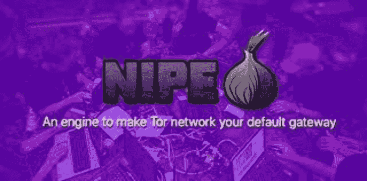

# Nipe:让 Tor Network 成为你默认网关的引擎

> 原文：<https://kalilinuxtutorials.com/nipe/>

Nipe 是一个让 Tor Network 成为你默认网关的引擎。

Tor 项目允许用户通过自己的机制匿名上网、聊天和发送即时消息。它被各种各样的人、公司和组织用于合法活动和其他非法目的。Tor 在很大程度上被情报机构、黑客组织、犯罪活动甚至是在数字世界中关心自己隐私的普通用户所使用。

Nipe 是一个用 Perl 开发的引擎，旨在使 Tor 网络成为您的默认网关。Nipe 可以通过 Tor 网络将流量从您的机器路由到互联网，因此您可以在网络空间中以更强大的隐私和匿名姿态上网冲浪。

目前，Nipe 仅支持 IPv4，但我们正在开发一个增加 IPv6 支持的解决方案。此外，除了 DNS 请求之外，只有发往本地和/或环回地址的流量不会通过 Tor 传输。Tor 项目还会阻止所有非本地 UDP/ICMP 流量。

## 下载并安装

**下载
git 克隆 https://github.com/htrgouvea/nipe&&CD Nipe
安装库和依赖关系
sudo cpan 安装 Try::Tiny Config::Simple JSON
Nipe 必须以 root 身份运行
perl nipe.pl 安装**

## 命令

**命令功能
安装安装依赖关系
启动启动路由
停止停止路由
重启重启 Nipe 电路
状态查看状态
示例:
perl nipe.pl 安装
perl nipe.pl 启动
perl nipe.pl 停止
perl nipe.pl 重启
perl nipe.pl 状态**

[**Download**](https://github.com/htrgouvea/nipe)