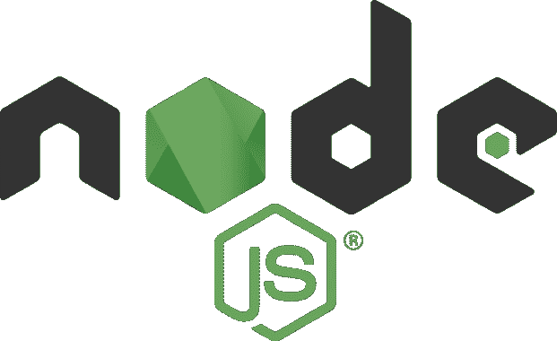

# Njsscan:一个语义感知 SAST 工具，可以发现 Node.js 应用程序中不安全的代码模式

> 原文：<https://kalilinuxtutorials.com/njsscan-a-semantic-aware-sast-tool-that-can-find-insecure-code-patterns-in-node-js-applications/>

.png)

Njsscan 是一个静态应用程序测试(SAST)工具，它可以使用 libsast 的简单模式匹配器和支持语法的语义代码模式搜索工具 semgrep 在 node.js 应用程序中找到不安全的代码模式。

## 装置

`**pip install njsscan**`

需要 Python 3.6 以上版本，仅支持 Mac 和 Linux

## 命令行选项

**$ njsscan
用法:njs scan[-h][–JSON][–SARIF][–HTML][–o OUTPUT][–c CONFIG][–missing-controls][-w][-v][Path…]
位置参数:
path Path 可以是带有源代码的文件或目录
可选参数:
-h，–help 显示此帮助消息并退出
–JSON 将输出格式设置为 JSON
–sarinjsscan 配置文件
–missing-controls 启用缺失安全控制检查
-w，–exit-warning 非零退出代码 on warning
-v，–version 显示 njsscan 版本**

## 用法示例

【T0 美元 njsscan 测试. js】模式匹配◎和

【中英文字幕】
【RES . send】【你好:【名字+】
【你好】【你好】【你好】

## nodejsscan sast

建立在 **njsscan** 之上的 **nodejsscan** 提供了一个成熟的漏洞管理用户界面以及其他漂亮的集成。

## Python API

**从 njsscan.njsscan 导入 njs scan
node _ source = '/node _ source/True _ positives/sqli _ node . js '
scanner = njs scan([node _ source]，json=True，check _ controls = False)
scanner . scan()
{
' templates ':{，
' nodejs ':{
' node _ sqli _ injection ':{
' files]:[{
' file _ path '/:]\ n \ nvar SQL = " SELECT * FROM trn _ employee WHERE employee _ id = "+employeeId；\n\n\n\nconnection.query(sql，function (error，results，fields) {\n\n if (error) {\n\n 抛出错误；\n\n }\n\n console.log(结果)；'
}]，
' metadata ':{
' owasp ':' A1:Injection '，
' cwe ':" CWE-89:SQL 命令中使用的特殊元素的不正确中和(' SQL Injection ')"，
'description ':'与原始 SQL 查询连接的不受信任的输入会导致 SQL Injection。'，
'严重度':'错误'
}
}
}，
'错误':[]
}**

## 配置 njsscan

源代码目录根目录下的一个`**.njssca**n`文件允许您配置 njsscan。你也可以通过使用`**--config**`参数来使用一个定制的`**.njsscan**`文件。

**nodejs-扩展:
。js
模板-扩展:
。新
。hbs
"
忽略文件名:
skip.js
忽略路径:
_ _ ma cosx
skip _ dir
node _ modules
忽略扩展:
。jsx
忽略-规则:
regex _ injection _ dos
pug _ jade _ template
严重性-过滤:
警告
错误**

## 隐藏调查结果

您可以通过向触发结果的行添加注释`**// njsscan-ignore: rule_id1, rule_id2**`来隐藏来自 javascript 源文件的结果。

示例:

**app.get('/some/redirect '，function (req，RES){
var target = req . param(" target ")；
res.redirect(目标)；//njss can-ignore:express _ open _ redirect
})；**

## CI/CD 集成

您可以在 CI/CD 或 DevSecOps 管道中启用 njsscan。

#### Github 动作

将以下内容添加到文件`**.github/**` **`workflows/njsscan.yml`。**

**名称:njsscan
on:
push:
分支:[ master，main ]
pull_request:
分支:[ master，main ]
作业:
njs scan:
run-on:Ubuntu-latest
名称:njsscan check
步骤:
–名称:Checkout 代码
用途:actions/check out @ v2
–名称:nodejsscan 扫描
id:njs scan** 

#### Github 代码扫描集成

将以下内容添加到文件`**.github/workflows/njsscan_sarif.yml**`。

n**ame:njs scan sarif
on:
push:
branches:[master，main]
pull _ request:
branches:[master，main]
jobs:
njs scan:
runs-on:Ubuntu-latest
name:njs scan 代码扫描
步骤:
–name:check out 代码
用途:actions/check out @ v2
–name:nodejsscan 扫描
id:–sarif–output results . sarif | | true '
–name:Upload njs scan report
用途:github/codeql-action/Upload-sarif @ v1
with:
sarif _ file:results . sarif**

#### Gitlab CI/CD

将以下内容添加到文件 **`.gitlab-ci.yml`。**

**阶段:
–测试
njsscan:
图片:python
before _ script:
–pip 3 安装–升级 njsscan
脚本:
–njs scan。**

示例:带 njsscan gitlab 的 dvna

#### 特拉维斯词

将以下内容添加到文件`**.travis.yml**`。

**语言:python
安装:
–pip 3 安装–升级 njsscan
脚本:
–njss can。**

#### 圆形 CI

将以下内容添加到文件`**.circleci/conf**i**g.yaml**`

**版本:2.1
作业:
njsscan:
docker:
–image:cimg/python:3 . 9 . 6
步骤:
–check
–run:
名称:安装 njsscan
命令:pip 安装–升级 njsscan
–run:
名称:njs scan 检查
命令:njs scan。**

## 码头工人

### 来自 DockerHub 的预建图像

**docker pull open security/njss can
docker run-v/path-to-source-dir:/src open security/njss can/src**

## 本地构建

ocker build -t njsscan。
docker run-v/path-to-source-dir:/src njss can/src

[Download](https://github.com/ajinabraham/njsscan)