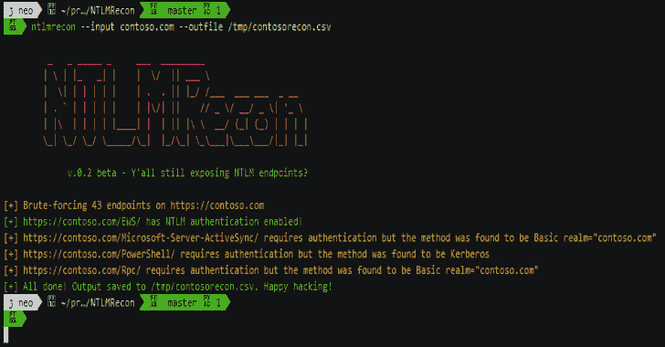

# NTLMRecon:查找 NTLM 端点信息的工具

> 原文：<https://kalilinuxtutorials.com/ntlmrecon-2/>

NTLMRecon 在构建时就考虑到了灵活性。需要运行一个单一的网址，一个 IP 地址，整个 CIDR 范围或所有这些都放在一个单一的输入文件的组合侦察？没问题！NTLMRecon 掩护你。请继续阅读。

一个快速灵活的 NTLM 侦察工具，无需外部依赖。在处理大量潜在的 IP 地址和域时，查找有关 NTLM 端点的信息非常有用。

**待办事项**

*   实现基于 aiohttp 的发送请求的解决方案
*   集成喷涂库
*   将找到的其他身份验证方案添加到输出中
*   自动检测自动发现域，如果域

**概述**

NTLMRecon 查找启用了 NTLM 的 web 端点，发送一个假的身份验证请求，并从 NTLMSSP 响应中枚举以下信息:

*   AD 域名
*   服务器名称
*   DNS 域名
*   正式域名(Fully Qualified Domain Name)
*   父 DNS 域

由于 NTLMRecon 利用了 NTLMSSP 的 python 实现，它消除了为每次成功发现运行 Nmap NSE `http-ntlm-info`的开销。

每次成功发现启用了 NTLM 的 web 端点时，该工具都会枚举有关域的信息并将其保存到 CSV 文件中，如下所示:

| 统一资源定位器 | 域名 | 服务器名称 | DNS 域名 | 正式域名(Fully Qualified Domain Name) | DNS 域 |
| --- | --- | --- | --- | --- | --- |
| [https://contoso.com/EWS/](https://contoso.com/EWS/) | XCORP | EXCHANGE01 | xcorp.contoso.net | EXCHANGE01.xcorp.contoso.net | contoso.net |

**安装**

**黑字研究**

NTLMRecon 已经为 BlackArch 打包，可以通过运行`**pacman -S ntlmrecon**`来安装

**拱门**

如果您使用的是 Arch linux 或任何基于 Arch Linux 的发行版，您可以从 [Arch 用户库](https://aur.archlinux.org/packages/ntlmrecon/)中获取最新的构建版本。

**黑桃**

你可以简单地运行`pip install ntlmrecon`从 [PyPI](https://pypi.org/project/ntlmrecon/) 获取最新的构建

**从源代码构建**

*   克隆存储库:`**git clone https://github.com/sachinkamath/ntlmrecon/**`
*   推荐–安装虚拟设备
*   启动一个新的虚拟环境:`**virtualenv venv**`并用`**source venv/bin/activate**`激活它
*   运行安装文件:`**python setup.py install**`
*   运行 ntlmrecon : `**ntlmrecon --help**`

**用途**

**用法:**NTLM recon[-h][–INPUT INPUT |–INFILE INFILE][–WORDLIST WORDLIST][–THREADS][–output-type][–OUTFILE OUTFILE][–random-user-agent][–force-all][–shuffle][-f][

**可选参数:**
-h，–help 显示此帮助消息并退出
–INPUT 将输入作为 IP 地址、URL 或 CIDR 来枚举 NTLM 端点
–INFILE 支持 JSON (TODO)和 CSV(默认值:CSV)
–OUTFILE OUTFILE 设置输出文件名(默认值:NTLM recon . CSV)
–random-user-agent TODO:发送请求时随机化用户代理(默认值:False)
–Force-all 即使找到 URL 的有效端点也强制枚举所有端点(默认值:False)
–打乱输入文件的顺序
-f，–如果输出文件已经存在，强制强制替换输出文件

**示例用法**

**侦察单个网址**

$ NTLM recon–输入 https://mail.contoso.com–输出 ntlmrecon.csv

**侦察 CIDR 范围或 IP 地址**

$ NTLM recon–输入 192 . 168 . 1 . 1/24–输出 ntlmrecon-ranges.csv

**检查输入文件**

该工具自动检测每行的输入类型，并自动给出结果。即使从文本文件中读取，CIDR 范围也会自动扩展。

输入文件可能像下面这样混乱:

mail.contoso.com 10 . 0 . 13 . 2/28
192 . 168 . 222 . 1/24
https://mail.contoso.com

要使用输入文件运行 recon，只需运行:

$ NTLM recon–in file/path/to/input/file–out file NTLM recon-from file . CSV

**演示**

[**Download**](https://github.com/sachinkamath/NTLMRecon#todo)