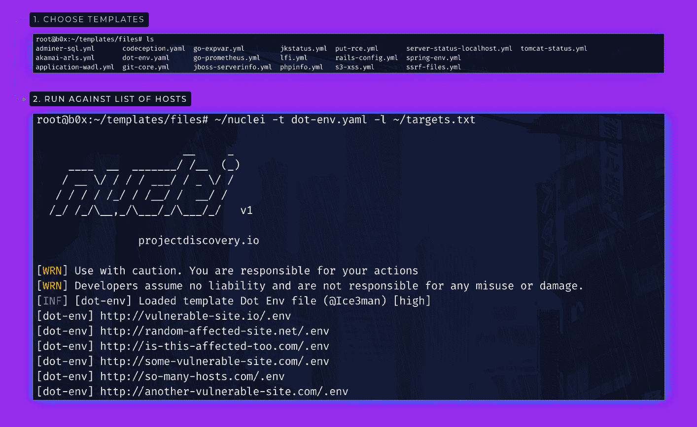

# Nuclei:可配置靶向扫描的快速工具

> 原文：<https://kalilinuxtutorials.com/nuclei/>

**nucleus**是一款基于模板的可配置目标扫描快速工具，具有巨大的可扩展性和易用性。

它用于根据模板跨目标发送请求，从而实现零误报，并提供对已知路径的有效扫描。它的主要使用案例是在初始侦察阶段，快速检查已知且易于探测的目标上的低挂果实或 cv。它使用 [retryablehttp-go 库](https://github.com/projectdiscovery/retryablehttp-go)来处理 WAFs 阻塞情况下的各种错误和重试，这也是我们自定义查询的核心模块之一。

我们还[开源了一个专门的库](https://github.com/projectdiscovery/nuclei-templates)来维护各种类型的模板，我们希望你也能在那里做出贡献。提供模板是希望这些将是有用的，并允许每个人建立自己的扫描仪模板。在 [**GUIDE.md**](https://github.com/projectdiscovery/nuclei-templates/blob/master/GUIDE.md) 查看指南，了解其模板。

**特性**

*   简单和模块化的代码基础使其易于贡献。
*   快速和完全可配置使用基于模板的引擎。
*   处理边缘情况，为处理 WAFs 进行重试、回退等。
*   零误报扫描的智能匹配功能。

**也读作-[wo Top:任何协议之上的 Web](https://kalilinuxtutorials.com/wotop/)**

**用途**

**原子核-h**

这将显示该工具的帮助。这里是它支持的所有开关。

| 旗 | 描述 | 例子 |
| --- | --- | --- |
| -丙 | 并发请求的数量(默认为 10) | 原子核-c 100 |
| -我 | 运行模板的 URL 列表 | nucleus-l URLs . txt |
| 相当于-ED | 要跨主机检查的模板输入文件 | nucleus-t git-core . YAML |
| 相当于-ED | 要跨主机检查的模板输入文件 | 原子核-t "路径/*。yaml " |
| -数控 | 不要在输出中使用颜色 | 细胞核-nC |
| 表示“具有…性质的” | 保存输出结果的文件(可选) | nucleus-o 输出. txt |
| -沉默 | 在输出中仅显示找到的结果 | 细胞核-沉默 |
| -重试次数 | 重试失败请求的次数(默认为 1) | 细胞核-重试次数 1 |
| -超时 | 超时前等待的秒数(默认为 5) | 细胞核-超时 5 |
| -v | 显示详细输出 | 原子核-v |
| -版本 | 显示细胞核的版本 | 细胞核-版本 |

**安装说明**

*   **来自二进制**

安装很容易。您可以从[发布版](https://github.com/projectdiscovery/nuclei/releases/)页面下载为您的平台预先构建的二进制文件。用焦油提取它们，移动到你的`$PATH`上，你就可以开始了。

**nuclei-linux-amd64.tar>tar-xzvf
mv nucleus-Linux-amd64/usr/bin/nucleus
nucleus-h**

*   **来源于**

需要 go1.13+才能成功安装。运行以下命令获取报告–

**github.com/projectdiscovery/nuclei/cmd/nuclei>go 111 module = on go get-u-v**

为了更新工具，你可以使用-u 标志和`go get`命令。

**运行中**

*   **使用单一模板运行它。**

这将针对`urls.txt`中的所有主机运行该工具，并返回匹配的结果。

**>nucleus-l URLs . txt-t git-core . YAML-o results . txt**

您还可以在标准输入(STDIN)处传递主机列表。这使得自动化管道中的集成变得容易。

这将针对`urls.txt`中的所有主机运行该工具，并返回匹配的结果。

**>猫 URLs . txt | nucleus-t git-core . YAML-o results . txt**

*   **使用多个模板运行它。**

这将使用`path-to-templates`目录中的所有模板对`urls.txt`中的所有主机运行该工具，并返回匹配的结果。

**>nucleus-l URLs . txt-t " path-to-templates/*yaml" -o results.txt**

*   使用 subfinder 和任何其他类似工具实现自动化。

**>sub finder-d hackerone.com | httprob | nucleus-t " path-to-templates/*。yaml" -o results.txt**

它支持以`.yaml`结尾的 glob 表达式，这意味着多个模板可以很容易地被一个接一个地执行。请参考[本指南](https://github.com/projectdiscovery/nuclei-templates/blob/master/GUIDE.md)来构建您自己的定制模板。

**鸣谢:** [projectdiscovery](https://projectdiscovery.io) 团队

[**Download**](https://github.com/projectdiscovery/nuclei)