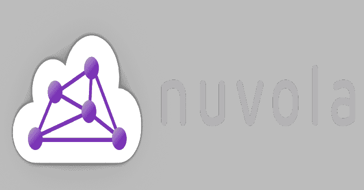
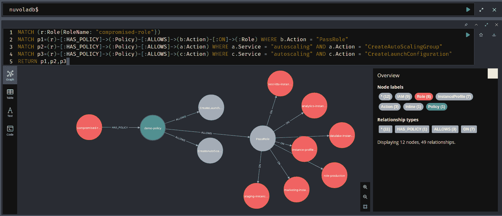

# Nuvola:在 AWS 上转储和执行自动和手动安全分析的工具

> 原文：<https://kalilinuxtutorials.com/nuvola/>

[](https://blogger.googleusercontent.com/img/b/R29vZ2xl/AVvXsEg5ncAlhChzlkvgl05VaDLEWKYbwVTIx_BwwFRd6lI1UQ29mEYq70mHBVzrjH5MbqGUpSnt2DoZPGRt7luuatqdtizrRSUjRgZbLqXDMPt3HNK4VMc4cmwgTU-ZWG_C9Az4FXS6bdcka7r6T7W2fE88AsFgO9ulCENpNdAJUDUqI5IKWDHG3DgkD_bR/s728/nuvola-logo-big-light(1).png)

**nuvola** (小写 n)是一个工具，它使用简单的 Yaml 语法创建的预定义、可扩展和自定义规则，对 AWS 环境配置和服务进行自动和手动安全分析。

这个项目背后的总体想法是创建一个云平台的抽象数字双胞胎。举一个更具体的例子:nuvola 反映了用于 Active Directory 分析的 BloodHound 特征，但是是在云环境中(目前只有 AWS)。

图形数据库的使用也增加了发现不同的和创新的攻击路径的可能性，并且可以用作离线、集中和轻量级的数字孪生。

## 快速启动

### 要求

*   `docker-compose`已安装
*   一个 AWS 帐户被配置为与对云资源具有完全访问权限的`awscli`一起使用，如果在*只读*模式下会更好(策略`arn:aws:iam::aws:policy/ReadOnlyAccess`没问题)

### 设置

1.  克隆存储库

```
git clone --depth=1 https://github.com/primait/nuvola.git; cd nuvola
```

2.  如果需要，创建并编辑`.env`文件来设置您的数据库用户名/密码/URL

```
cp .env_example .env;
Start the Neo4j docker instance
make start
Build the tool
make build
```

### 用法

1.  首先，您需要转储所有受支持的 AWS 服务配置，并将数据加载到 Neo4j 数据库中:

```
./nuvola dump -profile default_RO -outputdir ~/DumpDumpFolder -format zip
```

2.  要将之前执行的转储操作导入 Neo4j 数据库:

```
./nuvola assess -import ~/DumpDumpFolder/nuvola-default_RO_20220901.zip
```

3.  使用[预定义规则集](https://github.com/primait/nuvola/tree/master/assess/rules)仅对加载到 Neo4j 数据库中的数据执行静态评估:

```
./nuvola assess
```

4.  或者使用 [Neo4j 浏览器](https://neo4j.com/docs/operations-manual/current/installation/neo4j-browser/)手动探索数码孪生。

[Click Here To Download](https://github.com/primait/nuvola)