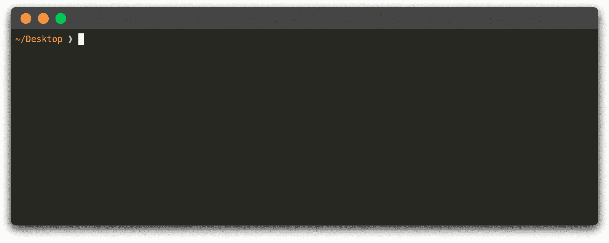
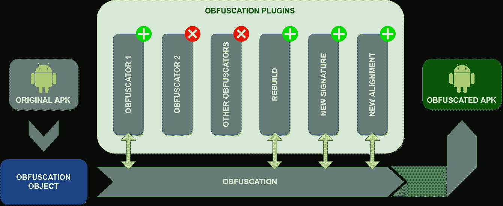

# obfuscapk:Android 应用程序的黑盒混淆工具

> 原文：<https://kalilinuxtutorials.com/obfuscapk/>

**Obfuscapk** 是一个模块化的 Python 工具，用于在不需要源代码的情况下混淆 Android 应用程序，因为`apktool`用于反编译原始 apk 文件，并在对反编译的`smali`代码、资源和清单应用一些混淆技术后构建新的应用程序。

模糊的应用程序保留了与原始应用程序相同的功能，但是隐藏的差异有时会使新应用程序与原始应用程序非常不同(例如，与基于签名的反病毒软件不同)。

**演示**

**架构**

Obfuscapk 被设计成模块化的，易于扩展，所以它是使用插件系统构建的。因此，每个混淆器都是一个从抽象基类继承的插件，需要实现方法`obfuscate`。

当该工具开始处理新的 Android 应用程序文件时，它会创建一个混淆对象来存储所有需要的信息(例如，反编译的`smali`代码的位置)和操作的内部状态(例如，已经使用的混淆器的列表)。

然后，混淆对象作为`obfuscate`方法的参数被传递给所有活动的插件/混淆器(按顺序)进行处理和修改。活动插件的列表和顺序是通过命令行选项指定的。

该工具很容易通过新的混淆器进行扩展:在`src/obfuscapk/obfuscators`目录中添加实现混淆技术的源代码和插件元数据(一个`<obfuscator-name>.obfuscator`文件)就足够了(以一个简单的现有混淆器如 [`Nop`](https://github.com/ClaudiuGeorgiu/Obfuscapk/blob/master/src/obfuscapk/obfuscators/nop/nop.py) 作为开始的例子)。

该工具将自动检测新插件，因此无需进一步配置(新插件将被视为与该工具捆绑在一起的所有其他插件)。

**安装**

有两种方法可以在您自己的计算机上获得 Obfuscapk 的工作副本:要么使用 Docker，要么在 Python 3.7 环境中直接使用源代码。

在这两种情况下，首先要做的是获得这个存储库的一个本地副本，因此在您想要保存项目和克隆存储库的目录中打开一个终端:

**$ git 克隆 https://github.com/ClaudiuGeorgiu/Obfuscapk.git**

**Docker 图像**

**先决条件**

这是安装 Obfuscapk 的建议方式，因为唯一的要求是安装最新版本的 Docker:

**$ Docker–版本
Docker 版本 19.03.0，编译 aeac949**

**也可阅读-[Python asub fuscate:混淆一个 Python 脚本&附带的外壳代码](https://kalilinuxtutorials.com/pythonaesobfuscate-obfuscates-a-python-script-accompanying-shellcode/)**

**官方 Docker Hub 图片**

官方的 Obfuscapk Docker 映像可以在 Docker Hub 上获得(根据该存储库自动构建):

**$ #下载坞站映像。
$ dock pull claudigeorgiou/obfuscapk
$ #给它取个简称。
$ dock tag claudigeorgiou/obfuscapk obfuscapk**

**安装**

如果您从 Docker Hub 下载了官方映像，那么您已经准备好使用该工具了，所以请继续检查使用说明，否则请在之前创建的 Obfuscapk/src/目录(包含 Docker 文件的文件夹)中执行以下命令，以便构建 Docker 映像:

**$ #确保在 Obfuscapk/src/目录下运行该命令。
$ #下载并安装所有依赖项需要一些时间。
$ docker build -t obfuscapk。**

当 Docker 映像准备就绪时，进行一个快速测试以检查所有组件是否安装正确:

**$ docker run–RM-it obfuscapk–help
用法:python 3.7-m obfuscapk . CLI[-h]-o obfuscar[-w DIR][-d OUT _ APK]
……**

Obfuscapk 现在可以使用了。

**来源于**

**先决条件**

确保安装了 apktool、jarsigner 和 zipalign，并且可以从命令行使用:

**$ apk tool
apk tool v 2 . 4 . 0——一个再造 Android apk 文件的工具
……

$ jarsigner
用法:jarsigner[选项] jar-file 别名
jarsigner-verify[选项]jar-file[别名……]
……

$ Zip align
Zip alignment 实用程序
版权所有(C)2009 Android 开源项目
……**

要安装和使用`apktool`,你需要一个最新版本的 Java，它也应该捆绑了`jarsigner`。`zipalign`包含在 Android SDK 中。

可执行文件的位置也可以通过以下环境变量来指定:`APKTOOL_PATH`、`JARSIGNER_PATH`和`ZIPALIGN_PATH`(例如，在 Ubuntu 中，在同一个终端中运行 Obfuscapk 之前运行`export APKTOOL_PATH=/custom/location/apktool`)。

除了上面的工具，这个项目唯一的需求是一个工作的 Python 3.7 安装(以及它的包管理器 pip)。

**安装**

在项目的主目录(Obfuscapk/)中运行以下命令，以安装所需的依赖项:

**$ #确保运行 Obfuscapk/目录中的命令。**

**$ #强烈建议使用虚拟环境，如 virtualenv。
$ #如果没有使用 virtualenv(https://virtualenv . pypa . io/)，跳过后面 2 行。
$ virtualenv-p python 3.7 venv
$ source venv/bin/activate**

**$ #安装 Obfuscapk 的要求。
$ python 3.7-m pip install-r src/requirements . txt**

在安装了需求之后，进行一个快速测试来检查一切是否正常工作:

**$ cd src/
$ #以下命令必须始终从 Obfuscapk/src/ directory
$ #或通过将 Obfuscapk/src/ directory 添加到 PYTHONPATH 环境变量中来执行。
$ python 3.7-m obfuscapk . CLI–help
用法:python 3.7-m obfuscapk . CLI[-h]-o obfuscar[-w DIR][-d OUT _ APK]
…**

Obfuscapk 现在可以使用了。

**用途**

从现在开始，obfuscapk 将被视为可作为 Obfuscapk 使用的可执行文件，因此您需要根据您安装该工具的方式来调整命令:

*   Docker 映像:包含要混淆的应用程序的本地目录必须挂载到容器中的/workdir(例如，当前目录“${PWD}”)，因此命令:

**$ obfuscapk [params…]**

变成了:

**$ docker run–RM-it-u $(id-u):$(id-g)-v " $ { PWD } ":"/workdir " obfuscapk[params…]**

*   From source:每个指令都必须从 Obfuscapk/src/目录执行(或者通过将 Obfuscapk/src/目录添加到 PYTHONPATH 环境变量),并且命令:

**$ obfuscapk [params…]**

变成了:

**$ python 3.7-m obfuscapk . CLI[params…]**

让我们从查看帮助消息开始:

**$ obfuscapk–help
obfuscapk[-h]-o 混淆器[-w DIR][-d OUT _ APK][-I][-p][-k VT _ API _ KEY]**

有两个强制参数:`<APK_FILE>`、要混淆的 apk 文件的路径(相对或绝对)和要应用的混淆技术的名称列表(用`-o`选项指定，例如`-o Rebuild -o NewSignature -o NewAlignment`)。其他可选参数如下:

*   `-w DIR`用于设置保存中间文件(由`apktool`生成)的工作目录。如果没有指定，一个名为`obfuscation_working_dir`的目录将创建在与输入应用程序相同的目录中。这对于调试非常有用，但是如果不需要的话，可以将其设置为一个临时目录(例如，`-w /tmp/`)。
*   `-d OUT_APK`用于设置目的文件的路径:混淆过程生成的 apk 文件(如`-d /home/user/Desktop/obfuscated.apk`)。如果未指定，最终的模糊文件将保存在工作目录中。注意:现有文件将被覆盖，没有任何警告。
*   `-i`是一个标记，用于在混淆期间忽略已知的第三方库，以便使用更少的资源，提高性能并降低出错的风险。要忽略的库列表改编自 LiteRadar 项目。
*   `-p`是用于在混淆操作期间显示进度条的标志。在批处理操作/自动构建中使用该工具时，禁用进度条很方便，否则应该启用该标志来查看模糊处理进度。
*   `-k VT_API_KEY`仅在使用`VirusTotal`混淆器时需要，用于设置与 Virus Total 通信时使用的 API 密钥。可以多次设置，以便在请求期间循环使用 API 键(例如，`-k VALID_VT_KEY_1 -k VALID_VT_KEY_2`)。

现在让我们考虑一个简单的工作示例，看看 Obfuscapk 是如何工作的:

**$ # original.apk 是有效的 Android apk 文件。
$ obfuscapk-o RandomManifest-o Rebuild-o new signature-o new alignment original . apk**

运行上述命令时，以下是幕后发生的情况:

*   因为没有指定工作目录，所以在与`original.apk`相同的位置创建了一个新的工作目录(`obfuscation_working_dir`)(这对于检查`smali`文件/清单/资源是否有错误很有用)
*   执行一些检查是为了确保所有需要的文件/可执行文件都可用
*   实际的混淆过程开始了:指定的混淆器被一个接一个地执行(按顺序),直到没有混淆器或者遇到错误
    *   当运行第一个混淆器时，`original.apk`用`apktool`反编译，结果存储在工作目录中
    *   由于第一个混淆器是`RandomManifest`，反编译的 Android 清单中的条目被随机重新排序(不破坏`xml`结构)
    *   `Rebuild` obfuscator 使用`apktool`简单地重建应用程序(现在使用修改后的清单),由于没有指定输出文件，生成的 apk 文件保存在之前创建的工作目录中
    *   `NewSignature` obfuscator 使用此密钥库中包含的自定义证书对新创建的 apk 文件进行签名
    *   `NewAlignment`混淆器使用`zipalign`工具对齐生成的 apk 文件
*   当所有的混淆器被正确执行后，产生的混淆后的 apk 文件可以在`obfuscation_working_dir/original_obfuscated.apk`中找到，被签名、对齐并准备好安装到设备/仿真器中

如前面的例子所示，

为了构建最终的混淆后的 apk，总是需要`Rebuild`、`NewSignature`和`NewAlignment`混淆器来完成混淆操作。它们不是真正的混淆技术，但在构建过程中需要它们，因此它们被包含在混淆器列表中，以保持整体架构的模块化。

**混淆器**

Obfuscapk 中包含的混淆器可以根据它们执行的操作分为不同的类别:

*   **琐碎的**:顾名思义，这个类别包括简单的操作(不会对原始应用程序做太多修改)，比如用新的签名对 apk 文件进行签名。
*   **重命名**:改变所用标识符(类、字段、方法)名称的操作。
*   **加密**:打包加密的代码/资源，在 app 执行过程中解密。当 Obfuscapk 启动时，它会自动生成一个随机密钥(32 个字符长，使用 ASCII 字母和数字)用于加密。
*   **代码**:所有涉及修改反编译源代码的操作。
*   **资源**:对资源文件的操作(比如修改清单)。
*   **其他**

下面简要介绍了目前与 Obfuscapk 捆绑在一起的混淆器(按字母顺序)。更多详情请参考守则。

`NOTE:`并不是下面所有的混淆器都对应于真正的混淆技术(例如`Rebuild`、`NewSignature`、`NewAlignment`和`VirusTotal`)，但是它们被实现为混淆器，以保持架构的模块化并易于扩展新功能。

**学分** : Simone Aonzo，gabriel claudiu georgiu，luca verderame，Alessio Merlo

[**Download**](https://github.com/ClaudiuGeorgiu/Obfuscapk)