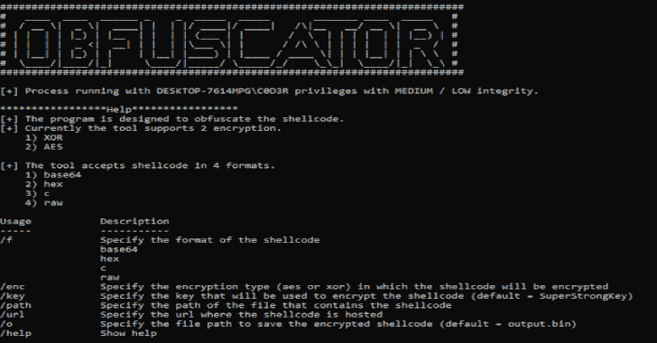

# 混淆器:该程序旨在混淆外壳代码

> 原文：<https://kalilinuxtutorials.com/obfuscator/>

[](https://1.bp.blogspot.com/-6Gnri1efNEA/X8_mAoVlJzI/AAAAAAAAIF4/Im1iThtCdckxk0MkV0NODMaseItLoBF2ACLcBGAsYHQ/s728/obfuscator%25281%2529.png)

**Obfuscator** 程序设计用于混淆外壳代码。目前，该工具支持 2 加密。

*   异或运算
*   俄歇电子能谱

该工具接受 4 种格式的外壳代码。

*   base64
*   十六进制
*   c
*   生的

**命令行用法**

```
Usage           Description
-----           -----------
/f              Specify the format of the shellcode
                base64
                hex
                c
                raw
/enc            Specify the encryption type (aes or xor) in which the shellcode will be encrypted
/key            Specify the key that will be used to encrypt the shellcode (default = SuperStrongKey)
/path           Specify the path of the file that contains the shellcode
/url            Specify the url where the shellcode is hosted
/o              Specify the file path to save the encrypted shellcode (default = output.bin)
/help           Show help
```

[**Download**](https://github.com/3xpl01tc0d3r/Obfuscator)