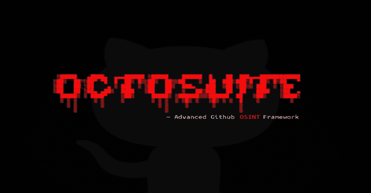

# Octosuite:高级 Github OSINT 框架

> 原文：<https://kalilinuxtutorials.com/octosuite-advanced-github-osint-framework/>

Octosuite 是一个开源的轻量级但先进的 osint 框架，面向 Github 用户和组织。octosuite 有超过 10 个特性，但只在 2 个外部依赖项(对于 GitHub alt)和 1 个依赖项(对于 PyPI 包)上运行。并以可读性很好的格式返回收集到的情报。

# 装置

## 从 Github 克隆

**git 克隆 https://github . com/rly 0 nhart/octosuite . git**

**光盘十月套**

**pip install-r requirements . txt**

## 从 PyPI 安装

**pip 安装 octosuite**

# 使用

## Linux

**sudo chmod +x octosuite**

**须藤。/octosuite**

## Windows 操作系统

**python 3 10 月 3 日套件**

## 苹果个人计算机

**python 3 10 月 3 日套件**

[**Download**](https://github.com/rly0nheart/octosuite)