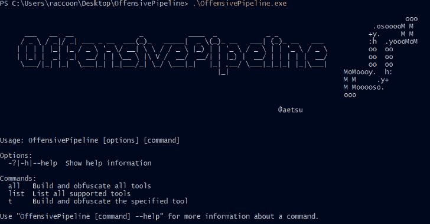
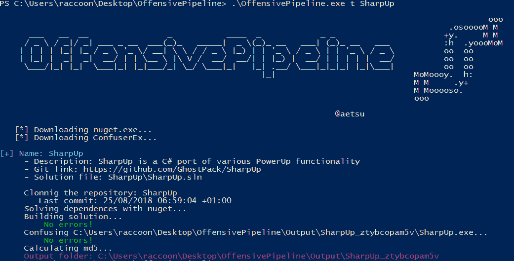

# OffensivePipeline:用于下载、编译和混淆红队练习的 C#工具的工具

> 原文：<https://kalilinuxtutorials.com/offensivepipeline/>

**OffensivePipeline** 允许下载、编译(没有 Visual Studio)和混淆红队练习的 C#工具。

它从 git 库下载工具，然后用 *msbuild* 编译，最后用 [ConfuserEx](https://github.com/mkaring/ConfuserEx/tree/v1.4.1) 混淆。

**例题**

*   列出所有工具:

**OffensivePipeline.exe 排行榜**

*   构建所有工具:

**OffensivePipeline.exe 所有**

*   制造工具

**OffensivePipeline.exe t 工具名称**

**添加新工具**

下载工具的脚本在 **Tools** 文件夹中，格式为 **yml** 。可以通过创建新的 *yml* 文件来添加新的工具，格式如下:

*   *Rubeus.yml* 文件:

**工具:**
–名称:Rubeus
描述:Rubeus 是一个用于原始 Kerberos 交互和滥用的 C#工具集
git link:https://github.com/GhostPack/Rubeus
solution path:rube us \ rube us . SLN

**发布版本要求(不需要 Visual Studio 2019)**

*   微软。NET Framework 3.5 Service Pack 1(针对某些工具):[https://www.microsoft.com/en-us/download/details.aspx?id=22](https://www.microsoft.com/en-us/download/details.aspx?id=22)
*   Visual Studio 2019 的构建工具:[https://Visual Studio . Microsoft . com/thank-you-downloading-Visual-Studio/？sku=BuildTools & rel=16](https://visualstudio.microsoft.com/thank-you-downloading-visual-studio/?sku=BuildTools&rel=16)
    *   安装。NET 桌面构建工具

*   禁用防病毒软件😀
*   在 Windows 10 Pro–版本 20 H2–内部版本 19042.631 上测试

**建造要求**

*   Net framework 3.5.1(针对部分工具):[https://www.microsoft.com/en-us/download/details.aspx?id=22](https://www.microsoft.com/en-us/download/details.aspx?id=22)
*   visual Studio 2019->[https://visual Studio . Microsoft . com/thank-you-downloading-visual-Studio/？sku =社区& rel=16](https://visualstudio.microsoft.com/thank-you-downloading-visual-studio/?sku=Community&rel=16)
    *   安装。NET 桌面构建工具

**支持的工具**

*   **内心独白:**
    *   描述:在不接触 LSASS 的情况下检索 NTLM 散列
    *   git link:[https://github.com/eladshamir/Internal-Monologue](https://github.com/eladshamir/Internal-Monologue)
*   **InveighZero:**
    *   描述:InveighZero 是一个 C# LLMNR/NBNS/mDNS/DNS/DHCPv6 欺骗器和中间人工具
    *   git link:[https://github.com/Kevin-Robertson/InveighZero](https://github.com/Kevin-Robertson/InveighZero)
*   **风疹:**
    *   描述:Rubeus 是一个用于原始 Kerberos 交互和滥用的 C#工具集
    *   gitlink:https://github . com/ghost pack/Rubus
*   **安全带:**
    *   描述:Seatbelt 是一个 C#项目，它执行许多面向安全的主机调查“安全检查”,这些检查从攻击性和防御性安全的角度都是相关的。
    *   gitlink:https://github . com/ghost pack/seatblt
*   **夏普铬:**
    *   描述:SharpChromium 是一个. NET 4.0+ CLR 项目，用于从 Google Chrome、Microsoft Edge 和 Microsoft Edge Beta 中检索数据。目前，它可以提取
    *   git link:[https://github.com/djhohnstein/SharpChromium](https://github.com/djhohnstein/SharpChromium)
*   **sharpdapi:**
    *   描述:SharpDPAPI 是@gentilkiwi 的 Mimikatz 项目中 DPAPI 部分功能的 C#移植。
    *   git link:[https://github.com/GhostPack/SharpDPAPI](https://github.com/GhostPack/SharpDPAPI)
*   **shargpoabuse:**
    *   描述:SharpGPOAbuse 是一个用 C#编写的. NET 应用程序，它可以利用用户对组策略对象(GPO)的编辑权限来危害由该 GPO 控制的对象。
    *   git link:[https://github.com/FSecureLABS/SharpGPOAbuse](https://github.com/FSecureLABS/SharpGPOAbuse)
*   **SharpHound3:**
    *   描述:用 C#重写了猎犬入口
    *   git link:[https://github.com/BloodHoundAD/SharpHound3](https://github.com/BloodHoundAD/SharpHound3)
*   **SharpMove:**
    *   描述:。远程主机的. NET 身份验证执行
    *   git link:[https://github.com/0xthirteen/SharpMove](https://github.com/0xthirteen/SharpMove)
*   **SharpRDP:**
    *   描述:用于验证命令执行的远程桌面协议控制台应用程序
    *   git link:[https://github.com/0xthirteen/SharpRDP](https://github.com/0xthirteen/SharpRDP)
*   **夏普-SMBExec:**
    *   描述:一个本地 C#转换的 Kevin Robertson Invoke-SMBExec powershell 脚本
    *   git link:[https://github.com/checkymander/Sharp-SMBExec](https://github.com/checkymander/Sharp-SMBExec)
*   **尖锐祈祷:**
    *   描述:SharpSpray 一个简单的代码集，使用 LDAP 对一个域的所有用户执行密码喷射攻击，与 Cobalt Strike 兼容。
    *   gitlink:https://github . com/jnqblc/sharpsp ray
*   **尖锐:**
    *   描述:。净持久性
    *   git link:[https://github.com/0xthirteen/SharpStay](https://github.com/0xthirteen/SharpStay)
*   **夏普普:**
    *   描述:SharpUp 是一个具有各种加电功能的 C#端口
    *   git link:[https://github.com/GhostPack/SharpUp](https://github.com/GhostPack/SharpUp)
*   **锐视:**
    *   描述:。PowerView 的网络端口
    *   git link:[https://github.com/tevora-threat/SharpView](https://github.com/tevora-threat/SharpView)
*   **SharpWMI:**
    *   描述:SharpWMI 是各种 WMI 功能的 C#实现。
    *   gitlink:https://github . com/ghost pack/sharpwmi
*   **ThreatCheck:**
    *   描述:物质传送者防御检查的修改版本
    *   git link:[https://github.com/rasta-mouse/ThreatCheck](https://github.com/rasta-mouse/ThreatCheck)
*   **沃森:**
    *   描述:Watson 是一个. NET 工具，旨在枚举缺失的知识库并建议利用特权提升漏洞。
    *   git link:[https://github.com/rasta-mouse/Watson](https://github.com/rasta-mouse/Watson)
*   **winPEAS:**
    *   描述:特权提升真棒脚本套件
    *   git link:[https://github . com/Carlos polop/privilege-escalation-awesome-scripts-suite](https://github.com/carlospolop/privilege-escalation-awesome-scripts-suite)