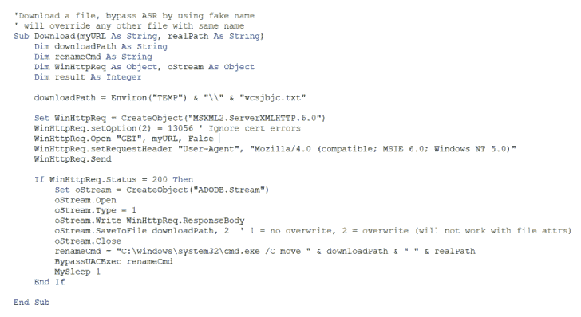

# offensive VBA:Office 文档中宏的代码执行和 AV 规避方法

> 原文：<https://kalilinuxtutorials.com/offensivevba/>

.png)

**OffensiveVBA** ，在准备 VBS AV 规避流/视频的过程中，我对 Office 宏代码执行方法和规避技术做了一些研究。

名单越来越长，我发现没有攻击性的 VBA 模板的中心位置，所以这个回购可以用于这种情况。它离完成还很远。如果你知道任何其他酷技术或有用的模板，请随意贡献并创建一个拉请求！

这个回购中的大多数模板已经在某个地方发布了。我只是从 ms-docs 网站、博客帖子或其他工具中复制粘贴大部分模板。

## 本回购中的模板

| 文件 | 描述 |
| --- | --- |
| shell application _ shell execute . VBA | 通过 ShellApplication 对象和 ShellExecute 方法执行操作系统命令 |
| shell application _ shell execute _ privileged . VBA | 通过 ShellApplication 对象和 ShellExecute 方法执行特权操作系统命令–UAC 提示符 |
| Shellcode_CreateThread.vba | 通过 Win32 CreateThread 在当前进程中执行外壳代码 |
| shellcode _ enumhildwindowsscallbackup . VBA | 通过 EnumChildWindows 在当前进程中执行外壳代码 |
| Win32_CreateProcess.vba | 通过 Win32 CreateProcess 函数为代码执行创建新的进程 |
| Win32_ShellExecute.vba | 通过 Win32 ShellExecute 函数创建新的代码执行进程 |
| WMI 进程创建 | 通过 WMI 为代码执行创建新流程 |
| WMI _ 过程 _ 创建 2.vba | 另一个 WMI 代码执行示例 |
| WscriptShell_Exec.vba | 通过 WscriptShell 对象和 Exec 方法执行操作系统命令 |
| WscriptShell_run.vba | 通过 WscriptShell 对象和 Run 方法执行操作系统命令 |
| VBA 朗佩 | @itm4n 在 VBA 的 RunPE 技术 |
| GadgetToJScript | med0x2e 的 C#脚本，用于生成。NET 序列化小工具可以触发。从基于 JS/VBS/VBA 的脚本中使用 BinaryFormatter 进行反序列化时，会加载/执行. NET 程序集。 |
| PPID _ 恶搞. vba | christophetd 的欺骗-office-macro 副本 |
| AMSIBypass _ AmsiScanBuffer _ ordinal . VBA | rmdavy 的 AMSI 旁路使用签名旁路的序数值来修补 AmsiScanBuffer |
| AMSIBypass _ AmsiScanBuffer _ classic . VBA | rasta-mouse 的经典 AmsiScanBuffer 补丁 |
| AMSIBypass_Heap.vba | rmdavy 的 HeapsOfFun 回购副本 |
| AMSIbypasses.vba | AMSI 旁路博客 |
| COMHijack _ DLL _ Load.vba | 通过 COM 劫持加载 DLL |
| COM_Process_create.vba | 通过 COM 对象创建进程 |
| Download_Autostart.vba | 从远程 web 服务器下载一个文件，并将其放入启动文件夹 |
| Download_Autostart_WinAPI.vba | 通过 URLDownloadtoFileA 从远程 web 服务器下载一个文件，并将其放入启动文件夹 |
| Dropper_Autostart.vba | 将批处理文件放入启动文件夹 |
| 注册表 _ 持久化 _wmi.vba | 通过 WMI 为持久性创建启动注册表项 |
| 注册表 _ 持久化 _wscript.vba | 通过 wscript 对象为持久性创建启动注册表项 |
| ScheduledTask_Create.vba | 创建并启动代码执行/持久性的计划任务 |
| XML DOM _ Load _ XSL _ Process _ create . VBA | 从远程 web 服务器加载 XSL 以执行代码 |
| 行 32_sct_DownloadExecute.vba | 执行 regsvr32 下载远程 web 服务器 SCT 文件以执行代码 |
| BlockETW.vba | 修补 ntdll.dll 的 EtwEventWrite 以阻止 ETW 数据收集 |
| block etw _ COMPLUS _ etw enabled _ env . VBA | 通过将环境变量 COMPLUS_ETWEnabled 设置为 0 来阻止 ETW 数据收集，credit to @ *xpn* |
| shell windows _ Process _ create . VBA | 创建 ShellWindows 进程以获取 explorer.exe 作为父进程 |
| AES.vba | 在 VBA 使用 AES 加密/解密的示例如下 |
| 滴管 _ 可执行文件 _ 自动启动. vba | 从 VBA 获得可执行字节，并放入自动启动-在这种情况下没有下载 |
| MarauderDrop.vba | 丢弃一个注册的 COM。NET DLL 到 temp 中，导入函数并执行代码——在这种情况下，从 web 服务器加载远程 C#二进制文件到内存并执行它——归功于@Jean_Maes_1994 for MaraudersMap |
| dropper _ work folders _ lol bas _ execute . VBA | 将嵌入式可执行文件放入临时目录，并使用 C:\ windows \ system32 \ work folders . exe 作为 LOLBAS 执行它——归功于@YoSignals |
| 沙盒逃避 | 一些沙盒规避模板 |
| 规避滴管 Autostart.vba | 通过重命名文件夹操作绕过文件写入监控，将文件放入启动目录 |
| escalation msiinstallproduct . VBA | 使用 WindowsInstaller ActiveXObject 安装远程 msi 包，避免生成可疑的 office 子进程，MSI 安装将作为`**MSIEXEC /V service**`的子进程执行 |
| stealnetntlmv 2 . vba | 通过共享连接窃取 NetNTLMv2 哈希–归功于 https://book . hack tricks . XYZ/windows/NTLM/places-to-steal-NTLM-creds |
| Parse-Outlook.vba | 分析 Outlook 中的敏感关键字和文件扩展名，并通过电子邮件发送出去——这要归功于 JohnWoodman |
| 反向外壳. vba | 使用 Windows API 调用完全在 VBA 编写的反向 shell 归功于 JohnWoodman |

[**Download**](https://github.com/S3cur3Th1sSh1t/OffensiveVBA)