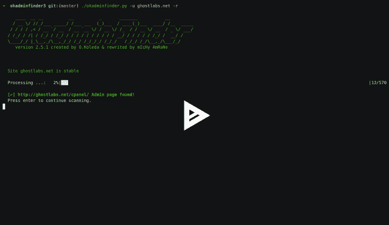

# Okadminfinder 3:查找网站的管理面板

> 原文：<https://kalilinuxtutorials.com/okadminfinder-admin-panel/>

OKadminFinder 是一个 Apache2 许可的实用程序，用 Python 3.x 重写，供想要找到网站管理面板的管理员/测试人员使用。

还有许多其他工具，但都没有这么有效和安全。是的，它有能力使用 tor 和隐藏你的身份

**要求**

**Linux**

sudo apt install tor
sudo apt install python 3-socks(可选)
pip 3 install–user-r requirements . txt

**窗户**

下载 [tor 专家包](https://dist.torproject.org/torbrowser/8.0.8/tor-win32-0.3.5.8.zip)pip 3 install-r requirements . txt

**也读作-[Anevicon:一个高性能的基于 UDP 的负载生成器](https://kalilinuxtutorials.com/anevicon/)**

**用途**

**预览**

**[Click Here For Preview](https://asciinema.org/a/209959)**

**Linux**

**git 克隆 https://ere.com/mIcHyAmRaNe/okadminfinder3.git
CD ok admin finder 3
chmod+x ok admin finder . py
python 3 ok admin finder . py**

**窗户**

**下载&解压 zip**

CD ok admin finder 3
py-3 ok admin finder . py

**Pentestbox(与 Linux 相同的过程)**

**您可以通过添加以下行来添加别名:
ok admin finder = py-3 " % pentest box _ ROOT %/bin/Path/to/ok admin finder 3/ok admin finder . py " $ *到 C://pentest box/bin/custom tools/custom aliases 文件，这样您就可以使用该工具启动它。**

**特性**

*   超过 500 个潜在的管理面板
*   Tor & Proxy
*   随机代理
*   使用参数的控制台工作，如:ok admin finder . py-u example.com-代理 127.0.0.1:8080
*   按受欢迎程度分类管理面板链接
*   多线程，加快工作速度
*   添加更多潜在的管理面板页面

[Download](https://github.com/mIcHyAmRaNe/okadminfinder3)