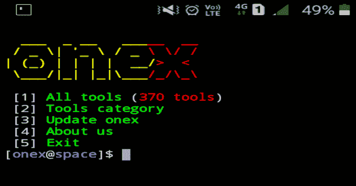
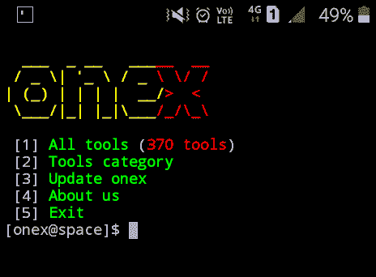
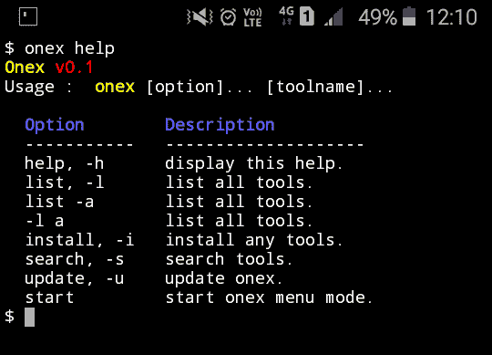

# onex:Termux 和其他 Linux 发行版的黑客工具库

> 原文：<https://kalilinuxtutorials.com/onex/>

**Onex** 是一个 kali linux hacking tools 安装程序，用于 termux 和其他 linux 发行版。是 hacker 的软件包管理器。它可以管理大量的黑客工具，只需点击一下就可以安装。

使用 onex，您可以在 Termux 和其他基于 Linux 的发行版中安装所有黑客工具。onex 可以安装**370 多个卡莉 linux 黑客工具**。使用`**onex install [tool_name]**`命令安装任何黑客工具。

**操作系统要求**

它可以在以下任何操作系统上运行:

*   Android(使用 Termux 应用程序)
*   Linux(基于 Linux 的系统)

**如何安装？**

打开终端并键入以下命令。

apt 更新
apt 安装 git
git 克隆 https://github.com/rajkumardusad/onex.git
chmod+x onex/install
sh onex/install 如果不行就用。/onex/install

**如何使用 onex？**

CLI 模式:

**onex -h 或 onex help 寻求帮助。**

**选项:**

onex install[工具名称]安装任何工具。
onex-I[工具名称]安装任何工具。
onex search [tool_name]搜索任何工具。
onex-s[工具名称]搜索任何工具。
onex list 列出所有工具。
onex list-列出所有工具。
onex -l 列出所有工具。
onex -l -a 列出所有工具。
onex help 获取帮助。
onex -h 获得帮助。

**菜单模式**

**onex 开始**开始 onex 菜单模式。

输入特定输出的数字:

*   显示所有可用的工具，并键入要安装的工具的编号。
*   显示工具类别。
*   如果你想更新 onex。
*   退出该工具。

[**Download**](https://github.com/rajkumardusad/onex)