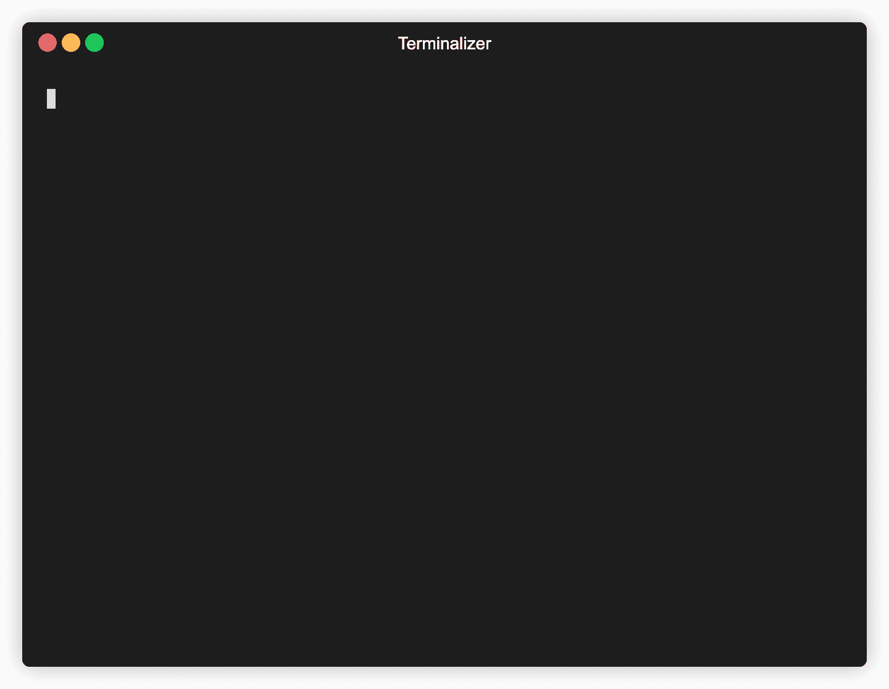
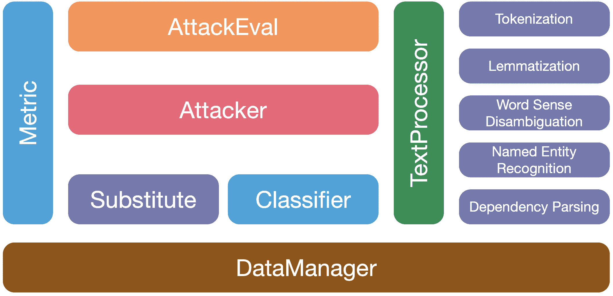

# OpenAttack:一个用于文本对抗攻击的开源包

> 原文：<https://kalilinuxtutorials.com/openattack/>

**OpenAttack** 是一个开源的基于 Python 的文本对抗性攻击工具包，处理文本对抗性攻击的全过程，包括文本预处理、访问受害者模型、生成对抗性实例和评估。

**功能&用途**

OpenAttack 具有以下特征:

*   **高可用性。** OpenAttack 提供了简单易用的 API，可以支持文本对抗性攻击的全过程；
*   **攻击模型类型全覆盖**。OpenAttack 支持句子/单词/字符级扰动和梯度/分数/基于决策/盲攻击模型；
*   **极大的灵活性和可扩展性**。您可以轻松攻击定制的受害者模型或开发和评估定制的攻击模型；
*   **综合评价**。OpenAttack 可以从攻击有效性、对抗样本质量和攻击效率三个方面全面评估一个攻击模型。

OpenAttack 用途广泛，包括:

*   为攻击模型提供各种方便的基线；
*   利用攻击模型的全面评估指标对攻击模型进行综合评估；
*   借助其通用攻击组件，帮助快速开发新的攻击模型；
*   评估机器学习模型对各种对抗性攻击的鲁棒性；
*   进行对抗训练，以通过用生成的对抗实例丰富训练数据来提高机器学习模型的鲁棒性。

**安装**

你可以使用`**pip**`或者克隆这个 repo 来安装 OpenAttack。

*   使用画中画(推荐)

**pip 安装 OpenAttack**

*   克隆此回购

**git 克隆 https://github.com/thunlp/OpenAttack.git
CD open attack
python setup . py install**

安装完成后，您可以尝试运行`**demo.py**`来检查 OpenAttack 是否工作正常:

**python demo.py**

**用法举例**

**基本:使用内置攻击**

OpenAttack 内置了一些常用的文本分类模型，如 LSTM 和伯特，以及数据集，如用于情感分析的 [SST](https://nlp.stanford.edu/sentiment/treebank.html) 和用于自然语言推理的 [SNLI](https://nlp.stanford.edu/projects/snli/) 。您可以毫不费力地对数据集上的内置受害者模型进行对抗性攻击。

以下代码片段显示了如何使用基于遗传算法的攻击模型( [Alzantot et al .，2018](https://www.aclweb.org/anthology/D18-1316.pdf) )在 SST 数据集上攻击 BERT:

**将 OpenAttack 导入为 OA
#选择一个经过训练的受害者分类模型
受害者= oa。DataManager.load("受害者。BERT . SST ")
#选择一个评估数据集
数据集= oa。DataManager.load("Dataset。SST . sample ")
#选择 Genetic 作为攻击者并用默认参数初始化
attack = OA . attackers . geneticattacker()
#准备攻击
attack_eval = oa.attack_evals。DefaultAttackEval(攻击者，受害者)
#发起攻击并打印攻击结果
attack_eval.eval(dataset，visualize=True)**

**高级:攻击定制的受害者模型**

以下代码片段显示了如何使用基于遗传算法的攻击模型来攻击 SST 上的定制情感分析模型(NLTK 中内置的统计模型)。

将 OpenAttack 导入为 oa
将 numpy 导入为 np
从 nltk . impression . Vader 导入 SentimentIntensityAnalyzer

#配置自定义受害者模型
类 MyClassifier(oa)的访问接口。分类器):
def**init**(self):
self . model = SentimentIntensityAnalyzer()
#访问关于输入句子的分类概率分数
def get_prob(self，input _):
rt =[]
for sent in input _:
RS = self . model . polarity _ scores(sent)
prob = RS[" pos "]/(RS[" neg "]+RS[" pos "])
DataManager.load("Dataset。SST . sample ")
#选择 Genetic 作为攻击者并用默认参数初始化
attack = OA . attackers . geneticattacker()
#准备攻击
attack _ eval = OA . attack _ evals。DefaultAttackEval(攻击者，受害者)
#发起攻击并打印攻击结果
attack_eval.eval(dataset，visualize=True)

**高级:设计定制的攻击模型**

OpenAttack 结合了许多方便的组件，可以很容易地组装成新的攻击模型。

这里给出了一个例子，说明如何设计一个简单的攻击模型，它打乱了原句中的标记。

**"'
这个示例代码展示了如何进行对抗性训练来提高情感分析模型的健壮性。
最重要的部分是“attack()”函数，在这个函数中，用一个 API“attack _ eval . generate _ adv()”**
'**"
import open attack
import torch
import datasets**

**设计一个前馈神经网络作为受害者情绪分析模型**

**def make _ model(vocab _ size):
" " "
见`tutorial - pytorch <https://pytorch.org/tutorials/beginner/text_sentiment_ngrams_tutorial.html#define-the-model>` __
"""
导入 torch.nn 为 nn
类 text sound(nn。模块):
def init(self，vocab_size，embed_dim=32，num_class=2):
super()。init()
self.embedding = nn。EmbeddingBag(vocab_size，embed_dim)
self.fc = nn。Linear(embed_dim，num_class)
self.softmax = nn。soft max(dim = 1)
self . init _ weights()
def init _ weights(self):
init range = 0.5
self . embedding . weight . data . uniform _(-init range，init range)
self . fc . weight . data . uniform _(-init range，init range)
self . fc . bias . data .()
def forward(self，text):
embedded = self . embedding(text，None)
拆分(" | "
}**

**选择 SST-2 作为数据集**

**def prepare _ data():
vocab = {
" ":0，
" ":1
}
dataset = datasets . load _ dataset(" SST ")。map(function=dataset_mapping)。remove_columns(["label "、" sentence "、" tree "])
for dataset _ name in[" train "、" validation "、" test "]:
for inst in dataset[dataset _ name]:
for token in inst[" tokens "]:
if token not in vocab:
vocab[token]= len(vocab)
返回 dataset["train"]、dataset["validation"]、dataset["test"]、vocab**

**批量数据**

**def make_batch(data，vocab):
batch _ x =[
[
vocab[token]if token in vocab else vocab[" "]
for token in tokens
for tokens in data[" tokens "]
]
max _ len = max([len(tokens)for tokens in data[" tokens "])
batch _ x =[
sentence+[vocab[" "]]*(max _ len–len(sentence))【max _ len(sentence)】】long tenser(batch _ x)，火炬。长期传感器(batch_y)**

**训练受害者模型一个时期**

**def train_epoch(model，dataset，vocab，batch_size=128，learning _ rate = 5e-3):
dataset = dataset . shuffle()
model . train()
criterion = torch . nn . nllloss()
optimizer = torch . optim . Adam(model . parameters()，lr = learning _ rate)
avg _ loss = 0
for start in range(0，len(dataset)，batch_size):
train_x，train _ y = make _ batch(dataset[start**

**训练受害者模型并进行评估**

**def train_model(model，data_train，data_valid，vocab，num _ epoch = 10):
MX _ ACC = None
MX _ model = None
for I in range(num _ epoch):
loss = train _ epoch(model，data_train，vocab)
clsf = OpenAttack。PytorchClassifier(model，word 2id = vocab)
accuracy = eval _ classifier _ ACC(data _ valid，clsf)
print(" Epoch % d:loss:% lf，accuracy %lf" % (i，loss，accuracy))
如果 mx_acc 为 None 或 MX _ ACC<accuracy:
MX _ model = model . state _ dict()
model . load _ state _ dict(MX _ model)
返回模型**

**发起对抗性攻击，生成对抗性实例**

**def attack(分类器，数据集，攻击者= open attack . attackers . pwwsattack()):
attack _ eval = open attack . attack _ evals。DefaultAttackEval(
攻击者=攻击者，
分类器=分类器，
success _ rate = True**
)
# correct _ samples = dataset . eval(分类器)。correct()
# Accuracy = len(correct _ samples)/len(dataset)
correct _ samples =[
inst for inst in dataset if classifier . get _**pred([inst[" x "]])[0]= = inst[" y "]
]
Accuracy = len(correct _ samples)/len(dataset)
adversarial _ samples = Attack _ eval . generate _ adv(correct _ samples)
Attack _ Success _ Rate = Attack _ evalDefaultTextProcessor()
def adversarial _ samples _ mapping(x):
return {
“tokens”:list(map(lambda x:x[0]，TP . get _ tokens(x[" x "]))
}
return adversarial _ samples . map(adversarial _ samples _ mapping)。remove_columns(["pred "，" original "，" info "])
def main():**
**print(" Loading data ")
train，valid，test，vocab = prepare _ data()# Load dataset
model = make _ model(len(vocab))# Design a victim model
print(" Training ")
trained _ model = Train _ model(model，Train，valid，vocab)# Train victim model
print("生成对抗性样本(本步骤 PytorchClassifier(trained _ model，word 2 id = vocab)# Wrap the victim model
adversarial _ samples = attack(clsf，train) #进行对抗性攻击并生成对抗性实例
print("对抗性训练分类器")
print(train . features)
print(对抗性 _ samples . features)
new _ dataset = {
" x ":[]，
"y": []，
"tokens": []append(it[" x "])
new _ dataset[" y "】。append(it[" y "])
new _ dataset[" tokens "】。追加(it[" tokens "])
for it in adversarial _ samples:
new _ dataset[" x "]。append(it[" x "])
new _ dataset[" y "】。append(it[" y "])
new _ dataset[" tokens "】。append(it[" tokens "])
fine tune _ model = train _ model(已训练模型，数据集。Dataset.from_dict(new_dataset)，valid，vocab) #用附加的对抗性例子重新训练分类器
print("测试增强模型(这一步需要几十分钟)")
attack(clsf，train) #重新攻击受害者模型来衡量对抗性训练的效果
if name = = ' main ':
main()**

**高级:对抗训练**

OpenAttack 通过攻击训练集中的实例，可以很容易地生成对抗性实例，这些实例可以添加到原始训练数据集中，以重新训练更健壮的受害者模型，即对抗性训练。

这里给出了一个如何用开放式进攻进行对抗性训练的例子。

**"'
这个示例代码展示了如何进行对抗性训练来提高情感分析模型的健壮性。
最重要的部分是“attack()”函数，在这个函数中，使用 API“attack _ eval . generate _ adv()”
“’
import open attack
import torch
import datasets**

**设计一个前馈神经网络作为受害者情绪分析模型**

**def make _ model(vocab _ size):
" " "
见`tutorial - pytorch <https://pytorch.org/tutorials/beginner/text_sentiment_ngrams_tutorial.html#define-the-model>` __
"""
导入 torch.nn 为 nn
类 text sound(nn。模块):
def init(self，vocab_size，embed_dim=32，num_class=2):
super()。init()
self.embedding = nn。EmbeddingBag(vocab_size，embed_dim)
self.fc = nn。Linear(embed_dim，num_class)
self.softmax = nn。soft max(dim = 1)
self . init _ weights()
def init _ weights(self):
init range = 0.5
self . embedding . weight . data . uniform _(-init range，init range)
self . fc . weight . data . uniform _(-init range，init range)
self . fc . bias . data .()
def forward(self，text):
embedded = self . embedding(text，None)
拆分(" | "
}**

**选择 SST-2 作为数据集**

d**ef prepare _ data():
vocab = {
" ":0，
" ":1
}
dataset = datasets . load _ dataset(" SST ")。map(function=dataset_mapping)。remove_columns(["label "、" sentence "、" tree "])
for dataset _ name in[" train "、" validation "、" test "]:
for inst in dataset[dataset _ name]:
for token in inst[" tokens "]:
if token not in vocab:
vocab[token]= len(vocab)
返回 dataset["train"]、dataset["validation"]、dataset["test"]、vocab**

**批量数据**

**def make_batch(data，vocab):
batch _ x =[
[
vocab[token]if token in vocab else vocab[" "]
for token in tokens
for tokens in data[" tokens "]
]
max _ len = max([len(tokens)for tokens in data[" tokens "])
batch _ x =[
sentence+[vocab[" "]]*(max _ len–len(sentence))【max _ len(sentence)】】long tenser(batch _ x)，火炬。长期传感器(batch_y)**

**训练受害者模型一个时期**

**def train_epoch(model，dataset，vocab，batch_size=128，learning _ rate = 5e-3):
dataset = dataset . shuffle()
model . train()
criterion = torch . nn . nllloss()
optimizer = torch . optim . Adam(model . parameters()，lr = learning _ rate)
avg _ loss = 0
for start in range(0，len(dataset)，batch_size):
train_x，train _ y = make _ batch(dataset[start**

**训练受害者模型并进行评估**

**def train_model(model，data_train，data_valid，vocab，num _ epoch = 10):
MX _ ACC = None
MX _ model = None
for I in range(num _ epoch):
loss = train _ epoch(model，data_train，vocab)
clsf = OpenAttack。PytorchClassifier(model，word 2id = vocab)
accuracy = eval _ classifier _ ACC(data _ valid，clsf)
print(" Epoch % d:loss:% lf，accuracy %lf" % (i，loss，accuracy))
如果 mx_acc 为 None 或 MX _ ACC<accuracy:
MX _ model = model . state _ dict()
model . load _ state _ dict(MX _ model)
返回模型**

**发起对抗性攻击，生成对抗性实例**

**def attack(分类器，数据集，攻击者= open attack . attacks . pwwsattack()):
attack _ eval = open attack . attack _ evals。DefaultAttackEval(
攻击者=攻击者，
分类器=分类器，
success _ rate = True
)
# correct _ samples = dataset . eval(分类器)。correct()
# Accuracy = len(correct _ samples)/len(dataset)
correct _ samples =[
inst for inst in dataset if classifier . get _ pred([inst[" x "]])[0]= = inst[" y "]
]
Accuracy = len(correct _ samples)/len(dataset)
adversarial _ samples = Attack _ eval . generate _ adv(correct _ samples)
Attack _ Success _ Rate = Attack _ eval . get _ resultDefaultTextProcessor()
def adversarial _ samples _ mapping(x):
return {
“tokens”:list(map(lambda x:x[0]，TP . get _ tokens(x[" x "]))
}
return adversarial _ samples . map(adversarial _ samples _ mapping)。remove_columns(["pred "，" original "，" info "])
def main():
print(" Loading data ")
train，valid，test，vocab = prepare _ data()# Load dataset
model = make _ model(len(vocab))# Design a victim model
print(" Training ")
trained _ model = Train _ model(model，Train，valid，vocab)# Train victim model
print("生成对抗性样本(这一步需要几十分钟)))PytorchClassifier(trained _ model，word 2 id = vocab)# Wrap the victim model
adversarial _ samples = attack(clsf，train) #进行对抗性攻击并生成对抗性实例
print("对抗性训练分类器")
print(train . features)
print(对抗性 _ samples . features)
new _ dataset = {
" x ":[]，
"y": []，
"tokens": []append(it[" x "])
new _ dataset[" y "】。append(it[" y "])
new _ dataset[" tokens "】。append(it[" tokens "])
for it in adversarial _ samples:
new _ dataset[" x "]。append(it[" x "])
new _ dataset[" y "】。append(it[" y "])
new _ dataset[" tokens "】。append(it[" tokens "])
fine tune _ model = train _ model(trained _ model，数据集。Dataset.from_dict(new_dataset)，valid，vocab) #用额外的对抗性例子重新训练分类器
print("测试增强模型(这一步需要几十分钟)")
attack(clsf，train) #重新攻击受害者模型来衡量对抗性训练的效果
if name = = ' main ':
main()**

**高级:设计定制的评估指标**

OpenAttack 支持设计定制的对抗性攻击评估指标。

这里给出了一个例子，如何添加 BLEU 分数作为一个定制的评估指标，以评估对抗性攻击。

**"'
此示例代码展示了如何设计一个定制的攻击评估指标，即 BLEU 分数。
"'
从 nltk.translate.bleu_score 导入语句 _bleu
导入数据集
类 CustomAttackEval(OpenAttack。DefaultAttackEval):
def init(self，attacker，clsf，processor=OpenAttack。DefaultTextProcessor()，**kwargs):
super()。init(attacker，clsf，processor=processor，* * kwargs)
self . processor = processor # We extend:py:class:`.DefaultAttackEval`并使用`processor`选项指定# the :py:class: `.TextProcessor`用于我们的`CustomAttackEval`。def measure(self，x_orig，x_adv): #调用最初的`measure`方法来获得 measurements info = super()。measure(x_orig，x _ adv)if info[" success "]:# Add`Blue`如果攻击成功，则由 NLTK 工具包计算得分。
token _ orig =【token for token，pos in self。_ _ processor . get _ tokens(x _ orig)]
token _ adv =[token for token，pos in self。_ _ processor . get _ tokens(x _ adv)]
info[" Bleu "]= sentence _ Bleu([x _ orig]，x _ adv)
return info
def update(self，info):
info = super()。update(info)
if info[" success "]:
#将我们刚刚计算的 bleu 分数加到总成绩中。
自我。_ _ result[" Bleu "]+= info[" Bleu "]
return info
def clear(self):
super()。
自清()。_ _ result = { " bleu ":0 }
# Clear results
def get _ result(self):
result = super()。get_result()
#计算 bleu 平均分数并返回。
结果["平均。Bleu"] = self。_ _ result[" bleu "]/result[" Successful Instances "]
返回结果
def dataset _ mapping(x):
return {
" x ":x[" sentence "]，
" y ":1 if x[" label "]>0.5 else 0，
}
def main():
clsf = open attack . load(" Victim。BiLSTM . SST ")
dataset = datasets . load _ dataset(" SST "，split="train[:20]")。map(function = dataset _ mapping)
attack = open attack . attackers . geneticattacker()
attack _ eval = CustomAttackEval(attack，clsf)
attack _ eval . eval(dataset，visualize = True)
if _ _ name = = " main ":
main()**

**攻击模式**

根据对原始输入的干扰程度，文本对抗性攻击模型可以分为句子级、单词级和字符级攻击模型。

根据对受害者模型的可达性，文本对抗性攻击模型可以分为基于**`gradient`**、 **`score`、基于**、`**decision**`和`**blind**`的攻击模型。

> [TAADPapers](https://github.com/thunlp/TAADpapers) 是一个论文列表，总结了几乎所有关于文本对抗性攻防的论文。你可以看看这个列表，找到更多的攻击模式。

目前 OpenAttack 包括 13 种针对文本分类模型的典型攻击模型，涵盖了**所有**攻击类型。

以下是当前涉及的攻击模型列表。

*   句子级
    *   用于调试 NLP 模型的语义等价对抗规则。*马尔科·图利奥·里贝罗，萨梅尔·辛格，卡洛斯·盖斯特林*。ACL 2018。`**decision**` [ [pdf](https://aclweb.org/anthology/P18-1079) ] [ [代码](https://github.com/marcotcr/sears) ]
    *   (SCPN) **用句法控制的释义网络生成对立范例**。莫希特·伊耶，约翰·维廷，凯文·金佩尔，卢克·塞特勒莫耶。NAACL-HLT 2018。`**blind**`[pdf](https://www.aclweb.org/anthology/N18-1170)[代码&数据](https://github.com/miyyer/scpn)
    *   **(甘)生成自然对立的例子**。*赵，Dheeru Dua，Sameer Singh* 。ICLR 2018。`**decision**` [ [pdf](https://arxiv.org/pdf/1710.11342.pdf) ] [ [代码](https://github.com/zhengliz/natural-adversary) ]
*   单词级
    *   作为组合优化的词级文本对抗攻击。*元稹、齐、、、和孙茂松*。ACL 2020。`**score**` [ [pdf](https://www.aclweb.org/anthology/2020.acl-main.540.pdf) ] [ [代码](https://github.com/thunlp/SememePSO-Attack) ]
    *   (TextFooler) **伯特真的健壮吗？自然语言攻击文本分类和蕴涵的强大基线**。*金迪，金志敬，乔伊·周天翼，彼得·索罗维兹*。AAAI 20 岁。`**score**` [ [pdf](https://arxiv.org/pdf/1907.11932v4) ] [ [代码](https://github.com/wqj111186/TextFooler) ]
    *   (PWWS) **通过概率加权的词显著性生成自然语言对抗实例**。*舒怀仁，邓义和，，车万祥*。ACL 2019。`**score**` [ [pdf](https://www.aclweb.org/anthology/P19-1103.pdf) ] [ [代码](https://github.com/JHL-HUST/PWWS/) ]
    *   **(遗传)生成自然语言状语的例子**。 *Moustafa Alzantot，Yash Sharma，Ahmed Elgohary，Bo-Jhang Ho，Mani Srivastava，张开伟*。EMNLP 2018。**`score`**[pdf](https://www.aclweb.org/anthology/D18-1316)[代码](https://github.com/nesl/nlp_adversarial_examples)
    *   (FD) **为递归神经网络制作对抗性输入序列**。Nicolas Papernot，Patrick McDaniel，Ananthram Swami，Richard Harang 。MILCOM 2016。`**gradient**` [ [pdf](https://arxiv.org/pdf/1604.08275.pdf) ]
*   单词/字符级
    *   (UAT) **攻击和分析 NLP 的通用对抗性触发器。** *埃里克·华莱士，史风，尼基尔·坎帕尔，马特·加德纳，萨米尔·辛格*。EMNLP-IJCNLP 2019。`**gradient**`[pdf](https://arxiv.org/pdf/1908.07125.pdf)[代码](https://github.com/Eric-Wallace/universal-triggers)[网站](http://www.ericswallace.com/triggers)
    *   (TextBugger) **TEXTBUGGER:生成对抗现实世界应用的对抗性文本**。*、纪守灵、杜天宇、、*。NDSS 2019。`**gradient**` `**score**` [ [pdf](https://arxiv.org/pdf/1812.05271.pdf)
    *   (HotFlip) **HotFlip:用于文本分类的白盒对抗示例**。*贾维德·易卜拉希米、饶安怡、丹尼尔·劳德、窦德静*。ACL 2018。`**gradient**` [ [pdf](https://www.aclweb.org/anthology/P18-2006) ] [ [代码](https://github.com/AnyiRao/WordAdver) ]
*   字符级
    *   像人类一样处理文本:视觉攻击和屏蔽 NLP 系统。*斯特芬·埃格尔、戈兹德·居尔·沙欣、安德里亚斯·吕克尔、李志荣、克劳迪娅·舒尔茨、莫赫森·梅斯加尔、克里斯坎特·斯万卡尔、埃德温·辛普森、伊雷娜·古雷维奇*。NAACL-HLT 2019。`**score**`[pdf](https://www.aclweb.org/anthology/N19-1165)[代码&数据](https://github.com/UKPLab/naacl2019-like-humans-visual-attacks)
    *   (DeepWordBug) **利用对抗性文本序列的黑盒生成来规避深度学习分类器**。*高技，杰克·兰昌廷，玛丽·卢索夫，*严俊·齐。IEEE SPW 2018。`**score**` [ [pdf](https://ieeexplore.ieee.org/document/8424632) ] [ [代码](https://github.com/QData/deepWordBug) ]

下表说明了攻击模型的比较。

| 模型 | 易接近 | 摄动 | 主要思想 |
| --- | --- | --- | --- |
| 海 | 决定 | 句子 | 基于规则的释义 |
| SCPN | 盲目的 | 句子 | 改写 |
| 开始 | 决定 | 句子 | 由编码器-解码器生成文本 |
| 谢梅尼普索 | 得分 | 单词 | 基于粒子群优化的单词替换 |
| TextFooler | 得分 | 单词 | 贪婪单词替换 |
| PWWS | 得分 | 单词 | 贪婪单词替换 |
| 遗传的 | 得分 | 单词 | 基于遗传算法的单词替换 |
| 软驱 | 梯度 | 单词 | 基于梯度的单词替换 |
| 短信虫 | 渐变，分数 | 单词+字符 | 贪婪的单词替换和字符操作 |
| UAT | 梯度 | 单词，字符 | 基于渐变的单词或字符操作 |
| 热剪辑 | 梯度 | 单词，字符 | 基于渐变的单词或字符替换 |
| 毒蛇 | 盲目的 | 茶 | 视觉上相似的字符替换 |
| DeepWordBug | 得分 | 茶 | 贪婪的字符操作 |

**工具包设计**

考虑到不同攻击模型之间的显著差异，我们为攻击模型的框架设计留下了相当大的自由度，并更多地关注于简化对抗性攻击的一般处理和攻击模型中使用的公共组件。

OpenAttack 有 7 个主要模块:

*   **TextProcessor** :处理原始文本序列，以协助攻击模型生成对抗实例。
*   **分类器**:包装受害者分类模型
*   **攻击者**:涉及多种攻击模式
*   **替换**:打包不同的单词/字符替换方法，广泛应用于单词级和字符级攻击模型。
*   **Metric** :提供多个对抗性实例质量度量，既可以作为攻击时对抗性实例的约束，也可以作为评估对抗性攻击的评估度量。
*   **AttackEval** :从攻击有效性、对抗性实例质量和攻击效率三个方面评估文本对抗性攻击。
*   **数据管理器**:管理所有的数据以及保存的模型，这些数据将在其他模块中使用

[**Download**](https://github.com/thunlp/OpenAttack)