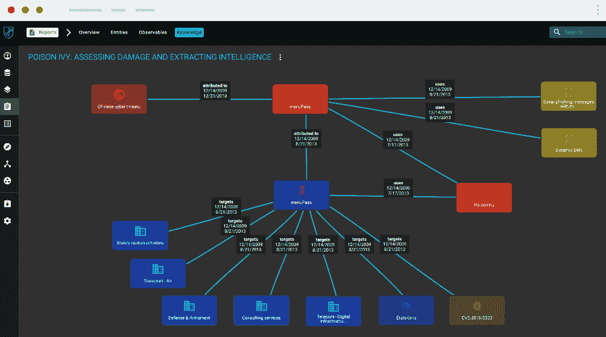

# OpenCti:开放式网络威胁情报平台

> 原文：<https://kalilinuxtutorials.com/opencti-open-cyber-threat-intelligence/>

OpenCTI 是一个开源平台，允许组织管理他们的网络威胁情报知识和可观察性。它是为了构建、存储、组织和可视化有关网络威胁的技术和非技术信息而创建的。

使用基于 [STIX2 标准](https://oasis-open.github.io/cti-documentation/)的知识架构来执行数据的结构化。它被设计成一个现代的网络应用程序，包括一个 [GraphQL API](https://graphql.org/) 和一个面向 UX 的前端。此外，OpenCTI 还可以与其他工具和应用程序集成，如 [MISP](https://github.com/MISP/MISP) 、[海芙](https://github.com/TheHive-Project/TheHive)、[米特 ATT & CK](https://github.com/mitre/cti) 等。

**目标**

目标是创建一个全面的工具，允许用户利用技术(如 TTP 和可观察值)和非技术信息(如建议的归因、受害者心理学等)。)同时将每条信息与其主要来源(报告、MISP 事件等)联系起来。)，具有诸如每个信息之间的链接、第一次和最后一次看到的日期、置信度等特征。该工具能够使用[ATT&CK 框架](https://attack.mitre.org/)(通过[专用连接器](https://github.com/OpenCTI-Platform/connectors))来帮助构建数据。用户也可以选择实现自己的数据集。

一旦 OpenCTI 中的分析师对数据进行了资本化和处理，就可以从现有关系中推断出新的关系,以便于理解和表示这些信息。这允许用户从原始数据中提取和利用有意义的知识。

OpenCTI 不仅允许[导入](https://opencti-platform.github.io/docs/usage/import)，还允许[导出不同格式(CSV、STIX2 包等)下的数据](https://opencti-platform.github.io/docs/usage/export)。).[连接器](https://github.com/OpenCTI-Platform/connectors)目前正在开发中，用于加速工具和其他平台之间的交互。

**也读-[Wordlister:一个简单的单词列表生成器&用 Python 写的 Mangler](https://kalilinuxtutorials.com/wordlister-simple-wordlist-generator/)**

**文档&演示**

如果你想了解更多关于 OpenCTI 的知识，可以阅读工具上的[文档。如果你想了解 OpenCTI 平台是如何工作的，一个](https://opencti-platform.github.io/docs)[演示实例](https://demo.opencti.io/)是可用的，并且对每个人开放。这个实例每天晚上都会重置，并且基于由 OpenCTI 开发人员维护的参考数据。

**发布下载**

这些版本可以在 [Github 发布页面](https://github.com/OpenCTI-Platform/opencti/releases)上获得。您还可以访问从存储库的 mater 分支生成的[滚动发布包](https://releases.opencti.io/)。

**安装**

安装 OpenCTI 平台所需要的一切都可以在[官方文档](https://opencti-platform.github.io/docs)中找到。对于安装，您可以:

*   [使用 Docker](https://opencti-platform.github.io/docs/installation/docker) (推荐)
*   [手动安装](https://opencti-platform.github.io/docs/installation/manual)

[**Download**](https://github.com/OpenCTI-Platform/opencti)