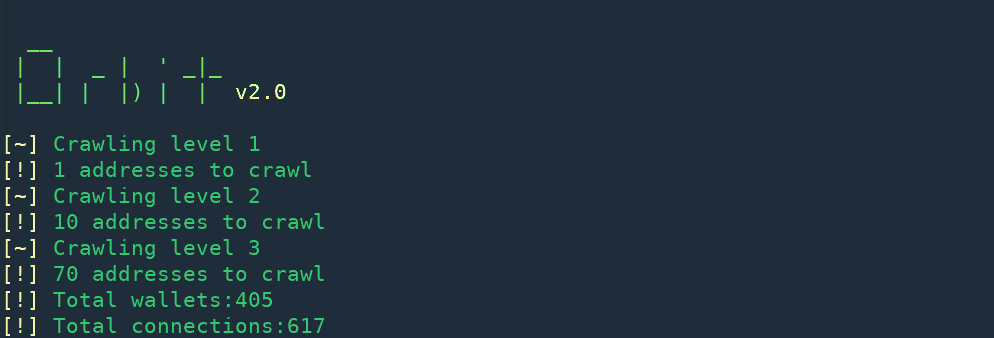

# Orbit:区块链交易调查工具

> 原文：<https://kalilinuxtutorials.com/orbit-blockchain-transactions-investigation/>

**Orbit** 旨在通过递归搜索交易历史来探索区块链钱包的网络。数据以图表的形式呈现，以揭示主要来源、汇点和可疑连接。

**注意:**只在 Python 3.2 及以上版本上运行。

**用途**

让我们从抓取钱包的交易历史开始

**python 3 orbit . py-s 1 ajbsfz 64 EPE fs 5 uajafcu G8 ph 8 jn3r n1 f**

爬多个钱包也没什么区别。

**python3 轨道。py-S1 aj FZ 64 epfs 5 uajacug 8 ph 8jn 3rn 1f，1 etbbshbydw 7 hgwxxxz 3 px VH 3 vfomax**

默认情况下，Orbit 从每个钱包中获取最后 50 笔交易，但是可以使用`-l`选项进行调整。

**python 3 orbit . py-s 1 ajbsfz 64 EPE fs 5 uajafcu G8 ph 8 jn3r n1 f-l 100**

Orbit 的默认搜索深度为 3，即它获取目标钱包的历史记录，搜索新发现的钱包，然后再次搜索结果中的钱包。可通过`-d`选项增加或减少爬行深度。

**python 3 orbit . py-s 1 ajbsfz 64 EPE fs 5 uajafcu G8 ph 8 jn3r n1 f-d 2**

与我们的目标进行了几次互动的钱包可能并不重要，可以使用`-t`选项告诉 Orbit 抓取每一级的前 N 个钱包。

**python 3 orbit . py-s 1 ajbsfz 64 EPE fs 5 uajafcu G8 ph 8 jn3r n1 f-t 20**

如果您想用自己选择的图形查看器查看收集的数据，可以使用-o 选项。

**python 3 orbit . py-s 1 ajbsfz 64 EPE fs 5 uajafcu G8 ph 8 jn3r n1 f-o output . graph ml**

支持格式

*   `**graphml**`(受大多数图形查看器支持)
*   `**json**`(用于原始加工)

这是你的终端仪表板。

**也可阅读—[7 大最佳开源 SQL 注入工具—2019](https://kalilinuxtutorials.com/best-open-source-sql-injection-tools/)**

**可视化**

扫描完成后，图表将自动在默认浏览器中打开。如果没有打开，手动打开`**quark.html**`。如果你的图表看起来像下图或者更糟，不要担心。

选择 **Make Clusters** 选项，使用社区检测算法形成集群。之后，您可以使用**颜色簇**为每个社区赋予不同的颜色，然后使用**指定**选项来修复重叠的节点&边缘。

边的厚度取决于两个钱包之间的交易频率，而节点的大小取决于交易频率和节点的连接数。

[**Download**](https://github.com/s0md3v/Orbit)