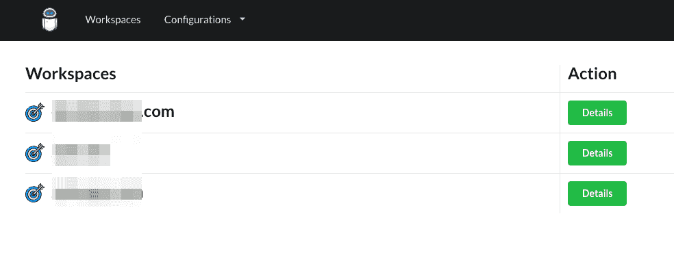
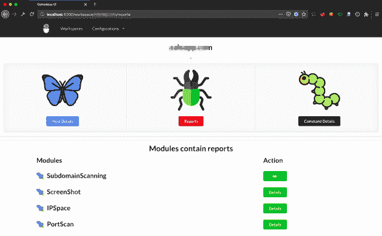
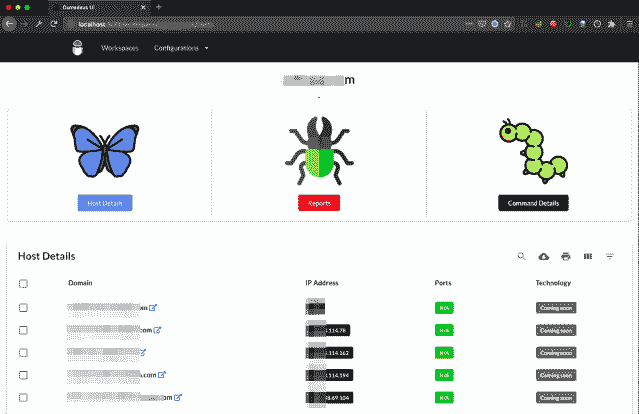
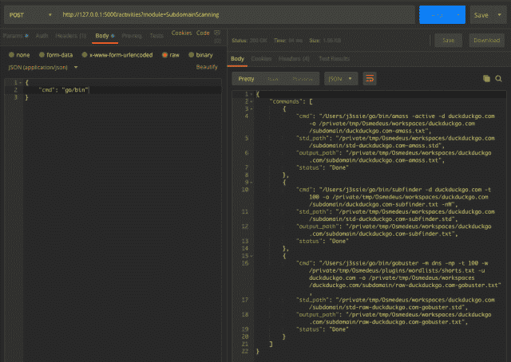

# Osmedeus:用于侦察和漏洞扫描的全自动攻击性安全工具

> 原文：<https://kalilinuxtutorials.com/osmedeus-reconnaissance-vulnerability-scanning/>

Osmedeus 允许您自动运行一系列出色的工具来侦察和扫描目标的漏洞。如果你不知道你在做什么，只需输入下面的命令

**。/osme deus . py-t example.com**

**也可阅读-[Just-Metadata:收集的工具&分析关于 IP 地址的元数据](https://kalilinuxtutorials.com/just-metadata/)**

**安装**

git 克隆 https://github.com/j3ssie/Osmedeus
CD osme deus
。/install.sh

**特性**

*   子域扫描。
*   子域接管扫描。
*   截图目标。
*   基本侦察，如 Whois，挖掘信息。
*   IP 发现。
*   彩色扫描。
*   SSL 扫描。
*   标题扫描。
*   端口扫描。
*   脆弱扫描。
*   单独的工作区存储所有扫描输出和详细记录。
*   REST API。
*   SPA Web 用户界面。
*   延期通知。

**演示**

*   
*   
*   
*   
*   

**免责声明**

这个工具大部分是由工具的作者完成的，你可以在模块文件夹中看到。我只是把所有的部分放在一起，加上一些我们不想每天做的额外的无聊的事情。

该工具仅用于教育目的。你要对自己的行为负责。如果你在使用这个软件时搞砸了一些事情或者违反了任何法律，那是你的错，而且仅仅是你的错。

[**Download**](https://github.com/j3ssie/Osmedeus)