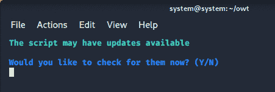
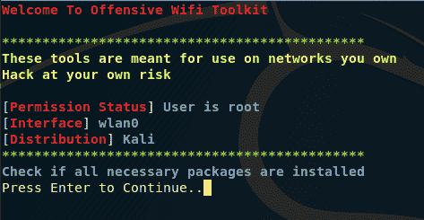
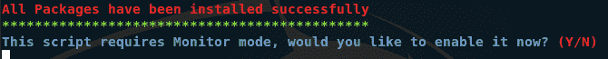
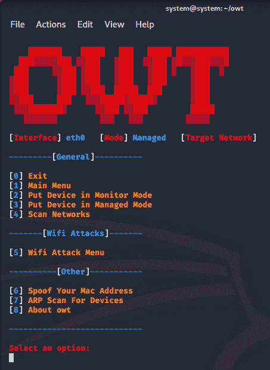
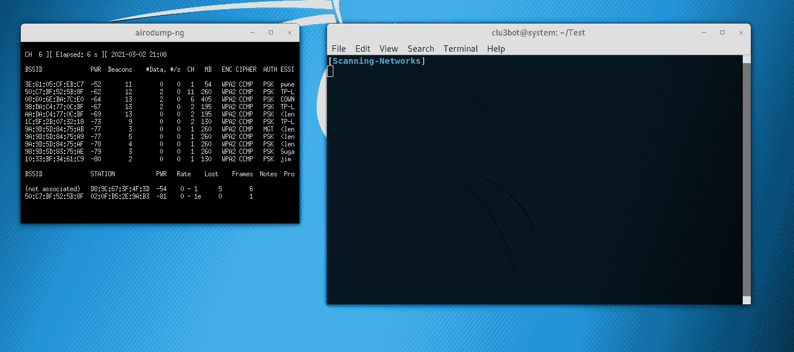
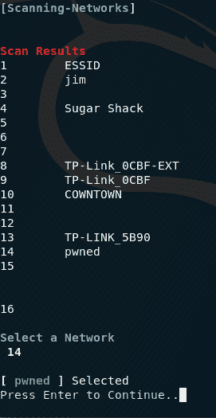
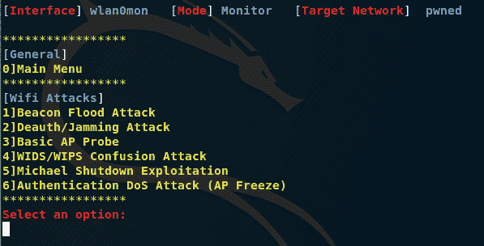

# Owt:在命令行 Linux 上工作的最紧凑的 WiFi 审计工具

> 原文：<https://kalilinuxtutorials.com/owt/>

Owt 在一个 unix bash 脚本中编译了一些必要的 wifi 审计工具，界面友好。owt 的目标是尽可能减小文件大小，同时仍然以最高的效率运行。

**安装&运行脚本**

**~ $ git 克隆 https://github.com/clu3bot/OWT.git
~ $ CD owt
~ $ sudo bash owt . sh**

**注意:owt 需要 root 权限**

**确保允许定期更新**

**用途**

**注意**这些照片可能已经过时，但功能将永远不变。

启动 owt 时，用户首先看到的是一个更新提示，上面写着检查脚本更新。按 enter 键将检查 owt 的更新并自动应用它们。

接下来，用户将被提示主介绍，其中显示了权限状态、当前检测到的界面以及您当前使用的 Linux 发行版。通过按 enter 键，脚本将自动下载任何所需的依赖项。

检查所需的依赖关系后。您必须将接口置于监控模式。按回车键将为您完成此操作。

接下来，脚本将把您带到 owt 主菜单，用户可以从 8 个选项中进行选择。

选择扫描网络将扫描您可以选择用于攻击的网络。除了 Deauther 和 Beacon Flood 之外的所有攻击都需要这个。

扫描后，你会得到扫描结果。用户可以在这里选择他们想要攻击的网络。选择网络后，您将返回主菜单。

一旦用户选择了一个网络，现在是时候去 WiFi 攻击菜单。这是主菜单上的选项 5。在攻击菜单中有 6 种攻击模式可供选择。除了 Deauther 攻击和信标洪水攻击之外，所有攻击都需要选择一个网络。

如果未选择网络，并且您试图使用需要该网络的攻击模式，您将被重定向到扫描网络。

**故障排除**

Troubleshoot.sh 将检测 owt 可能存在的问题

 ****~ $ CD owt
~ $ sudo bash trouble shooting . sh**

[**Download**](https://github.com/clu3bot/owt)**