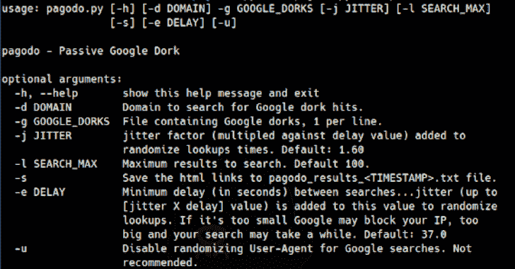

# Pagodo:自动化谷歌黑客数据库抓取和搜索

> 原文：<https://kalilinuxtutorials.com/pagodo/>

**帕果多**的目标是开发一个被动的谷歌呆子脚本，收集互联网上潜在的易受攻击的网页和应用程序。有两个部分。第一部分是检索谷歌呆子的`**ghdb_scraper.py**`，第二部分是利用由`**ghdb_scraper.py**`收集的信息的`**pagodo.py**`。

**什么是谷歌呆子？**

令人敬畏的人在攻击安全维护谷歌黑客数据库(GHDB)在这里找到:[https://www.exploit-db.com/google-hacking-database](https://www.exploit-db.com/google-hacking-database)。这是一个谷歌搜索的集合，称为呆子，可以用来找到潜在的易受攻击的框或其他有趣的信息，这些信息被谷歌的搜索机器人拾取。

**安装**

脚本是为 Python 3.6+编写的。克隆 git 存储库并安装需求。

**git 克隆 https://github.com/opsdisk/pagodo.git
CD 帕戈多
virtualenv -p python3。venv #如果使用虚拟环境。
来源。venv/bin/activate #如果使用虚拟环境。
pip install-r requirements . txt**

谷歌屏蔽了我！

如果你开始得到 HTTP 503 错误，谷歌已经理所当然地检测到你是一个机器人，并将阻止你的 IP 一段时间。解决方案是使用代理链和一组代理来循环查找。

安装代理链 4

**安装代理链 4 -y**

编辑`/etc/proxychains4.conf`配置文件，通过不同的代理服务器循环查找。在下面的例子中，已经用不同的本地监听端口(9050 和 9051)设置了 2 个不同的动态 socks 代理。不知道如何利用 SSH 和动态 socks 代理？帮自己一个忙，拿起一本[网络管道工手册](https://cph.opsdisk.com)，学习所有关于安全外壳(SSH)隧道、端口重定向和像老板一样弯曲流量的知识。

**vim/etc/proxy chains 4 . conf**

round _ robin
chain _ len = 1
proxy _ DNS
remote _ DNS _ subnet 224
TCP _ read _ time _ out 15000
TCP _ connect _ time _ out 8000
【proxy list】
socks 4 127 . 0 . 0 . 1 9050
socks 4 127 . 0 . 0 . 1 9051

将`proxychains4`放在 Python 脚本前面，每次查找将通过不同的代理(因此来自不同的 IP)。您甚至可以调低`-e`延迟时间，因为您将利用不同的代理盒。

**proxy chains 4 python 3 pagodo . py-g ALL _ dorks . txt-s-e 17.0-l 700-j 1.1**

**Ghdb_Scraper.py**

首先，`pagodo.py`需要一份当前所有谷歌呆子的名单。回购中还提供了一个带有日期时间戳的文件，其中包含谷歌呆子和个人呆子类别的呆子。幸运的是，使用`ghdb_scraper.py`的一个 GET 请求就可以拉回整个数据库。您可以将所有呆瓜转储到一个文件中，将单个呆瓜类别转储到单独的呆瓜文件中，或者如果您想要更多关于呆瓜的上下文数据，可以转储整个 json blob。

找回所有呆瓜

**python 3 ghdb _ scraper . py-j-s**

要检索所有呆瓜并将其写入单独的类别:

python3 ghdb_scraper.py -i

呆子类别:

类别= {
1:“立足点”，
2:“包含用户名的文件”，
3:“敏感目录”，
4:“Web 服务器检测”，
5:“易受攻击的文件”，
6:“易受攻击的服务器”，
7:“错误消息”，
8:“包含有趣信息的文件”，
9:“包含密码的文件”，
10:“敏感在线购物信息”，
11:“网络或易受攻击数据”，
12:“包含以下内容的页面

**Pagodo.py**

现在，一个包含最新 Google 文件的文件已经存在，可以使用`-g`开关将它输入到`pagodo.py`中，开始收集潜在易受攻击的公共应用程序。`pagodo.py`利用`google` python 库在谷歌上搜索带有谷歌呆子的网站，例如:

**intitle:“邮件列表登录”管理演示**

`-d`开关可用于指定一个域，并作为 Google 搜索操作符:

**网站:example.com**

尽可能快地执行大约 4600 个谷歌搜索请求是行不通的。谷歌将理所当然地发现它是一个机器人，并在一段时间内阻止你的 IP。为了使搜索查询看起来更人性化，已经做了一些改进。Python `google`模块的维护者提出并接受了一个 pull 请求，以允许用户代理在 Google 搜索查询中随机化。此功能在 [1.9.3](https://pypi.python.org/pypi/google) 中可用，允许您随机选择用于每次搜索的不同用户代理。这模拟了大型企业环境中使用的不同浏览器。

第二个增强集中在随机化搜索查询之间的时间。使用`-e`选项指定最小延迟，抖动因子用于将时间加到最小延迟数上。创建一个 50 个抖动时间的列表，其中一个随机附加到每次 Google dork 搜索的最小延迟时间上。

**#创建抖动值数组以增加延迟，有利于更长的搜索时间。self . jitter = numpy . random . uniform(低=self.delay，高=jitter * self.delay，size=(50，)**

在脚本的后面，从抖动数组中选择一个随机时间并添加到延迟中。

**暂停 _ 时间= self . delay+random . choice(self . jitter)**

尝试使用这些值，但默认设置在谷歌没有屏蔽我的 IP 地址的情况下成功运行。请注意，运行可能需要几天时间(平均 3 天),所以请确保您有时间。

要运行它:

python 3 pagodo . py-d example.com-g 多克斯. txt -l 50 -s -e 35.0 -j 1.1

**结论**

随时欢迎评论、建议和改进。一定要在 Twitter 上关注 [@opsdisk](https://twitter.com/opsdisk) 的最新更新。

[**Download**](https://github.com/opsdisk/pagodo)