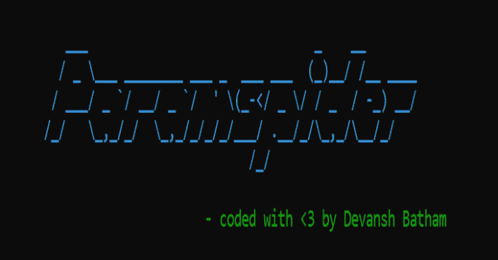
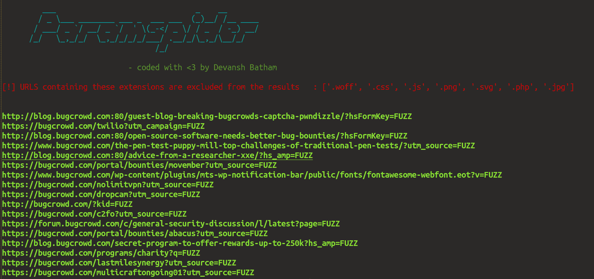

# ParamSpider:从 Web 档案的黑暗角落中挖掘参数

> 原文：<https://kalilinuxtutorials.com/paramspider/>

**ParamSpider** 是从 web 档案的黑暗角落中挖掘参数。

**特性**

*   从输入域的 web 档案中查找参数。
*   也从子域中查找参数。
*   支持排除带有特定扩展名的 URL。
*   以简洁的方式保存输出结果。
*   它从 web 档案中挖掘参数(无需与目标主机交互)

**用途**

**注意:**使用 python 3.7+版本

$ git 克隆 https://github.com/devanshbatham/ParamSpider
$ CD param spider
$ pip 3 install-r requirements . txt
$ python 3 param spider . py–域 hackerone.com

**使用选项**

**1–对于简单扫描[没有–exclude 参数]**
$ python 3 param spider . py–域 hackerone.com
->输出 ex:https://hackerone.com/test.php?q=FUZZ

**2–用于排除带有特定扩展名的 URL**
$ python 3 param spider . py–域 hackerone.com–排除 php、jpg、SVG

**3–用于查找嵌套参数**
$ python 3 param spider . py–域 hackerone.com–级别高
- >输出 ex:https://hackerone.com/test.php?p=test&q
**5–使用自定义占位符文本(默认为 FUZZ)，例如不添加占位符**
$ python 3 param spider . py–域 hackerone.com–占位符 FUZZ 2

**6–使用安静模式(不在屏幕上打印 URL)**
$ python 3 param spider . py–域 hackerone.com–安静

**7–排除子域[对于来自域+子域的参数，不要指定此项**

**也读作-[InQL:graph QL 安全测试的一个 Burp 扩展](https://kalilinuxtutorials.com/inql-2/)**

**ParamSpider+GF(针对海量 pwnage)**

假设您已经安装了该工具，现在您想从过多的参数中过滤出有价值的参数。不用担心，你可以使用 [GF(by tomnomnom)](https://github.com/tomnomnom/gf) 轻松完成。

**注意**:确保你已经将 [go](https://golang.org/doc/install) 正确安装在你的机器上。

跟着这个走:

$ go get-u github.com/tomnomnom/gf
$ CP-r $ GOPATH/src/github . com/tomnom nom/gf/examples ~/。gf

**注意:用你系统中 gf 二进制所在的路径替换'/User/levi/go/bin/gf '。**

$ alias gf = '/User/Levi/go/bin/gf '
$ CD ~/。gf/

**注意:在~/中粘贴 JSON 文件(https://github . com/devanshbatham/param spider/tree/master/gf _ profiles)。gf/ folder**

**现在运行 ParamSpider 并导航到输出目录**

$ GF redirect domain . txt//获取潜在的打开重定向/SSRF 参数
$ GF xss domain . txt//获取潜在的 XSS 易受攻击参数
$ GF potential domain . txt//获取 xss + ssrf +打开重定向参数
$ GF WordPress domain . txt//获取 WordPress URL

**【更多】**

**例子**

$ python 3 param spider . py–域 bugcrowd.com–排除 woff、css、js、png、svg、php、jpg–输出 bugcrowd.txt

**注意:**由于它从 web 档案数据中获取参数，因此误报的几率很高。

**推特:** [0xAsm0d3us](https://twitter.com/0xAsm0d3us)

[**Download**](https://github.com/devanshbatham/ParamSpider)