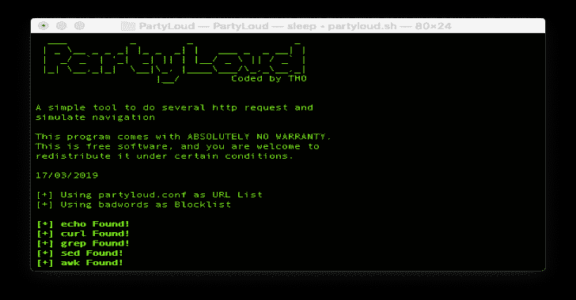

# PartyLoud:一个生成虚假网页浏览和减轻跟踪的简单工具

> 原文：<https://kalilinuxtutorials.com/partyloud/>

[](https://blogger.googleusercontent.com/img/b/R29vZ2xl/AVvXsEiNrzmSgtKc9-Kg2zlhKamnQTAEB-_Mb0bEfLTDB6W321lLgVN6-i_4L_EAuL6HkeRxG-90YtDPxJpI2e56xNyzMA1gousIhb70ZdlUSoXq_VId2_QwEtRiwnnvbnZ9Cmug8bkWUi5WTM_uLcz-yTFUsww7v3R0-Vji4Du5re6b4gYnTPuP65Ni9wFZ/s728/Partyloud.png)

PartyLoud 是一个高度可配置和简单的免费工具，帮助你避免直接从你的 linux 终端跟踪，不需要特殊技能。一旦开始，你可以忘记它正在运行。它提供了几个标志；每个旗帜都可以让你定制自己的体验，并根据自己的需要改变派对狂欢的行为。

*   **简单。只有 3 个文件，不需要安装，只需克隆这个 repo 就可以了。**
*   **强大的。**基于线程的导航。
*   **鬼头鬼脑。**优化模拟用户导航。
*   **便携。**您可以在所有基于 unix 的操作系统上使用这个脚本。

## 它是如何工作的？

*   加载 URL 和关键字(从 partyloud.conf 和 badwords 或从用户定义的文件)
*   如果使用了代理标志，将测试代理配置
*   对于 ULR 列表中的每个 URL，启动一个线程，每个线程作为一个[用户代理](https://developer.mozilla.org/en-US/docs/Web/HTTP/Headers/User-Agent)关联
*   每个线程将通过向给定的 URL 发送一个 [HTTP](https://www.scaler.com/topics/hypertext-transfer-protocol/) 请求来启动
*   使用关键字过滤响应，以防止 404 和格式错误的 URL
*   从过滤后生成的列表中选择一个新的 url
*   当前线程随机休眠一段时间
*   使用新的 URL 重复从 4 到 7 的动作，直到用户发送终止信号(CTRL-C 或 enter 键)

## 特征

*   可配置的 URL 列表和黑名单
*   随机 DNS 模式:每个请求在不同的 DNS 服务器上完成
*   多线程请求引擎(线程数等于 party cloud . conf 中的 URL 数)
*   保护引擎免受故障影响的错误恢复机制
*   欺骗用户代理阻止指纹识别(每个引擎有不同的用户代理)
*   动态用户界面

## **设置**

克隆存储库:

**git 克隆 https://github.com/realtho/PartyLoud.git**

导航到目录并使脚本可执行:

**CD party loud
chmod+x party loud . sh**

运行“派对云”:

**。/partyloud.sh**

**用途**

```
Usage: ./partyloud.sh [options...]

-d --dns <file>                    DNS Servers are sourced from specified FILE,
                                   each request will use a different DNS Server
                                   in the list
                                   !!WARNING THIS FEATURE IS EXPERIMENTAL!!
                                   !!PLEASE LET ME KNOW ISSUES ON GITHUB !!
-l --url-list <file>               read URL list from specified FILE
-b --blocklist <file>              read blocklist from specified FILE
-p --http-proxy <http://ip:port>   set a HTTP proxy
-s --https-proxy <https://ip:port> set a HTTPS proxy
-n --no-wait                       disable wait between one request and an other
-h --help                          dispaly this help
```

##### 要停止脚本，按回车键或 CRTL-C 键

## 文件规格

在当前版本中，没有对文件的输入验证。如果你发现了 bug 或者有关于如何改进这个功能的建议，请在 GitHub 上打开问题来帮助我

## 介绍

###### 如果你没有特殊的需求，默认的配置文件就足够了。

默认文件位于:

*   [脏话](https://github.com/davideolgiati/PartyLoud/blob/master/badwords)
*   [partyloud.conf](https://github.com/davideolgiati/PartyLoud/blob/master/partyloud.conf)
*   [日列表](https://github.com/davideolgiati/PartyLoud/blob/master/DNSList)

请注意，文件名和扩展名并不重要，重要的是文件的内容

#### [不良词汇](https://github.com/davideolgiati/PartyLoud/blob/master/badwords)–基于关键词的阻止列表

[badwords](https://github.com/davideolgiati/PartyLoud/blob/master/badwords) 是一个基于关键字的阻止列表，用于过滤非 HTML 内容、图像、文档等。
默认配置是经过几周的测试后创建的。如果你真的认为你需要一个自定义的黑名单，我的建议是根据你的需要复制和修改默认配置。
以下是一些关于如何创建优秀黑名单文件的提示:

| 做✅ | DONT🚫 |
| --- | --- |
| 仅使用 ASCII 字符 | 定义仅限一个站点的规则 |
| 尽量保持规则的一般性 | 定义区分大小写的规则 |
| 首选相对路径 | 每行放置多条嵌线 |

#### [party loud . conf](https://github.com/davideolgiati/PartyLoud/blob/master/partyloud.conf)–ULR 列表

[partyloud.conf](https://github.com/davideolgiati/PartyLoud/blob/master/partyloud.conf) 是一个 ULR 列表，用作假冒导航生成器的起点。
这里的目标是创建一个包含大量 URL 的网站列表。
除了建议你不要使用谷歌、youtube 和社交网络的相关链接，我真的没有给你任何提示。

注意# 1–要正常工作，URL 必须是[格式良好的](https://earthsci.stanford.edu/computing/hosting/urlsyntax/index.php)
注意# 2–即使文件包含 1000 行，也只使用 10 行(前 10 行，随机处理)
注意# 3–每行只允许一个 URL

#### [域名列表](https://github.com/davideolgiati/PartyLoud/blob/master/DNSList)–域名列表

[DNSList](https://github.com/davideolgiati/PartyLoud/blob/master/DNSList) 是用作随机 DNS 功能参数的 DNS 列表。默认情况下，随机 DNS 是不启用的，所以“默认文件”实际上只是一条指导线，是在开发 se 功能时使用的一个测试，如果一切都按预期工作的话。
这里唯一的建议是添加尽可能多的地址以增加随机性。

注意# 1–每行只允许一个地址

## 常见问题解答

这不就是 curl 的一个基于 cli 的前端吗？

错误恢复机制是如何工作的？

我可以叉你的项目吗？这种假流量有多容易被察觉？

坏词是做什么的？

party cloud . conf 是做什么的？

party cloud . conf 只是一个用来启动伪导航的根 URL 列表。您可以创建自己的 conf 文件，但是要注意，您添加的 URL 越多，启动的线程就越多。这是一个“未决问题”。即将发布的版本将会有一个最大线程数，以避免[分叉爆炸](https://www.geeksforgeeks.org/fork-bomb/)。

[Click Here To Download](https://github.com/davideolgiati/PartyLoud#intro)