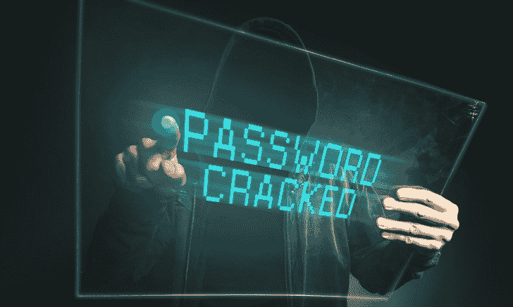

# 如何保护自己免受常见的密码攻击

> 原文：<https://kalilinuxtutorials.com/password-attacks/>

为了避免密码攻击，身份验证和访问管理可能会不断发展，但密码不会在不久的将来消失。专家认为，2020 年使用中的密码数量将达到[3000 亿](https://www.logonbox.com/en/journal/state-of-passwords-security-2019-businesses-still-falling-short/)。

虽然 IT 专业人员明白安全密码的重要性，但几乎 [70%](https://www.logonbox.com/en/journal/state-of-passwords-security-2019-businesses-still-falling-short/) 的员工都是以不安全的方式分享密码。除此之外，超过 50%的公司员工在他们所有的账户中重复使用同一个密码。

可靠的密码管理技术保护用户帐户免受常见的密码攻击。攻击者使用各种方法来访问密码信息。不使用适当安全措施的企业可能会面临数据泄露。

## **什么是密码攻击？**

密码攻击是试图获取用户登录信息。黑客技术不必很复杂。人们通常会想到显而易见的单词和数字，并将它们合并成一个简单的密码。

在大多数情况下，黑客可以通过尝试一些常见的短语(如用户名)来猜测密码。未经验证的攻击者可以利用诸如 [Apache Struts 漏洞](https://resources.whitesourcesoftware.com/blog-whitesource/apache-struts-vulnerabilitie)之类的漏洞在远程系统上执行恶意代码。

一项针对 1000 万人的分析显示，最常见的密码就是单词“password”或数字序列“12345”。这 1000 万人中有 8%在密码中使用了 0 到 99 之间的数字，五分之一的密码中包含数字 1。

除了这些可怕的发现，分析还发现，人们越来越意识到创建强密码。因此，黑客需要使用更复杂的密码破解方法。

## **6 种常见的密码破解攻击**

大多数密码攻击技术很容易在网上获得。任何具备基本计算机技能的黑客都可以遵循这些技术成功破解密码。这个列表回顾了六种最常见的技术。

### **1。暴力攻击**

在暴力攻击中，黑客使用机器人等自动化工具，通过运行尽可能多的密码组合来访问用户的帐户。

黑客通常会在黑网上或通过安全漏洞获得常用密码或真实用户凭证的列表。

暴力机器人通过系统地尝试这些列表中的所有凭据来攻击网站，并在登录成功时通知攻击者。

为了保护您的组织免受暴力攻击，请使用强密码和多重身份验证来授予帐户访问权限。

### **2。字典攻击**

在字典攻击中，黑客使用自动工具浏览常用单词列表，并获得用户帐户的访问权限。

这种攻击的成功率很高，因为用户通常选择短密码，并基于常用词。

字典攻击不同于暴力攻击。字典攻击从最有可能成功的可能性开始，而暴力攻击是逐字母进行的。在尝试常用单词后，攻击会在末尾添加数字，以及用数字替换字母。

### **3。凭证填充**

凭据填充攻击使用以前漏洞中的数据和上下文来登录其他系统。该攻击基于用户在不同的服务上重复使用密码的假设。

大约[在另一个系统上进行 1000 次](https://owasp.org/www-community/attacks/Credential_stuffing)凭据填充尝试中有一次会导致成功登录。即使用户创建了强密码，他们仍然在服务间共享它们。与暴力攻击相比，这种技术通常具有更高的成功率。

### **4。彩虹桌**

大多数现代组织使用哈希来保护他们的密码。哈希技术使用数学公式将密码加密成看起来随机的字符串。

散列法是基于黑客无法读取[加密密码](https://kalilinuxtutorials.com/passpie-command-line-password-manager/)的假设。这听起来很安全，但是哈希并不总是有效。

破解加密密码的一种方法是彩虹表攻击。这种攻击会对所有字典单词进行哈希处理，并将它们与实际的哈希密码进行交叉引用。如果匹配，这可能是正确的密码。

### **5。密码喷涂**

黑客使用密码喷射攻击来获得使用几个密码选项访问多个帐户的权限，而不是尝试使用多个密码访问单个帐户。

密码喷射大大扩大了潜在的目标。即使只有一个用户使用弱密码，您的整个业务也可能面临风险。

密码喷涂是一种缓慢而稳定的攻击方式。黑客更喜欢有条不紊地攻击，在不同的账户间尝试不同的密码。

因此，黑客可以绕过重复失败尝试后触发的帐户锁定检测机制。对于基于云的认证平台或登录服务，密码喷涂尤其危险。

### **6。中间人攻击**

当你在互联网上使用一个远程应用程序时，你假设你正在直接与应用程序的服务器通信。

[中间人](https://kalilinuxtutorials.com/mitm-man-in-the-middle-router/)攻击通过将黑客置于用户和目标服务器之间，打破了这一假设。

黑客拦截您的设备和服务器之间的流量，窃取凭证和其他敏感数据。

黑客通常对餐馆、机场和酒店等未加密的 Wi-Fi 网络实施中间人攻击。当你在公共 Wi-Fi 上冲浪时，黑客可以很容易地使用广泛可用的工具来窥探你的互联网流量。

## **如何保护**自己？

对常见威胁的基本认识和强大的网络安全措施可以帮助您防止常见的密码攻击。看看你需要采取的一些基本措施来保持安全:

*   **要求强密码**—您可以使用 LastPass 这样的密码生成器工具强制用户定义长而复杂的密码。您还应该强制定期更改密码。
*   **登录延迟**—您可以在尝试失败后锁定用户帐户一段时间。每一次尝试都会使延迟变得更长。
*   **锁定规则**—您可以在多次登录失败后锁定用户帐户，然后以管理员身份解锁帐户。
*   Captcha—像 reCAPTCHA 这样的工具需要用户完成简单的任务来登录系统。用户可以轻松完成这些任务，而暴力机器人却不能。

## **结论**

密码仍然是保护您的在线帐户的常用方法。然而，与 Fernando Corbató首次推出时相比，如今它们面临着许多安全挑战。

用一个普通的字典单词来保护你的帐户是不够的。黑客可以利用各种广泛使用的工具，比如 Kali Linux，来破解大部分密码。好消息是，基本的意识和网络安全措施，如多因素身份验证，可以保护您免受大多数密码窃取攻击。