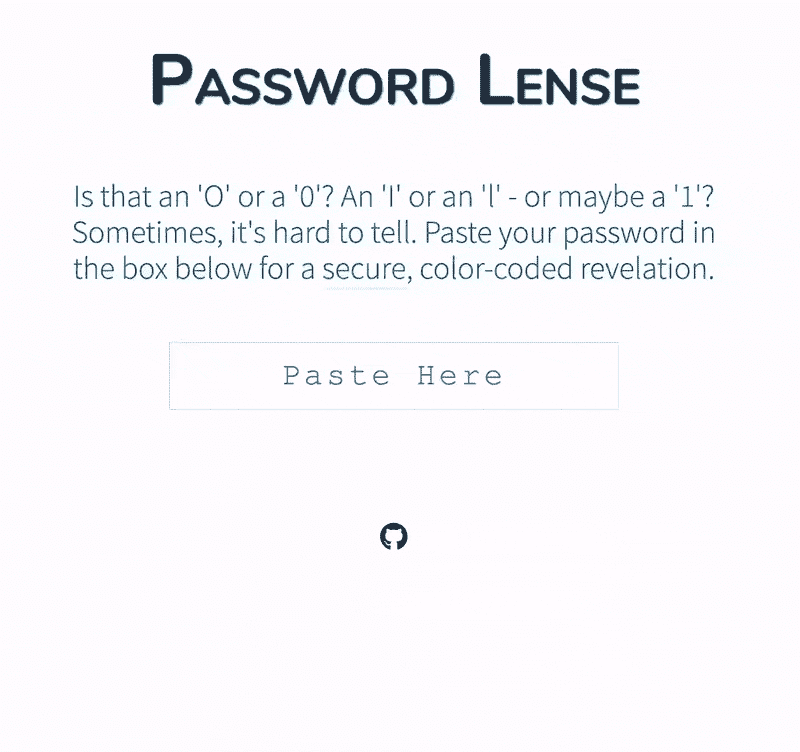

# 密码透镜:显示密码中字符类型

> 原文：<https://kalilinuxtutorials.com/password-lense/>

密码中的某些字符(“O”和“0”，“I”和“l”等)。)在您需要键入它们时可能很难识别(并且复制粘贴不可用)。**Password lens**是一个小型的网络应用程序，它提供了一种快速安全的方式来获取您的密码的更多信息。

**特色**

*   用相应的图例/密钥对密码中的每个字符进行颜色编码
*   在每个角色上基于悬停的工具提示以防颜色不够
*   辅助调色板
*   易于字符识别的等宽字体
*   核心功能即使在离线时也能工作
*   安全(您的密码永远不会离开您的浏览器)
*   按`ESC`清除密码(以防有人意外进入)
*   根据公开披露的数据漏洞检查您的密码*(需要互联网连接)*
*   自动检查更新*(需要互联网连接)*

**也可理解为—[osme deus—用于侦察和漏洞扫描的全自动攻击性安全框架](https://kalilinuxtutorials.com/osmedeus-fully-automated-offensive-security-framework/)**

**跑自己的**

[**Click Here**](https://app.netlify.com/start/deploy?repository=https://github.com/wKovacs64/pwl)[**Download**](https://github.com/wKovacs64/pwl)