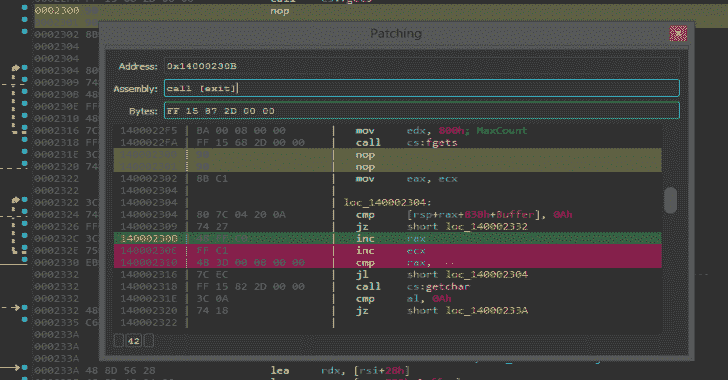
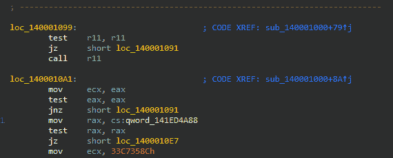

# 补丁:一个交互式二进制补丁插件

> 原文：<https://kalilinuxtutorials.com/patching/>

.png)

在恶意软件分析、软件逆向工程和更广泛的安全研究领域，修补汇编代码以改变现有程序的行为并不少见。该项目扩展了流行的 IDA Pro 反汇编程序，以创建一个更健壮的交互式二进制补丁工作流，用于快速迭代。

该项目目前由普遍存在的 Keystone 引擎的一个次要分支提供支持，支持 x86/x64 和 Arm/Arm64 补丁，并计划在未来的版本中支持剩余的 Keystone 架构。

# 装置

这个插件需要 IDA 7.6 和 Python 3。它支持 Windows、Linux 和 macOS。

## 易于安装

在 IDA 控制台中运行以下代码行，自动安装插件:

### Windows / Linux

**导入 urllib.request 作为 r；exec(r . urlopen(' https://github . com/gaasedelen/patching/raw/main/install . py ')。阅读())**

**苹果电脑**

**导入 urllib.request 作为 r；exec(r . urlopen(' https://github . com/gaasedelen/patching/raw/main/install . py '，cafile='/etc/ssl/cert.pem ')。阅读())**

## 手动安装

或者，可以通过从发布页面下载适用于您各自平台的可分发插件包并将其解压缩到您的插件文件夹来手动安装插件。

***强烈*** 建议您将该插件安装到 IDA 的用户插件目录中:

**导入 ida_diskio，OS；print(OS . path . join(IDA _ diskio . get _ user _ idadir()，" plugins))**

# 使用

补丁插件将为支持的架构(x86/x64/Arm/Arm64)自动加载，并将相关的补丁操作注入 IDA 反汇编视图的右键上下文菜单中:

以下部分描述了上下文修补操作的完整列表。

## 组装

可以通过右键单击上下文菜单中的组装操作启动主修补对话框。它模拟了一个基本的 IDA 反汇编视图，可以用来快速连续地编辑一个或几个指令。

装配线是一个可编辑字段，可用于实时修改说明。按回车键会将输入的指令提交(修补)到数据库中。

你当前的位置(也就是你的光标)将总是以绿色突出显示。在提交补丁之前，由于您的补丁/编辑而被破坏的指令将以红色突出显示。

最后，当仍然聚焦在可编辑的汇编文本字段上时，可以使用`**UP**`和`**DOWN**`箭头键来快速地在反汇编视图中上下移动光标，而不需要使用鼠标。

## NOP

最常见的修补操作是删除一条或多条指令。由于这个原因，NOP 操作将总是在快速访问的右键菜单中可见。

可以忽略单个指令，也可以忽略选定范围的指令。

## 强制条件跳转

强制条件跳转总是执行“好”路径是另一种常见的修补操作。这个插件只会在右击一个条件跳转指令时显示这个动作。

如果你*从来不*想要一个条件跳转，你可以直接不要它！

## 保存&快速应用

可以随时通过修补子菜单将修补程序保存(应用)到选定的可执行文件。快速应用操作使使用相同设置存储后续补丁变得更快。

该插件还将积极努力保留原始可执行文件的备份(`**.bak**`)，用于在每次保存时“干净地”应用当前的数据库补丁集。

## 恢复补丁

最后，如果你对一个补丁不满意，你可以简单地右击补丁(黄色)指令块，将它们恢复到原来的值。

虽然将字节恢复到它们的原始值是“容易”的，但是将分析恢复到以前的状态却是“困难”的。恢复补丁可能*偶尔*需要额外的人工修复。

[**Download**](https://github.com/gaasedelen/patching)