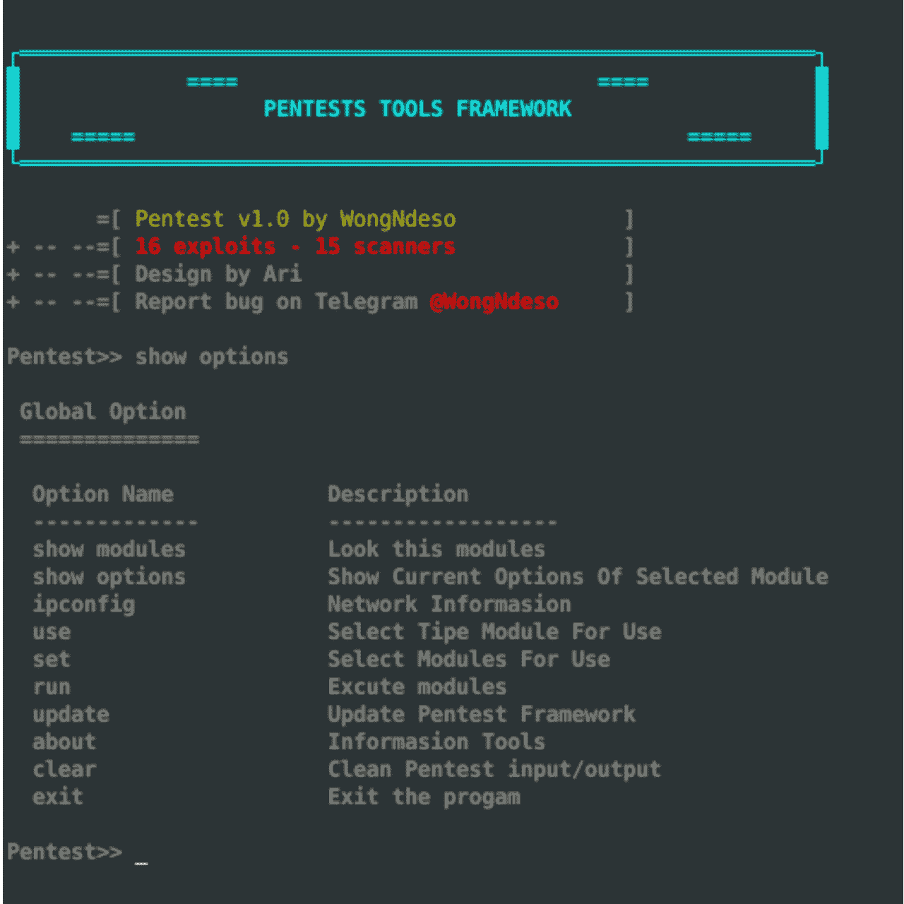
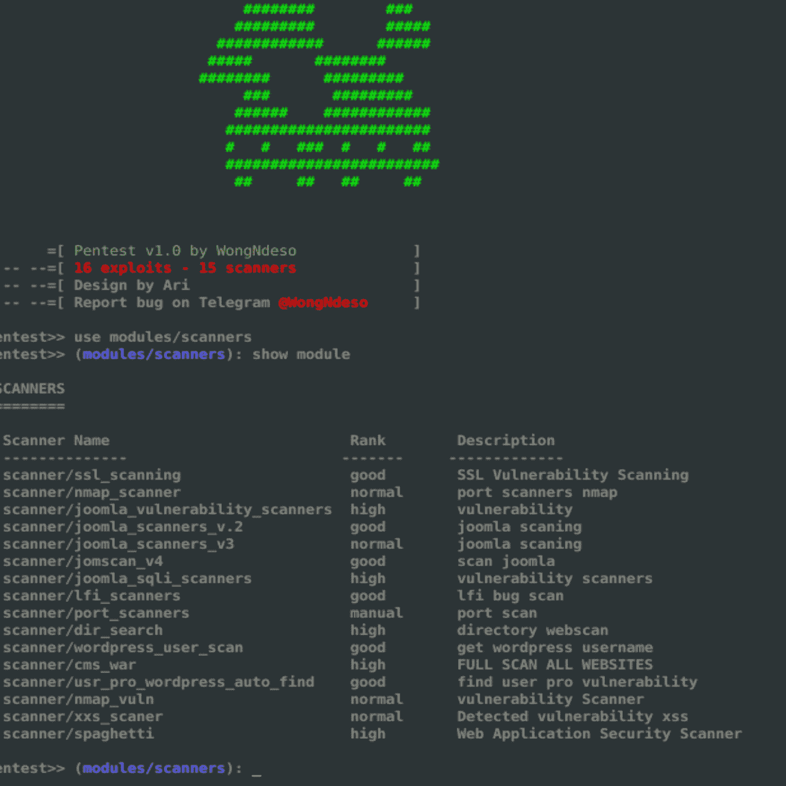
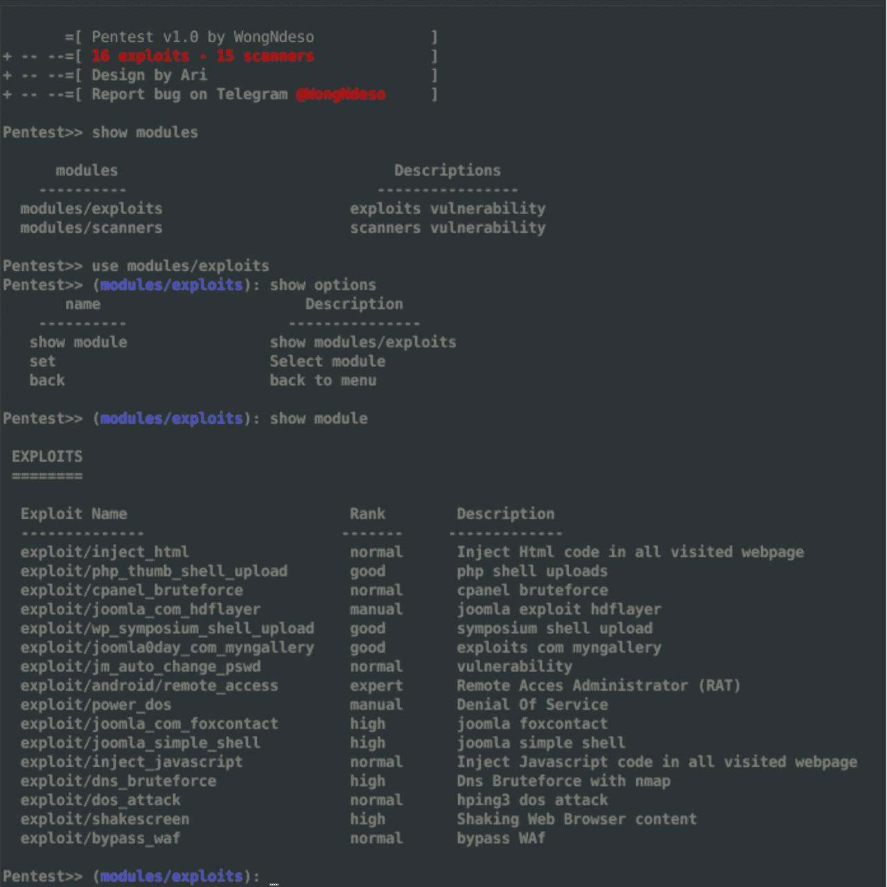

# Pentest 工具框架:一个用于渗透测试的漏洞、扫描器和工具的数据库

> 原文：<https://kalilinuxtutorials.com/pentest-tools-framework/>

**Pentest Tools** Framework 是一个漏洞、扫描器和渗透测试工具的数据库。Pentest 是一个功能强大的框架，包含了很多适合初学者的工具。可以探索内核漏洞，网络漏洞。

**关于** **PTF**

这是一个漏洞、扫描器和渗透测试工具的数据库。Pentest 是一个功能强大的框架，包含了很多适合初学者的工具。可以探索内核漏洞，网络漏洞。

**如何安装 PTF？**

**root @ kali ~ # CD Pentest-Tools-Framework**
**root @ kali ~ # pip install-r requirements . txt**
**root @ kali ~ # python install . py**
**root @ kali ~ # PTF**

运行 install.py 之后，你应该选择你的**back box/kali Linux/parrot**Os，所有计算机 Os，

**关于 PTF 模块**

*   **战功**

利用软件中的漏洞并用于对计算机系统进行攻击的计算机程序、代码或命令序列。攻击的目的可以是夺取对系统的控制，并破坏其功能！

*   **扫描仪**

扫描指定互联网资源、档案或网站的程序。此外，网络扫描仪可以扫描开放的端口或您的本地网络和 IPs！

**另请阅读-[无密码认证将在 2022 年成为主流](https://kalilinuxtutorials.com/passwordless-authentication/)**

为什么是 PTF？

这是一个自由软件。这是一个开始探索漏洞的好平台！

*   面向初学者的简单 UX/用户界面
    *   它为初学者提供了简单的 UX/用户界面！
    *   它很容易理解，你会更容易掌握这个工具。
*   很多适合初学者的工具
*   它有ерт以下模块
    *   **战功**
    *   **扫描仪**
    *   **密码**
*   这对于初学者来说已经足够了。

[**Download**](https://github.com/pikpikcu/Pentest-Tools-Framework)