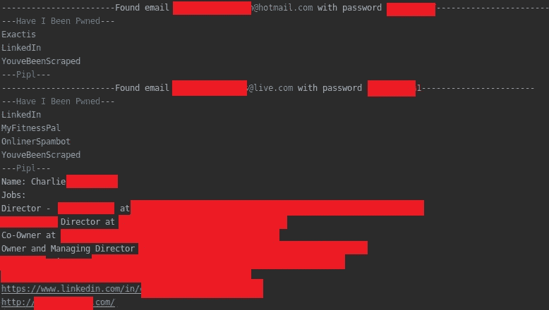
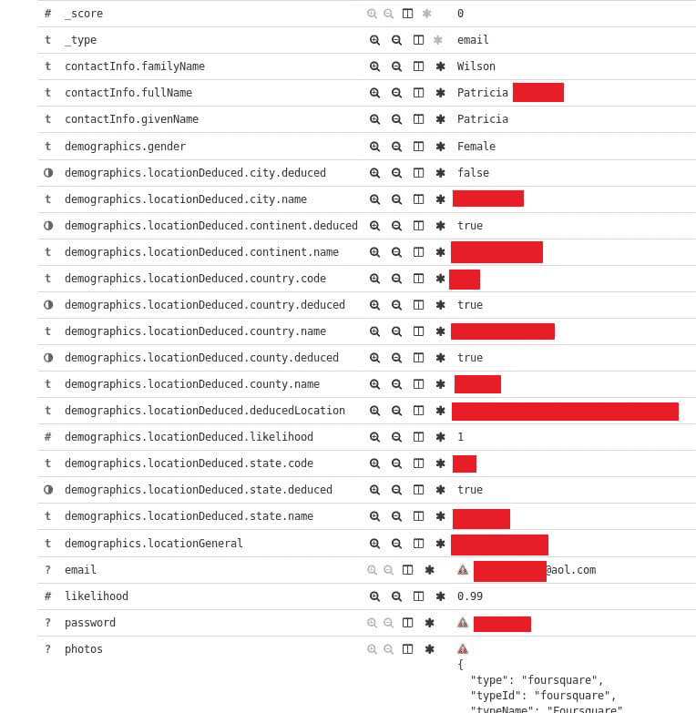
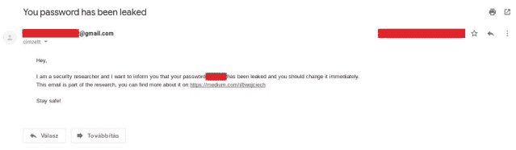

# Pepe:从 Pastebin 收集有关电子邮件地址的信息

> 原文：<https://kalilinuxtutorials.com/pepe-information-email-addresses/>

Pepe 是一个从 Pastebin 收集邮件地址信息的工具。脚本解析 Pastebin 电子邮件:密码转储并收集每个电子邮件地址的信息。

它支持 Google、Trumail、Pipl、FullContact 和 HaveIBeenPwned。此外，它允许你发送一封信息邮件给某人，告诉他密码被泄露了，最后所有的信息都会进入 Elasticsearch，以供进一步的探索。

它只支持一种格式-电子邮件:密码。

其他的都不行！

目前，当它在 FullContact 上找到匹配时，通知就会起作用，然后向您发送电子邮件地址和相关的社交媒体帐户。

**又读-[xs strike:最先进的 XSS 扫描仪](https://kalilinuxtutorials.com/xsstrike-xss-scanner/)**

**要求:**

*   python3
*   全接触 API[https://www.fullcontact.com/developer/](https://www.fullcontact.com/developer/)
*   谷歌
*   pipl API[https://pipl.com/api/](https://pipl.com/api/)
*   HaveIBeenPwned
*   安全推送(用于通知–可选–进行中)[https://www.pushsafer.com/](https://www.pushsafer.com/)
*   trumail[https://trumail.io/](https://trumail.io/)
*   Gmail 帐户(发送电子邮件)
*   Elasticsearch (optional)

**pip 安装要求**

**配置**

{ " domains ":
{ # domains to white list 或 blacklist
"whitelist": [""]，
" black list ":[" Yahoo . com "]
}，
" KEYS ":
{ # API KEYS
" push safer ":" API _ KEY "，
"fullcontact": "API_KEY "，
"pipl": "API_KEY"
}，
"gmail":
{ #GMAIL 密码！已经泄露，您应该立即更改。\ n 此电子邮件是研究的一部分，您可以在 https://medium.com/@wojciech\n\nStay 安全网站上找到更多相关信息！”}，
" elastic search ":
{ # elastic search 连接信息
"host": "127.0.0.1 "，
"port": 9200}
}

**用途**

root @ kali:~/pycharmprojects/Pepe # python Pepe . py-h
用法:Pepe . py[-h][–file file][–stream][–interactive]
[–modules modules[modules…]]][–elastic search]
[–whitelist][–blacklist]
clover/snark^
http://ascii.co.uk/art/platypus
发布剥削 Pastebin 邮件
github.com/woj-ciech
medium.com/@woj_ciech
示例:
python Pepe . py–file–interactive–whitelist
python Pepe . python Pepe

**例子**

交互模式，每封邮件被单独检查，特定的模块被执行。

root @ kali:~/PycharmProjects/Pepe # python Pepe . py–file paste . txt–interactive–黑名单
——————————
发现邮箱[REDACTED]@hotmail.com 带密码【编校】————【A】添加域名 hotmail.com 到黑名单
【T】测试
【G】Google 搜索
【H】havebeenpwned
【P】Pipl
【F】full contact
【I】通知
【N】下一步【T9 通知
【N】下一个
N
——————————【编辑】———
【A】添加域名 gmail.com 到黑名单
【T】测试
【G】Google 搜索
【H】已更新
【P】Pipl
【F】full contact
【I】通知
【N】下一个
F
通知
【N】下一位
P
—Pipl—
姓名:【编审】
【编审】年龄
工作:
品控【编审】(2018 年至今)
【编审】审核[编审](2017-2018)
【编审】代理人[编审](2017-2018)
代理人[编审](2017-2017)

……

非交互模式，当只有选择的模块对电子邮件地址执行。

root @ kali:~/PycharmProjects/# python Pepe . py–file paste test . txt–black list–modules hibp Google full contact Trumail–elastic Search
—————————找到密码为[编校]————
—Google Search—
https://paste bin . com/[编校]
—我被 Pwned 了吗—
LinkedIn
—full contact—
没有结果
—Trumail— 【T8
—Trumail—
邮件测试通过
—————————找到密码为【编校】————————
—谷歌搜索—
http://【编校】
http://【编校】
https://pastebin.com/【编校】
—我被 Pwned 了吗—
BTSec

https://www.facebook.com/【编校】
https://plus.google.com/【编校】
https://www . LinkedIn . com/in/【编校】
http://www.pinterest.com/【编校】
https://twitter.com/【编校】
https://youtube.com/user/【编校】
【编校】

**截图**

*   
*   
*   

[**Download**](https://github.com/woj-ciech/pepe)