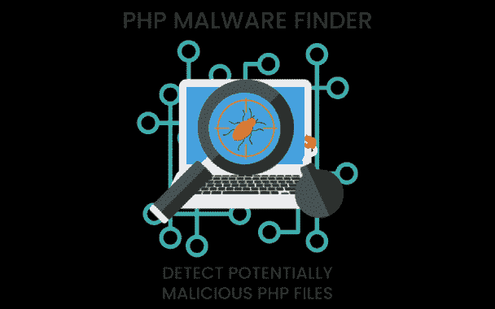

# Php-Malware-Finder:检测潜在的恶意 Php 文件

> 原文：<https://kalilinuxtutorials.com/php-malware-finder/>

**PHP-malware-finder** 尽最大努力使用恶意软件/web shell 中常用的 PHP 函数来检测混乱/危险的代码和文件。

还检测到以下编码器/混淆器/web shell 列表:

*   矮脚鸡
*   最佳 PHP 混淆器
*   卡宾胺
*   密码设计
*   Cyklodev
*   Joes 网络工具混淆器
*   页（page 的缩写）美国航空公司
*   PHP Jiami
*   Php 模糊编码
*   续集
*   Weevely3
*   原子的
*   眼镜蛇混淆器
*   毫微；纤（10 的负九次方）
*   诺瓦霍特
*   php 编码
*   tennc
*   网络恶意软件收集
*   webtoolsvn

当然，绕过 PMF 是微不足道的，但它的目标是抓住小孩和白痴，而不是有正常大脑的人。如果你报告了一个愚蠢的为 PMF 量身定做的旁路，你很可能属于一个(或两个)类别，应该重新阅读前面的陈述。

## 它是如何工作的？

检测是通过搜索文件系统并根据一组 YARA 规则测试文件来执行的。对，就是这么简单！

PMF 没有使用基于*哈希的*方法，而是尽可能地使用语义模式，来检测“一个`**$_GET**`变量被解码两次，解压缩，然后传递给一些危险的函数，如**`system`**”之类的东西。

## 安装

*   安装 Yara。这也可以通过一些 Linux 包管理器来实现:
    *   Debian: `**sudo apt-get install yara**`
    *   红帽:`**yum install yara**`(需要 EPEL 资源库)

您也可以从源代码编译它:

**git 克隆 git @ github . com:virus total/yara . git
CD yara/
YACC =野牛。/配置
使**

*   下载 php 恶意软件查找工具`**git clone https://github.com/jvoisin/php-malware-finder.git**`

## 怎么用？

**$。/phpmalwarefinder -h
用法 phpmalwarefinder[-cfhtvl]…
-c 规则文件的可选路径
-f 快速模式
-h 显示此帮助消息
-t 指定要使用的线程数量(默认为 8 个)
-v 详细模式**

或者如果你喜欢使用`**yara**`:

**$ yara -r ./php.yar /var/www**

请记住，您应该至少使用 YARA 3.4，因为我们正在为白名单系统使用哈希和贪婪的正则表达式。请注意，如果您计划从源代码构建 yara，为了支持散列，必须在您的系统上安装 libssl-dev。

哦，顺便说一下，你可以用`**make tests**`运行*综合*测试套件。

## 白名单

检查 whitelist.yar 文件。如果您很懒，可以使用 generate_whitelist.py 脚本为整个文件夹生成白名单。

## 为什么我要用它而不是别的？

因为:

*   它没有对每个样本使用单一的规则，因为它只关心寻找恶意模式，而不是特定的 webshells
*   它有一个完整的测试套件，以避免回归
*   它的白名单系统不依赖文件名
*   它不依赖于(缓慢的)熵计算
*   它使用犹太风格的静态分析，而不是依赖文件散列
*   多亏了前面提到的伪静态分析，它(尤其)在混淆文件上工作得很好

[**Download**](https://github.com/jvoisin/php-malware-finder)