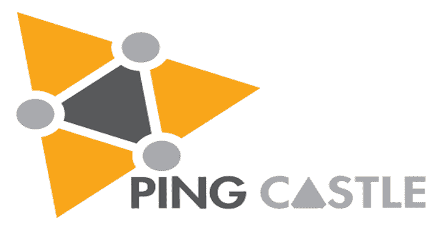

# PingCastle:在 20%的时间内获得 80%的 Active Directory 安全性

> 原文：<https://kalilinuxtutorials.com/pingcastle-active-directory-security/>

**PingCastle** 是一款工具，旨在通过基于风险评估和成熟度框架的方法快速评估活动目录的安全级别。它的目标不是完美的评估，而是一种效率折衷。

关于 Active Directory 安全的风险级别已经更改。像米米卡兹这样的工具或者像 adsecurity.org T2 这样的网站已经流行了几个漏洞。

|:.PingCastle(版本 2.5.2.0)
| #:。在 20%的时间内获得 80%的 Active Directory 安全性
# @@ >支持结束日期:2020 年 7 月 31 日
| @@@:
:。#文森特·勒图克斯·(contact@pingcastle.com)
。:https://www.pingcastle.com
使用交互模式。
不要忘记还有其他命令行开关，如–help，您可以使用
您想做什么？
1-健康检查-对域的风险进行评分
2-图表-分析管理组和授权
3-综合-将多个报告聚合为一个报告
4-空会话-执行特定的安全检查
5-绘制所有互联域的地图
6-扫描仪-在工作站上执行特定的安全检查

**也可阅读-[Http 请求走私者:为打嗝套件](https://kalilinuxtutorials.com/http-request-smuggler-extension-burp-suite/)扩展 **

**建造**

PingCastle 是一个 c#项目，可以从 Visual Studio 2012 构建到 Visual Studio 2017

**支持&生命周期**

对于支持请求，您应该联系[support@pingcastle.com](mailto:support@pingcastle.com)我们会尽最大努力为基础版提供支持，并在新版本发布时提供修复。

PingCastle 的基础版每 6 个月(1 月、8 月)发布一次，每次发布时都会更新这个库。

如果您需要更改，请联系[contact@pingcastle.com](mailto:contact@pingcastle.com)获取支持包。

**执照**

PingCastle 源代码根据专有许可证和非营利性开放软件许可证(“非营利性 OSL”)3.0 进行许可。

除非购买了许可证，否则您不得从该源代码中获利。更具体地说:

*   如果营利性公司自己(或其 ITSM 提供商)运营 PingCastle，则无需购买任何许可证即可运营。
*   要基于 PingCastle 构建服务并从中赚钱，您必须购买许可证。

Ping Castle 使用以下开源组件:

*   [Bootstrap](https://getbootstrap.com/) 获得[麻省理工学院许可](https://tldrlegal.com/license/mit-license)
*   [JQuery](https://jquery.org/) 获得[麻省理工学院许可](https://tldrlegal.com/license/mit-license)
*   [vis.js](http://visjs.org/) 获得[麻省理工学院许可](https://tldrlegal.com/license/mit-license)

**信用:Vincent LE TOUX**

[**Download**](https://github.com/vletoux/pingcastle)