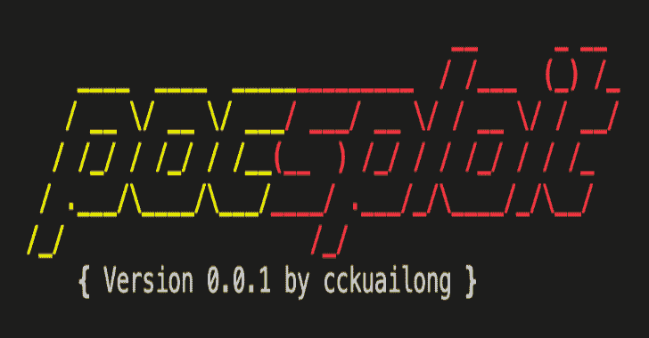

# Pocsploit:一个轻量级、灵活、新颖的开源 Poc 验证框架

> 原文：<https://kalilinuxtutorials.com/pocsploit/>

.png)

pocsploit 是一个轻量级的、灵活的、新颖的开源 poc 验证框架。

## 市场上 POC 框架的难点

*   params 太多了，不知道怎么入门，只说了一些常用的。
*   YAML poc 框架(如 nuclei & xray)不够灵活。写 poc 的时候转换成本很高。有时候遇到非 http 协议就很难了。(只能使用十六进制)
*   有时 POC 会出现误报，这可以通过精确的指纹匹配来避免。
*   它严重依赖于框架。pocsploit 中的 Poc 可以在框架中使用，也可以单独使用。

## pocsploit 的优势

*   更轻，不依赖于框架，单个 poc 就可以运行
*   更容易重写概念验证
*   更灵活(相比原子核、x 射线、虾虎鱼等。)
*   误报少，提供指纹前提判断，可以先判断现场是否有某个成分的指纹，再进行 POC 验证，更准确
*   有许多方法可以使用，提供 poc / exp
*   详细的漏洞信息显示
*   Poc 生态可持续性:我将继续更新 Poc 到 modules/，并欢迎大家加入我们贡献 Poc

遇到代码/poc 问题，请提交问题

## 概念验证统计

| cve | cnnvd | 其他人 |
| --- | --- | --- |
| Three hundred and forty-five | seven | One hundred and two |

## 用法

### 安装要求

**pip 3 install-r requirements . txt**

验证单一网站的概念验证

**python 3 pocs loit . py-iS " http://xxxx/"-r " modules/"-t 100–POC**

特定概念证明

**python 3 pocslpoit . py-iS " http://xxxxx "-r "模块/漏洞/thinkphp/thinkphp-5022-rce . py "-POC**

exp 利用许多网站(在一个文件中的网址)

**python 3 pocslpoit . py-iF " URLs . txt "-r " modules/vulnerability/"–exp**

输出到文件和控制台安静模式

**python 3 pocslpoit . py-iS " http://xxxx "-r " modules/vulnerability/"–POC-o result/result . log-q**

[**Download**](https://github.com/cckuailong/pocsploit)