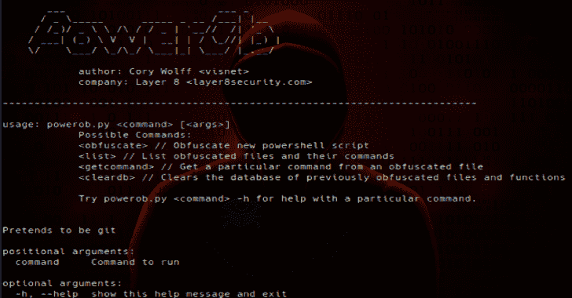

# Powerob:一个动态 Powershell 脚本混淆器

> 原文：<https://kalilinuxtutorials.com/powerob/>

**Powerob** 是一个动态 Powershell 脚本混淆器，用于红队参与。出于需要而建造。

**安装**

**git 克隆 https://github.com/cwolff411/powerob**

**用途**

**python 3 powerob . py obfuscate original file . PS1 obfuscated file . PS1**

接受一个输入文件，对其进行模糊处理，并将模糊处理后的版本转储到输出文件中。

**python3 powerob.py 列表**

**也可理解为-[Ossem 加电:评估数据质量的工具](https://kalilinuxtutorials.com/ossem-power-up/)**

列出所有当前模糊的文件及其命令和相关的模糊命令。

**python 3 powerob . py get command Invoke-all checks**

当你忘记的时候，可以随时参考。获取原始命令名，并显示要在 Powershell 中使用的模糊命令名。

**python3 powerob.py cleardb**

维护功能，以清除过去混淆的文件和函数的数据库。
关于

这是出于在最近的项目中绕过端点安全的需要而构建的。在 priv esc 尝试期间，我无法下载 PowerUp.ps1，直到它被混淆。

这是 v1。它只是模糊了功能，我会在时间允许的情况下增强功能。欢迎拉请求和协作。

[**Download**](https://github.com/cwolff411/powerob)