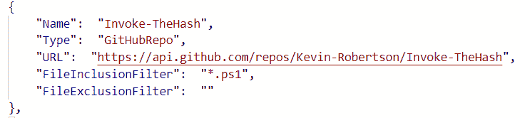
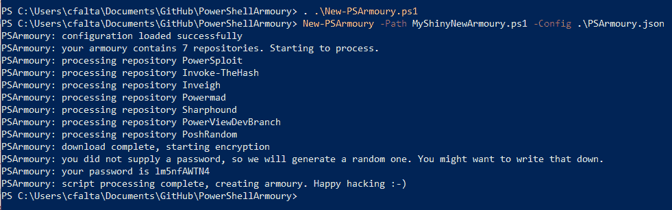
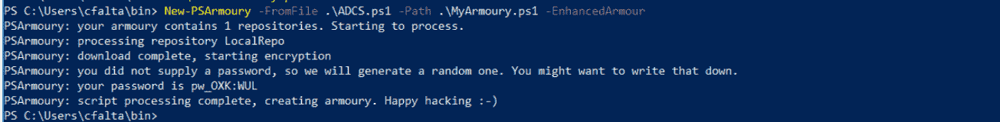
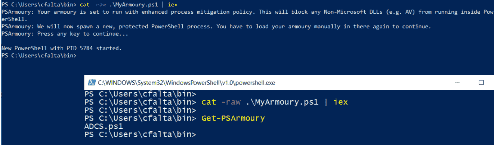
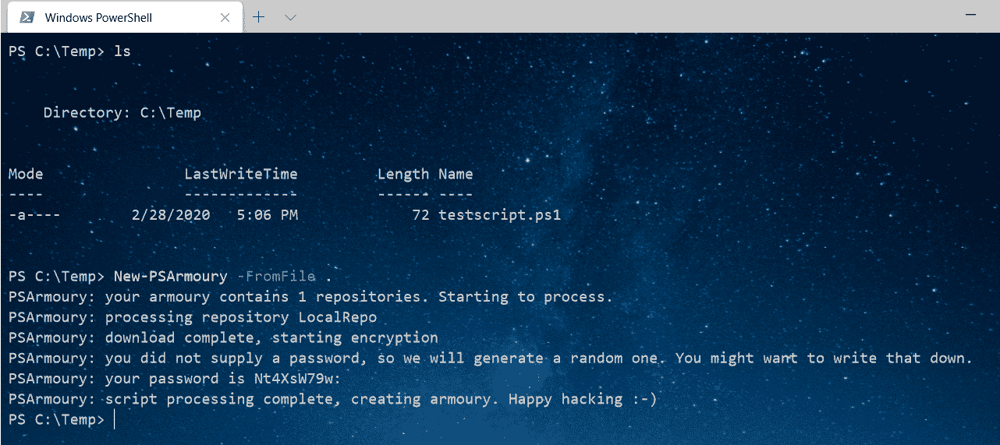
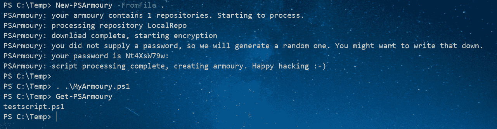

# PowerShell 军械库:一个 PowerShell 军械库，供保安人员使用

> 原文：<https://kalilinuxtutorials.com/powershell-armoury-2/>

**PowerShell Armoury** 面向 pentesters、“insert-color-here”teamers 以及在工作中使用各种 PowerShell 工具的其他人。它允许你下载并存储所有你喜欢的 PowerShell 脚本到一个单独的加密文件中。

您不必为手动更新 Rubeus、PowerView 而烦恼。只需创建一次配置文件，或者使用工具中包含的默认配置文件。从现在开始，你只需要在去下一个约会前跑“新军械库”就行了。此外，你的新的闪亮军械库是加密的，包括 AMSI 的旁路，所以你不必担心反病毒。

注意:您必须提供一个有效的 github 帐户和一个个人访问令牌，这样脚本才能正确地使用 github API。不要使用用户名/密码，因为如果您启用了 MFA(并且您应该启用 MFA)，这无论如何都不会起作用。此外，不推荐使用基本用户名/密码访问 API。按照本指南创建个人访问令牌。

**配置参考**

配置文件需要是一个有效的 json，由一个数组和一个或多个对象组成，其中每个对象都被解释为一个脚本源。每个对象都有以下属性

**名称(必填)**

您选择的名称，用于标识该对象中包含的脚本。这只是作为你自己的参考。

**网址(必填)**

从中获取脚本内容的位置。这可以是 web 资源的 URL(https://)或本地路径(C:)或网络资源(\…)。URL 被扔进了网里。Webclient 或 powershell Get-Item。所以基本上这两种格式中的任何一种都可以默认处理。

**类型(强制)**

这给了军械库创建者一个关于脚本位置的提示。有三种有效类型:

*   开源代码库
    *   将提示输入凭证，以便我们可以根据 github API 进行身份验证。还将尝试区分直接指向文件的“原始”URL 和指向存储库的 URL。如果 URL 指向一个存储库，脚本将自动搜索该存储库中的所有 Powershell 文件并包含它们。比如“https://github . com/cf alta/PoshRandom”
*   网站下载简单
    *   指的是一个文件，可以使用 HTTP GET 下载，不需要认证或其他东西。比如“http://myweb server . com/file . PS1”
*   local file-本机档案
    *   像“C:\temp\test.ps1”这样的磁盘上的文件。如果路径指向一个目录，所有扩展名为“. ps1”的文件(递归的)都将包含在内。

**文件包含筛选器(可选)**

只会在“GitHub”类型的对象中解释。将使用 powershell“like”比较运算符对整个文件名进行匹配，因此请记住，您需要自己包含通配符。如果要匹配文件名的一部分，不要忘记加上星号(*)。“*.ps1”是指所有以“. ps1”结尾的文件，但“. ps1”只是指“. ps1”。

你不必包含一个过滤器，但如果你这样做，你必须使用它。空的 InclusionFilter 意味着没有文件。

**文件排除过滤器(可选)**

就像包容过滤器，但显然是反过来的。排斥优先。

**论据**

请参阅内嵌 Powershell 帮助(man -full New-PSArmoury)了解更多详细信息。

**-路径**

你的新军械库文件的路径。默认为 ist”。\MyArmoury.ps1 "

**-来自文件**

直接从本地文件夹或文件加载 Powershell 脚本，而不必提供配置文件。

**-配置**

JSON-config 文件的路径。看看这个脚本附带的例子。

**-密码**

将用于加密您的军械库的密码。如果您不提供密码，脚本将随机生成一个。

请注意:这个脚本中加密的主要目的是规避反病毒。如果保密性对您很重要，请使用“-OmitPassword”开关。否则，您的密码和盐将以明文形式存储在您的军械库中！

**-盐**

将与您的密码一起用于生成 AES 加密密钥的 salt。如果您不提供 salt，脚本将随机生成一个。

请注意:这个脚本中加密的主要目的是规避反病毒。如果保密性对您很重要，请使用“-OmitPassword”开关。否则，您的密码和盐将以明文形式存储在您的军械库中！

**-忽略密码**

此开关将从最终 armoury 脚本中删除明文密码。如果保密性对你很重要，使用这个。

**-仅有效**

与"-Config "一起使用，让脚本验证 JSON 配置文件的基本语法，而不执行它。

**——使用 3DES**

使用 3DES 而不是 AES 加密。

**-强化装甲**

指示您的军械库需要一个 protectecd PowerShell 进程。因此，在第一次执行时，您的军械库不会加载，但会生成一个新的 PowerShell，该 Shell 设置为使用 BLOCK _ NON _ MICROSOFT _ BINARIES _ ALWAYS _ ON 进程缓解运行。这可以防止非 non-microsoft DLLs(例如 AV/EDR 产品)加载到 PowerShell 中。无耻抄袭大@ _ rasta mouse:https://gist . github . com/rasta-mouse/af 009 f 49229 c 856 DC 26 E3 a 243 db 185 EC

**例句用法**

你可以在下面找到一个非常简单的介绍。也看看这两篇博文吧。

**用 Powershell 军械库躲避 Aniti 病毒**

**TL；DR；**

PSArmoury 是一个 PowerShell 脚本，允许您轻松获得所有您最喜爱的攻击性 PowerShell 工艺的最新版本，并自动将它们放在一个加密的. ps1 文件中。可以把它想象成一个“yum update ”,通过管道把结果保存在一个加密的容器中。包括 AMSI 和 EDR 绕道🙂

**PS 军械库**

我不久前写了我的“Powershell Armoury”脚本来解决我在项目中经常遇到的两个问题:

*   首先，我是 PowerShell 的超级粉丝，如果可能的话，我在 PowerShell 中做任何事情。因此，过了一段时间，我得到了一个相当大的现有工具和自制脚本的列表，我希望在进行 Windows 或 Active Directory 评估时随身携带。然而所有这些不同的脚本(甚至我自己的；-))经常更新，我通常会在这个领域使用一些过时的软件。
*   第二，大多数现有的知名 PowerShell 工具，如 PowerView 或 Inveigh，会被任何反病毒解决方案立即检测到，至少在磁盘上是这样。

所以我创建了 PSArmoury，它允许我做以下事情:

*   创建一个简单的 json 配置文件，包含我在互联网上最喜欢的工具的链接。你只需要做一次。
*   然后，每次在约定之前，您只需运行 New-PSArmoury，它就会自动获取所有这些 PowerShell 脚本的最新版本，并将它们放在一个加密的 ps1 文件中。这是你的军械库。

让我们看看那个。你可以在 Github 上找到 PSArmoury。只需下载或克隆，你就可以开始了。首先，让我们看一下配置。PSArmoury 附带了一个名为 PSArmoury.json 的示例配置文件，该文件已经引用了一些知名的工具，如 PowerSploit 或 Inveigh。你可以用这个来激发灵感。配置文件只是一个 JSON 数组，包含您想要包含的不同脚本文件。数组成员看起来像这样。

每个配置项都由名称、URL、类型和可选的包含/排除过滤器组成。这里的主要区别是类型，有三种不同的类型可用。

*   **GitHubRepo** :指示 PSArmoury 自动将所有文件包含在 GitHubRepo 中(匹配包含/排除过滤器)。它将要求 Github 用户名和个人访问令牌，因为我们在这里使用 Github API。
*   **GitHubItem** :指示 PSArmoury 从 Github 下载一个文件。它将要求 Github 用户名和个人访问令牌，因为我们在这里使用 Github API。
*   **WebDownloadSimple** :这指示 PSArmoury 从任意 web 服务器下载单个文件。不需要凭证。

因此，在上面的示例中，配置指示 PSArmoury 从 Kevin Robertsons 的 repository“Invoke-the hash”下载与包含过滤器“*.ps1”匹配的所有文件。

一旦创建了配置，您就可以简单地运行

**。。\ New-PS armoury . PS1
New-PS armoury-Path。\MyShinyNewArmoury.ps1 -Config。\PSArmoury.json**

请注意，使用 GitHub API 需要您输入凭证。您必须输入您的用户名和个人访问令牌。

这里有一个使用 PSArmoury 附带的示例配置的屏幕截图。

上面的输出提到了一个密码。这是随机生成的，并以明文的形式**包含在最终军械库文件中。这不是一个问题，因为我们使用加密只是作为一种混淆手段，而不是为了保密。不过，如果你想从你的军械库中移除密码，你可以使用 **`-OmitPassword`** 开关来完成。如果您想使用自定义密码或 salt，也可以通过使用`**-Password**`和`**-**` **`Salt`参数来实现。****

现在，你如何使用你崭新闪亮的军械库？其实很简单，在你选择的主机上打开 powershell，像这样加载. ps1 文件就可以了。

**猫生的。\MyShinyNewArmoury.ps1 | iex**

仅此而已。这将禁用 AMSI，将所有加密的 blobs 加载到 powershell 中，然后解密并加载到内存中。黑客快乐。

PS 军械库 1.4-现在有了更多的盔甲

**TL；DR；**

我最近对 PSArmoury 做了一些改进，我想在本帖中与你分享

*   支持 BlockDLL 进程缓解以保护您的军械库
*   新的配置参数让你选择 github 中的分支
*   从本地文件创建军械库的简单方法
*   自动库存功能

还在读书？太好了，我们走吧。

**引入 BlockDLL 进程缓解**

多亏了@_RastaMouse 强大的 C#移植，实现进程缓解变得非常容易，这实际上是为了保护进程免受恶意注入。通过在新进程的扩展启动信息中设置一个特殊的标志，我们可以防止任何非 microsoft DLL 加载到该进程中。这可以阻止某些 EDR 解决方案检测 powershell 中的知名工具。

要使用 PSArmoury，只需用如下所示的`**-EnhancedArmour**`开关创建你的军械库。

请注意，这将稍微改变您的用户体验。如果你试图加载一个增强的军械库，它不会解密它的内容，而是启动一个新的、受保护的 powershell 进程，并要求你再次手动运行它。乍一看，这似乎有点麻烦，但原因很简单:

*   我们还可以将进程缓解策略应用于我们运行的第一个 powershell 进程(只需使用 Set-process impression)，但此时，该进程已经启动，并且任何 EDR/AV DLL 已经在该进程中运行。因此，我们需要创建一个新的、干净的流程。
*   在第二个 powershell 进程中，有多种方法可以自动运行您的军械库，但是这本身可能会引发一个危险信号，所以我选择了手动方式。

因此，要使用它，只需像往常一样运行你的军械库，它将引导你通过如下所示的其余过程。

**选择 github 分支**

配置文件中“GitHubRepo”类型的每一项现在都可以包含一个名为“Branch”的属性。如果存在，PSArmoury 将尝试使用该属性中提供的分支名称。如果它不存在，它将像以前一样使用默认分支。在 github 上的示例配置中，我们使用该属性下载 PowerSploit 的 dev 分支，而不是 master。

**{
"Name": "PowerSploit "、
"Type": "GitHubRepo "、
" URL ":" https://API . github . com/repos/PowerShellMafia/PowerSploit "、
"Branch": "dev "、
" file inclusion filter ":"*. PS1 "、" file exclusion filter ":["*. tests . PS1 "]
}**

从文件创建军械库

PSArmoury 现在提供了一个从本地文件创建军械库的简单方法。如果您只想快速保护磁盘上的一个(或多个)powershell 脚本，而不需要创建配置文件，这就很方便了。只需使用`**-FromFile**`开关运行 PSArmoury，并将包含 powershell 脚本的文件或文件夹的路径传递给它。您可以省略`**-Config**`-开关，但是请注意，只有扩展名为`***.ps1**`的文件才会被包含在内。

**库存**

我偶尔会发现自己不记得在军械库里放了什么脚本，尤其是在我创建它已经有一段时间了。因为所有相关的东西都被加密在磁盘上的文件中，所以获取这些信息并不容易。因此，现在每个军械库都包含一个名为`Get-PSArmoury`的库存函数，它将打印所有包含在 stdout 中的文件的名称。这个功能是在军械库创建过程中动态构建的。

暂时就这样了。如果你正在使用 PSArmoury，并遇到任何问题或有新功能的想法，我会很高兴收到你的来信。给我发邮件或者在 github 上开一期就行了。

使用以下命令创建一个默认设置的军械库。您可以从这个存储库中的示例配置文件开始寻找灵感。

**。。\ New-PS armoury . PS1
New-PS armoury-Config。\PSArmoury.json**

这将在当前工作目录中创建一个名为“MyArmoury.ps1”的加密. ps1 文件。用于加密的密码和 salt 是随机生成的，并以明文形式包含在文件中。(注意，我们使用加密只是为了防止在磁盘上被检测到，而不是为了保密)

您可以使用以下命令将军械库加载到当前会话中

**猫生的。\MyArmoury.ps1 | iex**

装载你的军械库调用以下步骤:

*   将所有加密的 powershell 函数作为数组的一部分加载到当前会话中
*   禁用 AMSI
*   禁用控制台历史记录(有助于防止检测)
*   解密所有内容并通过管道传输到 iex

之后，您放入军械库的所有 powershell 代码都将可用。就像这样像往常一样调用 cmdlets

**Invoke-rube us-Command " Kerberos/stats "
Invoke-blood hound
Get-DomainGroupMember-Identity " Domain Admins "-Recurse**

如果你不记得你在军械库里放了什么，就把它装上，然后打电话给库存🙂

**获得军械库**

[**Download**](https://github.com/cfalta/PowerShellArmoury)