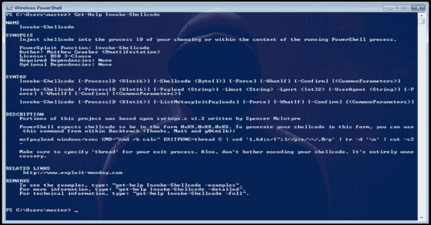

# PowerSploit:一个 PowerShell 后开发框架

> 原文：<https://kalilinuxtutorials.com/powersploit-a-powershell-post-exploitation-framework/>

PowerSploit 是微软 PowerShell 模块的集合，可用于在评估的所有阶段帮助渗透测试人员。PowerSploit 由以下模块和脚本组成:

**代码执行**

在目标机器上执行代码。

*   `**Invoke-DllInjection**`
    *   将 Dll 注入到您选择的进程 ID 中。
*   `**Invoke-ReflectivePEInjection**`
    *   将 Windows PE 文件(DLL/EXE)反射性地加载到 powershell 进程中，或者将 DLL 反射性地注入到远程进程中。
*   `**Invoke-Shellcode**`
    *   将外壳代码注入到您选择的进程 ID 或本地 PowerShell 中。
*   `**Invoke-WmiCommand**`
    *   在目标计算机上执行 PowerShell ScriptBlock，并使用 WMI 作为 C2 通道返回其格式化输出。

脚本修改

修改和/或准备在受损机器上执行的脚本。

*   `**Out-EncodedCommand**`
    *   压缩、Base-64 编码，并为 PowerShell 负载脚本生成命令行输出。
*   `**Out-CompressedDll**`
    *   压缩、Base-64 编码并输出生成的代码，以将托管 dll 加载到内存中。
*   `**Out-EncryptedScript**`
    *   加密文本文件/脚本。
*   `**Remove-Comments**`
    *   从脚本中去除注释和多余的空白。

**坚持**

向 PowerShell 脚本添加持久性功能

*   `**New-UserPersistenceOption**`
    *   为 Add-Persistence 函数配置用户级持久性选项。
*   `**New-ElevatedPersistenceOption**`
    *   为 Add-Persistence 函数配置提升的持久性选项。
*   `**Add-Persistence**`
    *   向脚本添加持久性功能。
*   `**Install-SSP**`
    *   安装安全支持提供程序(SSP) dll。
*   `**Get-SecurityPackages**`
    *   枚举所有加载的安全包(ssp)。

**抗病毒旁路**

AV 对 PowerShell 毫无胜算！

*   `**Find-AVSignature**`
    *   使用与“class101”中的 DSplit 相同的方法定位单字节 AV 签名。

**也可理解为-[Klar:Clair 和 Docker 注册表的集成](https://kalilinuxtutorials.com/klar/)**

**渗出**

你所有的数据都属于我！

*   `**Invoke-TokenManipulation**`
    *   列出可用的登录令牌。使用其他用户登录令牌创建进程，并在当前线程中模拟登录令牌。
*   `**Invoke-CredentialInjection**`
    *   使用明文凭据创建登录，而不触发可疑事件 ID 4648(显式凭据登录)。
*   `**Invoke-NinjaCopy**`
    *   通过读取原始卷并解析 NTFS 结构，从 NTFS 分区卷复制文件。
*   `**Invoke-Mimikatz**`
    *   使用 PowerShell 将 Mimikatz 2.0 反射性地加载到内存中。可用于转储凭据，而无需将任何内容写入磁盘。可用于 Mimikatz 提供的任何功能。
*   `**Get-Keystrokes**`
    *   记录按键、时间和活动窗口。
*   `**Get-GPPPassword**`
    *   检索通过组策略首选项推送的帐户的明文密码和其他信息。
*   `**Get-GPPAutologon**`
    *   如果通过组策略首选项推送，则从 registry.xml 检索自动登录用户名和密码。
*   `**Get-TimedScreenshot**`
    *   定期截图并保存到文件夹的功能。
*   `**New-VolumeShadowCopy**`
    *   创建新的卷影副本。
*   `**Get-VolumeShadowCopy**`
    *   列出所有本地卷影副本的设备路径。
*   `**Mount-VolumeShadowCopy**`
    *   安装卷影副本。
*   `**Remove-VolumeShadowCopy**`
    *   删除卷影副本。
*   `**Get-VaultCredential**`
    *   显示 Windows 保管库凭据对象，包括明文 web 凭据。
*   `**Out-Minidump**`
    *   生成进程的全内存小型转储。
*   **‘获取-麦克风音频’**
    *   从系统麦克风录制音频并保存到磁盘

**故意伤害**

用 PowerShell 造成大混乱。

*   `**Set-MasterBootRecord**`
    *   用您选择的消息覆盖主引导记录的概念验证代码。
*   `**Set-CriticalProcess**`
    *   导致您的计算机在退出 PowerShell 时蓝屏。

**Privesc**

帮助提升目标权限的工具。

*   `**PowerUp**`
    *   常见权限提升检查的信息交换所，以及一些武器化载体。

**侦察**

渗透测试勘测阶段的辅助工具。

*   `**Invoke-Portscan**`
    *   使用常规套接字进行简单的端口扫描，基本上基于 nmap。
*   `**Get-HttpStatus**`
    *   当提供字典文件时，返回指定路径的 HTTP 状态代码和完整 URL。
*   `**Invoke-ReverseDnsLookup**`
    *   扫描 IP 地址范围中的 DNS PTR 记录。
*   `**PowerView**`
    *   PowerView 是一系列执行网络和 Windows 域枚举和利用的功能。

**侦察\词典**

用于帮助渗透测试侦察阶段的字典集。字典取自以下来源。

*   admin.txt – [http://cirt.net/nikto2/](http://cirt.net/nikto2/)
*   generic . txt-[http://sourceforge.net/projects/yokoso/files/yokoso-0.1/](http://sourceforge.net/projects/yokoso/files/yokoso-0.1/)
*   SharePoint . txt-[http://www . stach Liu . com/resources/tools/SharePoint-hacking-Digg ity-project/](http://www.stachliu.com/resources/tools/sharepoint-hacking-diggity-project/)

**用途**

有关详细的用法信息，请参考每个脚本中基于注释的帮助。

要安装此模块，请将整个 PowerSploit 文件夹放入您的一个模块目录中。默认的 PowerShell 模块路径在$Env:PSModulePath 环境变量中列出。

默认的每用户模块路径是:**" $ Env:home drive $ Env:home path \ Documents \ windows powershell \ Modules "默认的计算机级模块路径是:" $ Env:windir \ System32 \ windows powershell \ v 1.0 \ Modules "**

要使用该模块，请键入`**Import-Module PowerSploit**`

要查看导入的命令，请键入`**Get-Command -Module PowerSploit**`

如果您运行的是 PowerShell v3，并且希望消除恼人的“您真的想运行从互联网下载的脚本吗”警告，那么一旦您将 PowerSploit 放入模块路径，运行下面的一行程序:`**$Env:PSModulePath.Split(';') | % { if ( Test-Path (Join-Path $_ PowerSploit) ) {Get-ChildItem $_ -Recurse | Unblock-File} }**`

对于每个单独命令的帮助，Get-Help 是您的好朋友。

注意:本模块中包含的工具都被设计为可以单独运行。将它们包含在一个模块中只是增加了可移植性。

**投稿规则**

我们需要捐款！如果您对 PowerSploit 有什么好主意，我们很乐意添加。新增内容将需要以下内容:

*   剧本必须符合风格指南。指导原则的任何例外都需要一个明确、有效的理由。
*   需要更新模块清单以反映添加的新功能。
*   此自述文件中应添加对该函数的简要描述。md
*   纠缠测试必须伴随所有新功能。查看测试文件夹中的例子，但我们正在寻找的测试，至少涵盖了预期/意外输入/输出的基本测试，以及功能展示所需的功能。在提交 pull 请求之前，确保函数通过所有测试(最好是在多个系统中)。谢谢！

**脚本风格指南**

对于 PowerSploit 的所有贡献者和未来的贡献者，我要求你们在编写脚本/模块时遵循这个风格指南。

*   不惜一切代价避免写主机。PowerShell 函数/cmdlet 不是命令行实用程序！将不考虑包含使用写主机的代码的拉请求。您应该输出自定义对象。有关创建自定义对象的更多信息，请阅读以下文章:
    *   [http://blogs . TechNet . com/b/heyscriptingguy/archive/2011/05/19/create-custom-objects-in-your-powershell-script . aspx](http://blogs.technet.com/b/heyscriptingguy/archive/2011/05/19/create-custom-objects-in-your-powershell-script.aspx)
    *   [http://technet.microsoft.com/en-us/library/ff730946.aspx](http://technet.microsoft.com/en-us/library/ff730946.aspx)
*   如果您想在屏幕上显示相关的调试信息，请使用 Write-Verbose。用户总是可以加上“-Verbose”。
*   始终为每个脚本提供描述性的、基于注释的帮助。此外，一定要包括你的名字和 BSD 3 条款许可证(除非有情有可原的情况阻止 BSD 许可证的应用)。
*   确保所有函数都遵循正确的 PowerShell 动词-名词协议。使用 Get-Verb 列出 PowerShell 使用的默认动词。受支持动词的例外将根据具体情况考虑。
*   我更喜欢变量名大写，并且尽可能的描述性。
*   在代码之间提供逻辑间距。缩进你的代码，使其可读性更好。
*   如果你发现自己在重复代码，写一个函数。
*   捕捉所有预期的错误并提供有意义的输出。如果您遇到了应该停止脚本执行的错误，请使用“Throw”。如果你有一个不需要停止执行的错误，使用 Write-Error。
*   如果您正在编写与 Win32 API 交互的脚本，请尽量避免使用 Add-Type 内联编译 C#。如果可能，请尝试使用 PSReflect 模块。
*   不要使用硬编码的路径。脚本应该开箱即用。任何人都不应该修改代码，除非他们想这样做。
*   PowerShell v2 兼容性是非常需要的。
*   使用位置参数，并在有意义时强制使用参数。例如，我正在寻找类似以下的东西:
    *   `**[Parameter(Position = 0, Mandatory = $True)]**`
*   除非别名对接收管道输入有意义，否则不要使用别名。对于不熟悉特定别名的人来说，它们使得代码更难阅读。
*   尽量不要让命令运行太长时间。例如，管道是换行的自然位置。
*   不要过分使用行内注释。只有当代码的某些方面可能会让读者感到困惑时，才使用它们。
*   与其使用 Out-Null 来抑制不需要的/不相关的输出，不如将不需要的输出保存到$null。这样做可以稍微提高性能。
*   当有意义时，使用参数的默认值。理想情况下，您需要一个不需要任何参数就能工作的脚本。
*   如果脚本创建复杂的自定义对象，请包含一个 ps1xml 文件，该文件将正确格式化对象的输出。

[**Download**](https://github.com/PowerShellMafia/PowerSploit#powersploit-is-a-collection-of-microsoft-powershell-modules-that-can-be-used-to-aid-penetration-testers-during-all-phases-of-an-assessment-powersploit-is-comprised-of-the-following-modules-and-scripts)