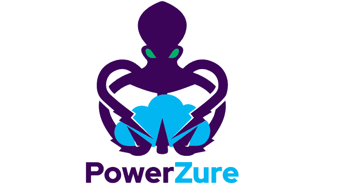

# PowerZure:评估 Azure 安全性的 PowerShell 框架

> 原文：<https://kalilinuxtutorials.com/powerzure/>

PowerZure 是一个 PowerShell 项目，旨在评估和开发微软云平台 Azure 中的资源。PowerZure 是出于对一个框架的需求而创建的，该框架既能执行侦察**又能利用 Azure、AzureAD 和相关资源。**

**CLI 与门户网站**

一个常见的问题是，既然可以登录 Azure 门户网站，为什么还要使用 PowerZure 或命令行呢？

这是一个公平的问题，老实说，你可以通过在门户中点击来完成 PowerZure 中 90%的功能，但是通过使用 Azure PowerShell 模块，你可以通过编程来执行门户中繁琐的任务。例如，列出用户所属的组。此外，能够以编程方式上传漏洞，而不是修补混乱的 web UI。最后，如果您危及一个以前使用过 PowerShell 模块 for Azure 的用户的安全，并且能够窃取 accesstoken.json 文件，那么您可以模拟该用户，从而有效地绕过多因素身份验证。

**为什么选择 PowerShell？**

虽然由于防御产品和解决方案的进步，攻击性安全行业的 PowerShell 使用量有所下降，但该项目不包含任何恶意代码。PowerZure 没有利用 Azure 中的漏洞，而是利用了错误配置。

*   创建这个项目时也使用了 C#，但是有两个主要问题:
    *   这个项目至少使用了四种不同的 API。MSOL，Azure REST，Azure SDK，Graph。
    *   这些 API 的文档太差，无法继续。整个方法缺失、名称空间输入错误以及其他问题引发了这样一个问题:C#比 PowerShell 有什么优势(答案:没有)

实际上，没有理由在受害者的机器上运行 PowerZure。通过使用从受害者计算机中提取的现有 accesstoken 文件或通过与 Az PowerShell (Connect-AzAccount)交互登录来完成身份验证。

**要求**

“Az”[Azure PowerShell](https://docs.microsoft.com/en-us/powershell/azure/?view=azps-4.2.0)模块是 PowerZure 中使用的主要模块，因为它处理大多数与 Azure 资源交互的请求。Az 模块使用 Azure REST API 进行交互。

AzureAD PowerShell 模块也用于处理 AzureAD 请求。AzureAD 模块使用 Microsoft Graph API。

**作者&执照**

*   作者:Ryan Hausknecht (@haus3c)
*   许可证:BSD-3