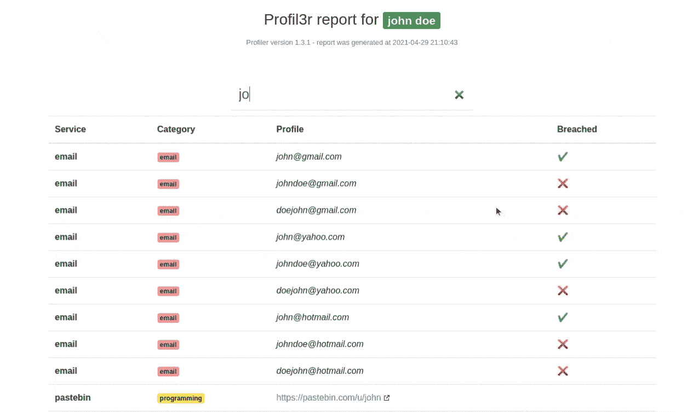

# Profil3r : OSINT 工具，可以让你找到一个人的帐户和电子邮件+被破坏的电子邮件

> 原文：<https://kalilinuxtutorials.com/profil3r/>

Profil3r 是一款 [OSINT](https://en.wikipedia.org/wiki/Open-source_intelligence) 工具，可以让你在社交网络上找到一个人的潜在资料，以及他们的电子邮件地址。该程序还会提醒您发现的电子邮件存在数据泄漏。

**先决条件**

*   [Python 3](https://www.python.org/)

**安装**

安装 PyInquirer 和 jinja2:

pip3 安装 PyInquirer jinja2

安装 3r 配置文件:

**git 克隆 https://github.com/Rog3rSm1th/Profil3r.git
CD profile 3r/
sudo python 3 setup . py 安装**

**特性**

**域**

*   TLD(。com，。组织，。网等……)

**电子邮件**

*   数据泄露
*   电子邮件

**社交**

*   照片墙
*   脸谱网
*   推特
*   Tiktok
*   拼趣
*   Linktr.ee
*   聚友网（网站）

**音乐**

*   声音云
*   Spotify

**编程**

*   开源代码库
*   Pastebin
*   Repl.it
*   Cracked.to

**论坛**

*   0x00sec.org
*   Jeuxvideo.com
*   黑客新闻

再见

*   网络电话

**娱乐**

*   日常运动
*   Vimeo

**色情**

*   色情网站名
*   红管
*   赛克斯

**钱**

*   BuyMeACoffee

**报告**

**JSON**

在`reports/json`文件夹中自动生成 JSON 格式的报告

**HTML**

HTML 格式的报告会自动生成在`reports/html`文件夹中，您可以在您的网络浏览器中访问它

**config . JSON 文件**

您可以修改默认情况下报告、分隔符和服务配置文件 3r 将在`config.json`文件中搜索的路径

| 田 | 类型 | 默认 | 描述 |
| --- | --- | --- | --- |
| 报告 _ 元素 | 排列 | `["email", "facebook", "twitter"]` | profil3r 将搜索的服务列表 |
| json _ 报告 _ 路径 | 线 | `"./reports/json/{}.json"` | 报表的 JSON 文件的路径，该路径必须包含一个对应于文件名的{} |
| html _ 报表 _ 路径 | 线 | `"./reports/html/{}.html"` | 报告的 HTML 文件的路径，该路径必须包含一个对应于文件名的{} |
| 分离器 | 目标 | `{"Dot": ".", "Dash": "-", "Underscore": "_"}` | 分隔项目的分隔符列表，例如:`john.doe`、`john-doe`、`john_doe` |

**例子**

**python 3 profile 3r . py John doe**

[**Download**](https://github.com/Rog3rSm1th/Profil3r)