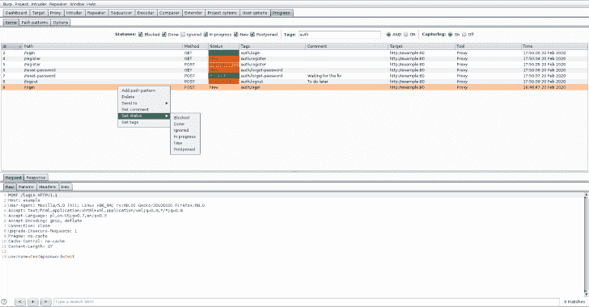

# Progress Burp : Burp 套件扩展，用于跟踪漏洞评估进度

> 原文：<https://kalilinuxtutorials.com/progress-burp/>

用于跟踪漏洞评估进度的套件扩展。

**特性**

*   从 Burp 套件工具(代理、中继器、目标)中捕获项目(唯一请求)。请求唯一键定义如下:目标(主机、端口、协议)、路径和方法。
*   项目具有以下可编辑属性:
    *   评论
    *   状态(阻止、完成、忽略、进行中、新、延期)
    *   标签
*   项目可以通过以下方式进行筛选:
    *   状态
    *   标签(有两种过滤模式:**和**–项目必须具有所有过滤标签**或**–项目必须具有至少一个过滤标签)
*   根据路径扩展名或响应状态代码从捕获中排除请求
*   选定的项目可以发送到打嗝套件工具:入侵者，中继器或扫描仪
*   所选项目显示在功能齐全的 Burp Suite HTTP 消息编辑器中
*   路径模式——请求的唯一键由目标、路径和方法定义。但是，定义路径模式(regexp)将不同的请求视为同一项(例如/article/\d+？/comments 路径模式按照请求分组:/article/1/comments、/article/2/comments、/article/100/comments 等。)
*   可选地，可以持久化项目和路径模式，以保持 Burp 套件运行之间的状态(请参见[需求](https://github.com/dariusztytko/progress-burp#Requirements))

**也可以理解为-[获取团队通行证:从局域网中的远程计算机](https://kalilinuxtutorials.com/get-team-pass/)获取团队查看器的 ID &密码**

**选项**

*   数据库–选择文件以保存项目和路径模式(请参见[要求](https://github.com/dariusztytko/progress-burp#Requirements)
*   范围工具–为选定的 Burp 套件工具(代理、中继器、目标)启用项目捕获
*   排除的扩展名–不会处理带有这些路径扩展名的请求
*   排除的状态代码-带有这些状态代码的响应(和相关请求)将不会被处理
*   覆盖重复项目–当前项目将被最新的重复项目替换(项目的状态被保留)
*   仅处理范围内的请求
*   向工具发送项目时，设置*进行中*状态

**要求**

要保存项目和路径模式，需要 SQLite JDBC 驱动程序。

1.  从[https://mvnrepository.com/artifact/org.xerial/sqlite-jdbc](https://mvnrepository.com/artifact/org.xerial/sqlite-jdbc)下载驱动
2.  将下载的驱动程序(jar 文件)放在磁盘上的文件夹中(例如/home/user/burpsuite-jars)
3.  将 Burp Suite 选项(扩展器->选项-> Java 环境)设置为带有驱动程序的文件夹的路径
4.  重新加载扩展

[**Download**](https://github.com/dariusztytko/progress-burp)