# 黑色计划:用扫描模块控制 BugBounty 进度

> 原文：<https://kalilinuxtutorials.com/project-black/>

[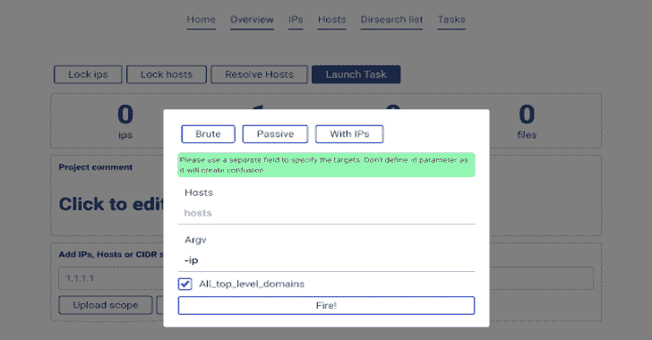](https://1.bp.blogspot.com/-R7ESAqNWk0Q/XjyUJFbI_xI/AAAAAAAAEx8/TXgKCQdTAGwjHfQX8PFBq8UuSrC04KWXQCLcBGAsYHQ/s1600/project-black%25281%2529.png)

Project Black 是一个范围控件、范围扫描仪和进度跟踪器，可以更轻松地处理 bug bounty 或 pentest 项目。这些工具鼓励更多**有条不紊的**在 pentest/bugbounty 上工作，跟踪进度和一般扫描信息。

它可以发射

*   masscan
*   nmap
*   目录搜索
*   积累
*   马铃薯

并以方便的形式存储数据。对项目数据进行有用的过滤，例如:

*   给我找到所有有开放端口，但不是 80 的主机
*   给我找所有主机，IP 都是 82 开头的。
*   在目录搜索中找到至少一个包含 200 状态代码的文件的主机

**安装**

通过 docker-compose 进行的基本设置可以在任何依赖 docker 和 docker-compose 的系统上运行

**也可以理解为-[应用程序检查器:一个源代码分析器，用于显示感兴趣的特性](https://kalilinuxtutorials.com/application-inspector/)**

如果你没有安装 docker

Ubuntu/debian 的坞站

**sudo apt 安装坞站。我**

**工具安装**

如果你设置了 docker，那么对于 Ubuntu/Debian 来说

-sudo curl-l " https://github . com/docker/compose/releases/download/1 . 23 . 1/docker-compose-(uname-s)-(uname-m)"-o/usr/local/bin/docker-compose " t0 "-sudo chmod+x/usr/local/bin/docker-compose " t1 "-git clone https://github . com/c0rvax/project-black "-T2]

如果您看到一些 SQL 错误，尝试停止 docker-compose (Ctrl + C **一次**并等待正常关闭)并运行`**docker-compose up**`

这可能需要一些时间，但就是这样！其他发行版应该有非常相似的指导。

现在前往 [http://localhost:5000](http://localhost:5000) ，输入凭证。可以在`**application**`下的[https://github . com/c0r VAX/project-black/blob/master/config/config _ docker . yml](https://github.com/c0rvax/project-black/blob/master/config/config_docker.yml)中找到

对于更复杂的设置或失败的东西，参见 [wiki](https://github.com/c0rvax/project-black/wiki/Set-up) 。

**资源通知**

没有一个 docker 容器限制资源的使用量，但是，您可以单独地为每个工作者改变并行任务的数量。参见维基上的[那](https://github.com/c0rvax/project-black/wiki/Tuning#parallel-tasks-inside-worker)

**如何工作？**

设置完成后，创建一个项目并转到相应的页面。

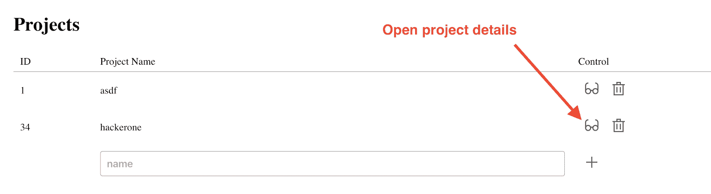

现在，我们将遵循您可以在应用程序中执行的基本步骤

**添加范围**

假设我们正在评估 hackerone.com 和它的所有子域。将`**hackerone.com**`写入`**add scope**`字段，并按下`**Add to scope**`

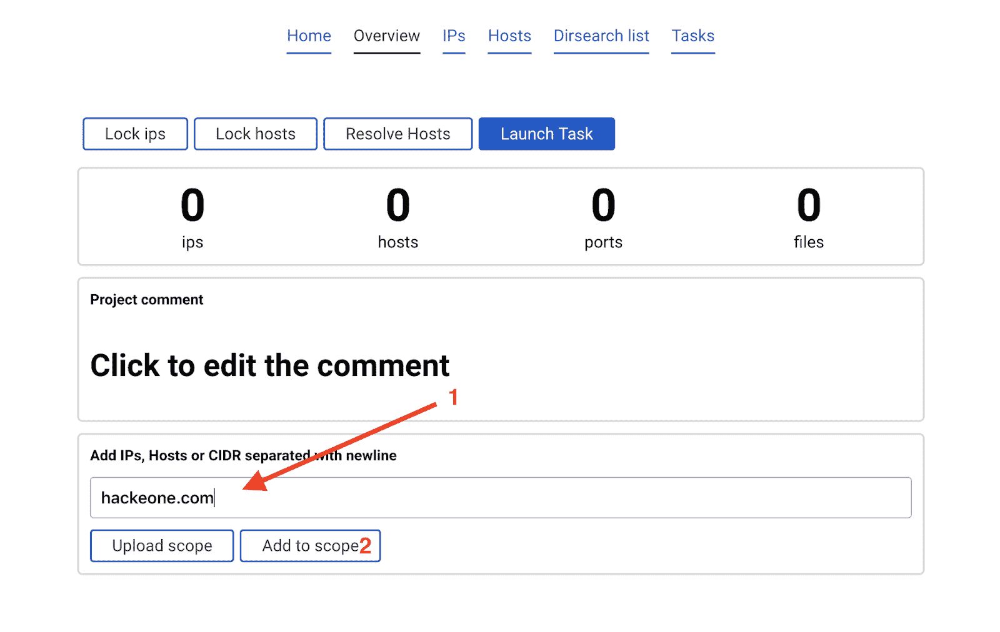

已添加入口点。

还有其他方法来添加范围，参见 [wiki](https://github.com/c0rvax/project-black/wiki/Scope)

**工作快速记录**

所有的任务都可以从用户那里读取参数，但是，用一些选项启动不会显示任何新的结果，因为解析一个程序所有可能的输出是相当困难的。因此，首先，尝试复制本手册中的选项。

可用选项可在此[页面](https://github.com/c0rvax/project-black/wiki/Supported-options)中找到

**开始积累**

点击蓝色按钮`Launch task`。

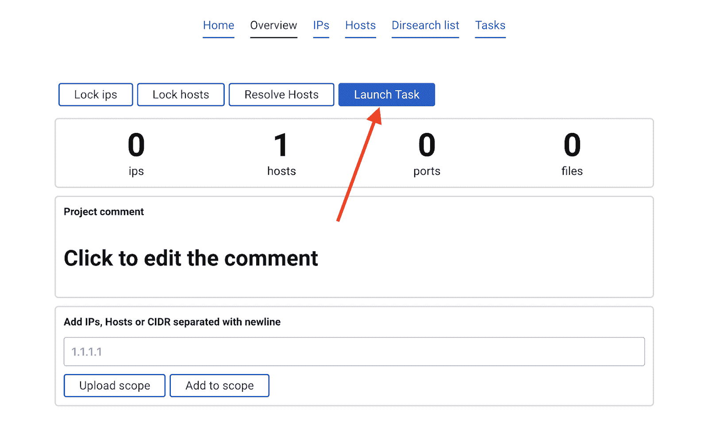

将出现一个带有参数的弹出窗口。

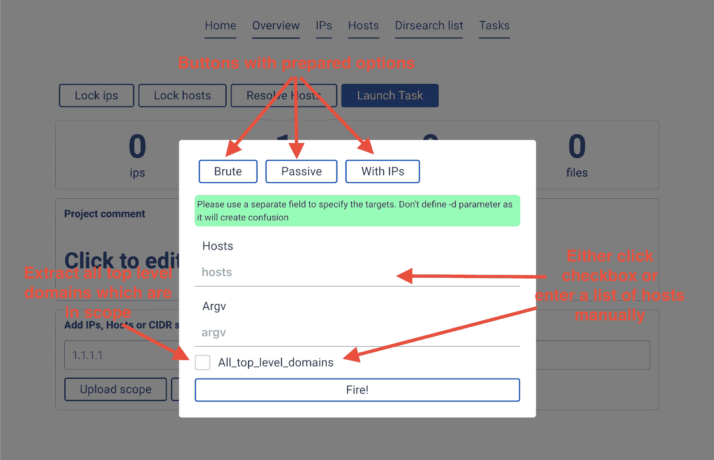

建议点击`**All_top_level_domains**`复选框，在 argv 中输入`**-ip**`并点击`**Fire!**`按钮。

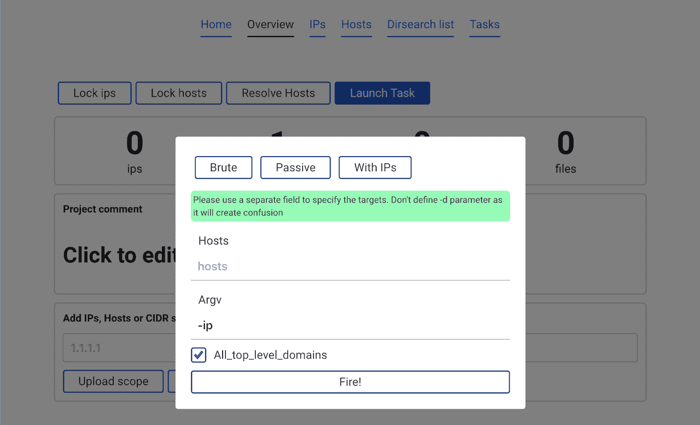

这将启动`**amass -d hackerone.com -ip**`。请注意，在这种情况下，我们没有指定任何域。这是因为`**All_top_level_domains**`复选框意味着查看存储在数据库中的范围。所以程序看到`**hackerone.com**`被添加到范围中，并启动`**amass**`来反对它。

完成后，新数据会自动添加到范围中。

**启动 masscan 和 nmap**

现在头转向 **`IPs`** 选项卡。点击已知按钮`**Launch task**`，选择 **`masscan`。**

我们将使用按钮`**Top N ports**`启动快速扫描。这将自动完成`**argv**`参数。按下`**Fire!**`

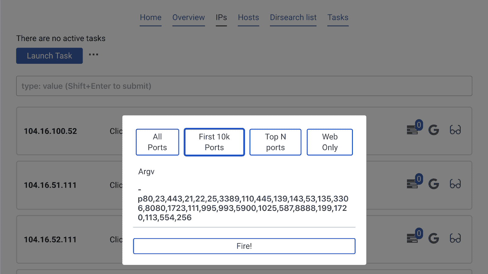

结果会自动从数据库中下载。

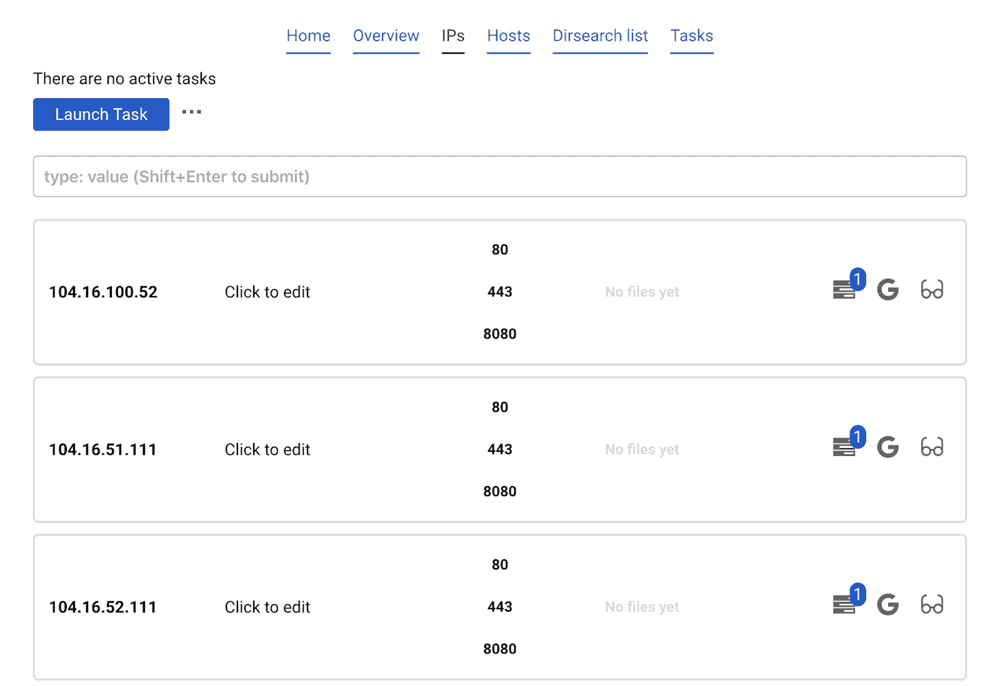

现在点击`**Launch task**`，选择`**nmap only open**`。这将找到数据库中存在的所有打开的端口，并仅对它们运行 nmap。

点击`**Banner**`和`**Fire**`。

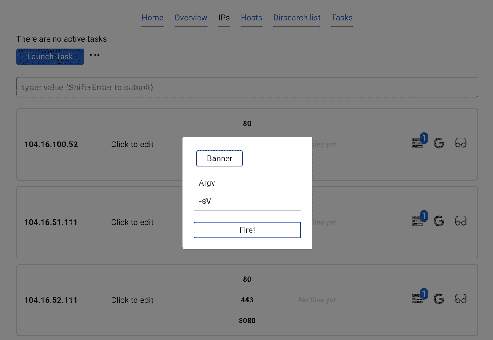

检测到的横幅将自动出现

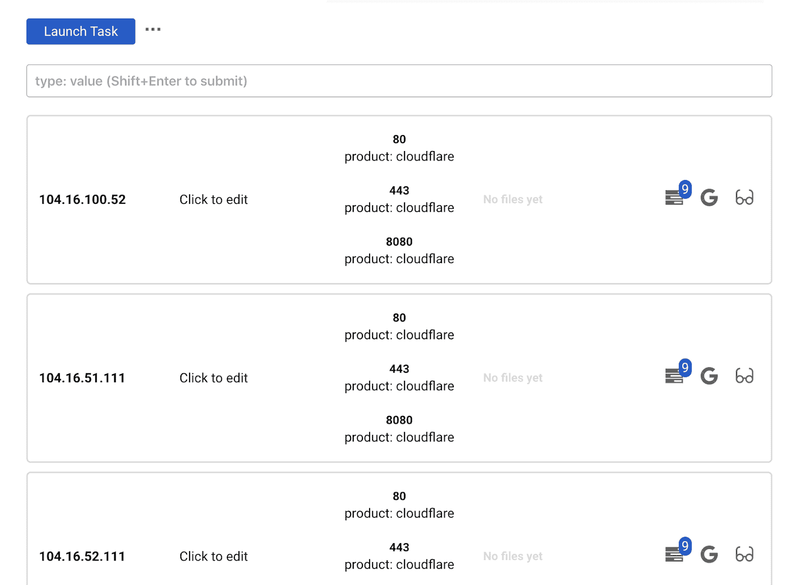

**启动目录搜索**

对所有 IP 和所有开放端口启动 dirsearch(HTTP 和 HTTPS 都将被尝试)

在`**IPs**`选项卡上点击`**Launch task**`并选择`**dirsearch**`。填写您想要尝试的扩展名，然后点击`**Fire!**`

您可以在`**Hosts**`选项卡上对主机(非 IP)启动目录搜索。

**关于目录搜索的注释**

如果没有端口，dirsearch 甚至不会启动。因此，首先，确保您启动了 nmap 或 masscan 来发现开放的端口。

**检查结果**

通常有三种方法来检查结果:

*   IPs/主机列表
*   IP/主机详细信息
*   目录搜索列表

**IP 和主机列表**

那是两个标签。它们的工作方式相同，因此我们将在主机上停止。

您可以看到主机、其端口和文件的列表。您还可以编辑该主机的注释。

这里重要的部分是**过滤**框。

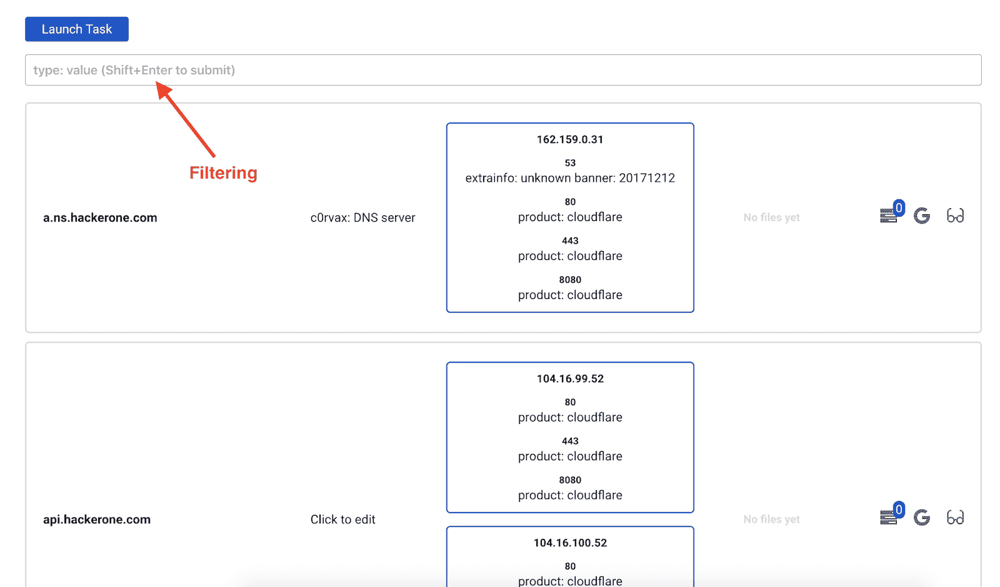

您可以使用上面显示的字段聚合不同的过滤器。输入你想要的过滤器(有一个助手)并按下 **Shift + Enter**

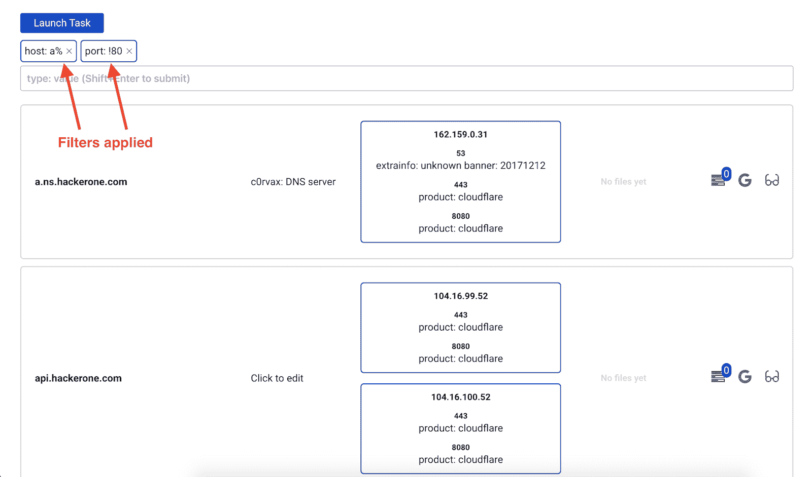

**IP/主机详细信息**

您还可以查看特定主机或 ip 的详细信息。用眼镜按下按钮

在那里，您将看到主机上每个开放端口 dirsearch 结果

**目录搜索列表**

按钮将打开一个新窗口，显示在该项目中启动的每个目录搜索中找到的所有文件。

**针对特定范围发起任务**

IP 和主机`**Launch task**`不一样！ips 页面上的按钮将针对当前项目中的所有 IPs 启动，同时 Hosts 页面上的按钮将针对主机启动。

要针对某些主机启动任务，您应该

1.  过滤主机
2.  启动任务

示例:

已经应用了一些过滤器。如果我们现在启动 dirsearch，它将针对与所用过滤器对应的主机启动。

[**Download**](https://github.com/c0rvax/project-black)