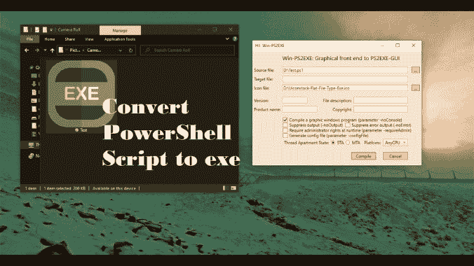

# PS2EXE:将 Powershell 脚本编译成可执行文件的模块

> 原文：<https://kalilinuxtutorials.com/ps2exe/>

**PS2EXE** 是一个将 Powershell 脚本编译成可执行文件的模块。Ingo Karstein 的伟大脚本在 GUI 支持下的过度使用。GUI 输出和输入通过一个开关激活，生成真正的 windows 可执行文件。具有 Powershell 5.x 支持和图形前端。

模块版本。

您可以在这里(https://github.com/MScholtes/TechNet-Gallery)和这里找到基于脚本的版本:PS2EXE-GUI:用 GUI 将 PowerShell 脚本“转换”为 EXE 文件。

作者:马库斯·舒尔茨

版本:1.0.10

日期:2021 年 4 月 10 日

**安装**

安装模块 ps2exe

(在 Powershell V4 上，您可能需要先安装 PowershellGet)或从这里下载:https://www.powershellgallery.com/packages/ps2exe/.

使用

**调用-ps2exe。\source.ps1。\target.exe**

或者

**ps2exe。\source.ps1。\target.exe**

将“source.ps1”编译成可执行的 target.exe(if”。\target.exe "被省略，输出被写入"。\source.exe”)。

或者使用以下命令启动 Win-PS2EXE 作为图形前端

**Win-PS2EXE**

**参数**

**PS2 exe[-input file]"[[-output file]"][-prepare debug]
[-x86 |-x64][-lcid][-STA |-MTA][-noConsole][-unicode encoding]
[-credential GUI][-iconFile "][-title "][-description '<description>'] [-company '<company>'][-product '【T10**

**inputFile =要转换为可执行文件的 Powershell 脚本(文件必须是 UTF8 或 UTF16 编码的)
outputFile =目标可执行文件的名称或文件夹，默认为带扩展名的 inputFile。exe'
prepareDebug =为调试创建有用的信息
x86 或 x64 =仅针对 32 位或 64 位运行时编译
lcid =已编译可执行文件的位置 id。如果未指定当前用户区域性
STA 或 MTA =“单线程单元”或“多线程单元”模式
noConsole =生成的可执行文件将是一个没有控制台窗口的 Windows 窗体应用程序
UNICODEEncoding =在控制台模式下将输出编码为 UNICODE
credential GUI =在控制台模式下使用 GUI 提示凭据
iconFile =已编译可执行文件的图标文件名
title =标题信息(显示在 Windows 资源管理器的“属性”对话框的“详细信息”选项卡中)
描述=描述信息(不显示，嵌入可执行文件)
公司=公司信息(不显示， 但是嵌入在可执行文件中)
产品=产品信息(显示在 Windows 资源管理器属性对话框的详细信息选项卡中)
版权=版权信息(显示在 Windows 资源管理器属性对话框的详细信息选项卡中)
商标=商标信息(显示在 Windows 资源管理器属性对话框的详细信息选项卡中)
版本=版本信息(显示在 Windows 资源管理器属性对话框的详细信息选项卡中)
配置文件=写入配置文件(. exe.config)
noOutput =生成的可执行文件不会生成标准输出(包括详细信息和信息通道)
noError =生成的可执行文件不会生成错误输出(包括警告和调试通道)
noVisualStyles =禁用生成的 windows GUI 应用程序的视觉样式(仅使用-noConsole)
requireAdmin =如果启用了 UAC， 编译后的可执行文件仅在提升的上下文中运行(如果需要，会出现 UAC 对话框)
supportOS =使用最新 Windows 版本的函数(执行[环境]::OSVersion 以查看差异)
virtualize =激活应用虚拟化(强制 x86 运行时)
longPaths =如果在 OS 上启用，则启用长路径(> 260 个字符)**

生成的可执行文件具有以下保留参数:

**-debug 强制调试可执行文件。它叫做“系统”。Diagnostics.Debugger.Launch()"。
-extract:提取可执行文件中的 powerShell 脚本，并保存为文件名。
脚本不会被执行。
-在脚本执行结束时等待，它会写下“按任意键退出…”并等待按下某个键。
-end 下面的所有选项都将被传递到脚本的可执行文件里面。
所有前面的选项都由可执行文件本身使用，不会传递给脚本。**

[**Download**](https://github.com/MScholtes/PS2EXE)